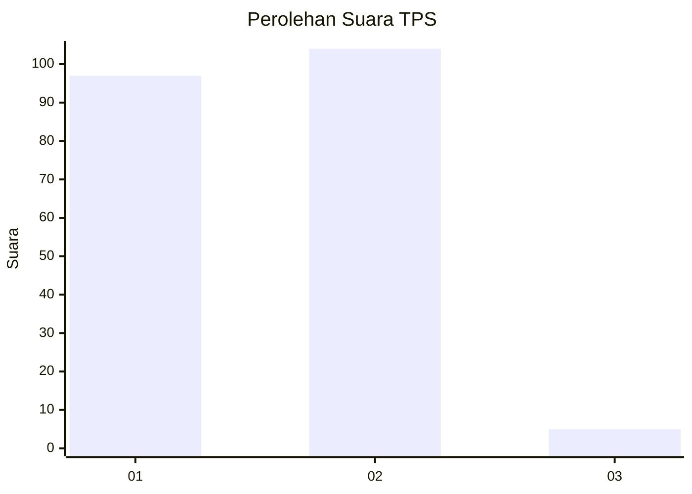
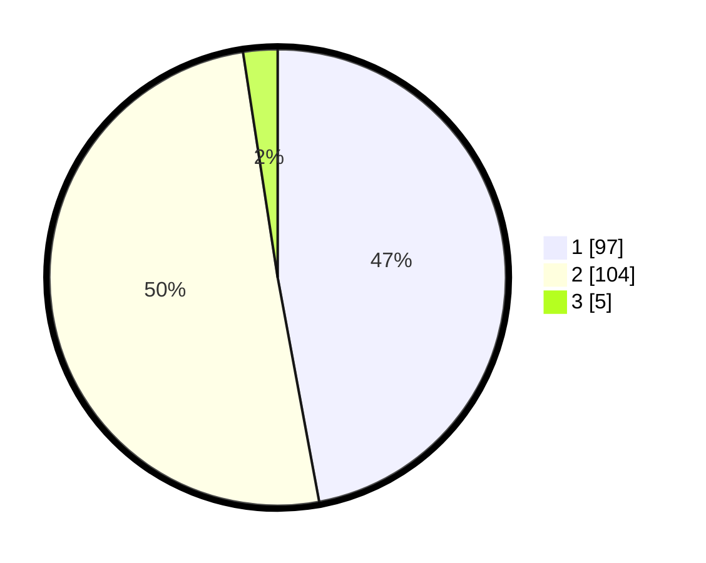

# Hasil

## Grafik

## Tabel

| No. | Nama Paslon    | Suara | Suara (raw) | Persentase |
|:--- |:-------------- | -----:| -----------:| ----------:|
| 1   | ANIES MUHAIMIN | 97    | [97][p-1]   | 47,09      |
| 2   | PRABOWO GIBRAN | 104   | [104][p-2]  | 50,49      |
| 3   | GANJAR MAHFUD  | 5     | [5][p-3]    | 2,43       |

[p-1]: https://github.com/gigit-pemilu/pemilu-2024-63-kalimantan-selatan/blob/main/pilpres/hitung-suara/sub/63-kalimantan-selatan/sub/03-banjar/sub/02-kertak-hanyar/sub/1008-manarap-lama/sub/003-tps/sub/paslon-1.txt
[p-2]: https://github.com/gigit-pemilu/pemilu-2024-63-kalimantan-selatan/blob/main/pilpres/hitung-suara/sub/63-kalimantan-selatan/sub/03-banjar/sub/02-kertak-hanyar/sub/1008-manarap-lama/sub/003-tps/sub/paslon-2.txt
[p-3]: https://github.com/gigit-pemilu/pemilu-2024-63-kalimantan-selatan/blob/main/pilpres/hitung-suara/sub/63-kalimantan-selatan/sub/03-banjar/sub/02-kertak-hanyar/sub/1008-manarap-lama/sub/003-tps/sub/paslon-3.txt

## Foto C Plano

https://sirekap-obj-formc.kpu.go.id/bf0b/pemilu/ppwp/63/03/02/10/08/6303021008003-20240214-210824--6020f25b-3807-4cbe-a139-e8de64913efc.jpg

https://sirekap-obj-formc.kpu.go.id/bf0b/pemilu/ppwp/63/03/02/10/08/6303021008003-20240214-213629--039331d3-50f5-466a-b1a6-6cd9ef71d384.jpg

https://sirekap-obj-formc.kpu.go.id/bf0b/pemilu/ppwp/63/03/02/10/08/6303021008003-20240214-215800--6466a712-47e2-462b-a275-70e704501e7c.jpg

## Metadata

| Key        | Value               |
| ---------- | ------------------- |
| Time Stamp | 2024-02-24 22:31:28 |

