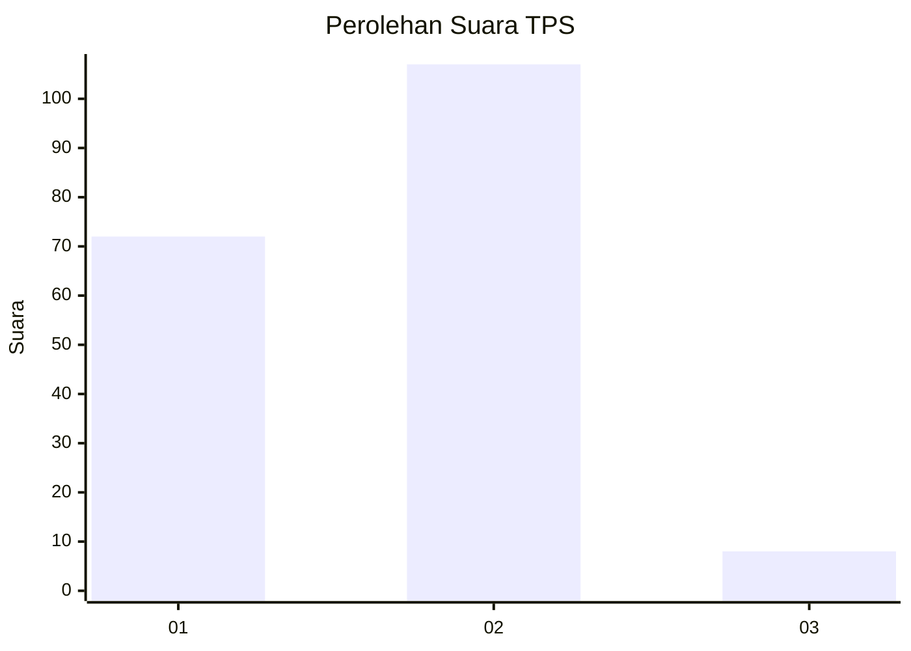
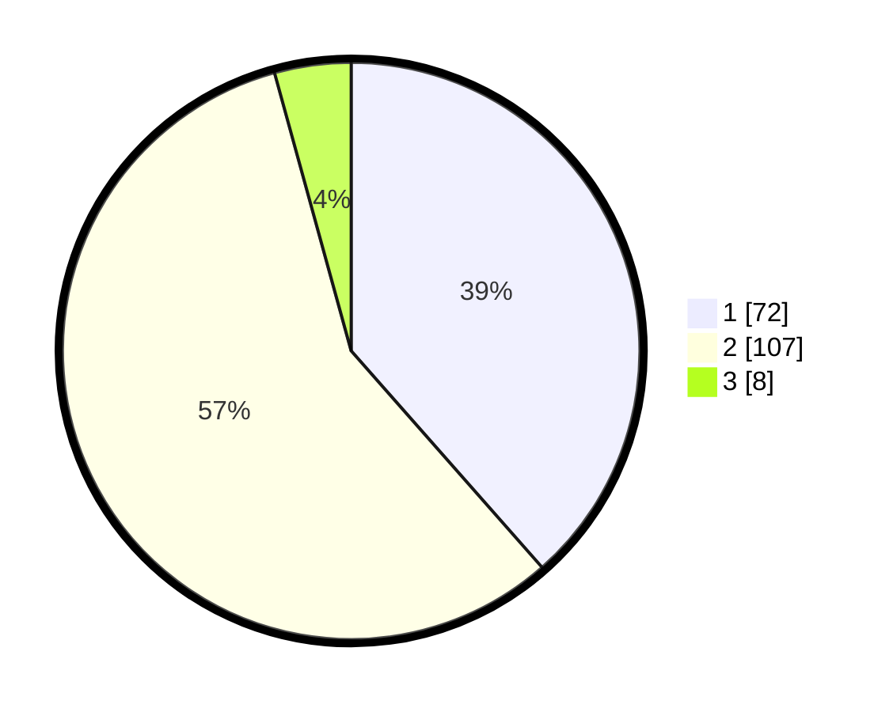

# Hasil

## Grafik

## Tabel

| No. | Nama Paslon    | Suara | Suara (raw) | Persentase |
|:--- |:-------------- | -----:| -----------:| ----------:|
| 1   | ANIES MUHAIMIN | 72    | [72][p-1]   | 38,50      |
| 2   | PRABOWO GIBRAN | 107   | [107][p-2]  | 57,22      |
| 3   | GANJAR MAHFUD  | 8     | [8][p-3]    | 4,28       |

[p-1]: https://github.com/gigit-pemilu/pemilu-2024-63-kalimantan-selatan/blob/main/pilpres/hitung-suara/sub/63-kalimantan-selatan/sub/03-banjar/sub/03-gambut/sub/1001-gambut/sub/017-tps/sub/paslon-1.txt
[p-2]: https://github.com/gigit-pemilu/pemilu-2024-63-kalimantan-selatan/blob/main/pilpres/hitung-suara/sub/63-kalimantan-selatan/sub/03-banjar/sub/03-gambut/sub/1001-gambut/sub/017-tps/sub/paslon-2.txt
[p-3]: https://github.com/gigit-pemilu/pemilu-2024-63-kalimantan-selatan/blob/main/pilpres/hitung-suara/sub/63-kalimantan-selatan/sub/03-banjar/sub/03-gambut/sub/1001-gambut/sub/017-tps/sub/paslon-3.txt

## Foto C Plano

https://sirekap-obj-formc.kpu.go.id/d843/pemilu/ppwp/63/03/03/10/01/6303031001017-20240219-135201--b9becbb7-0500-4ae1-b405-4bc4901c9ded.jpg

https://sirekap-obj-formc.kpu.go.id/d843/pemilu/ppwp/63/03/03/10/01/6303031001017-20240219-135443--3668e837-0d11-4d21-ba53-71c7b12029b7.jpg

https://sirekap-obj-formc.kpu.go.id/d843/pemilu/ppwp/63/03/03/10/01/6303031001017-20240219-135725--a8f659c4-c964-4e9b-9c78-cf3f9225ee71.jpg

## Metadata

| Key        | Value               |
| ---------- | ------------------- |
| Time Stamp | 2024-02-25 16:00:00 |

