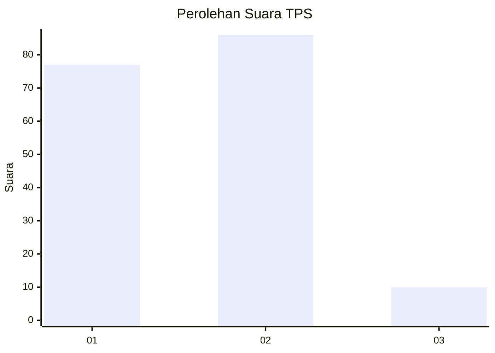
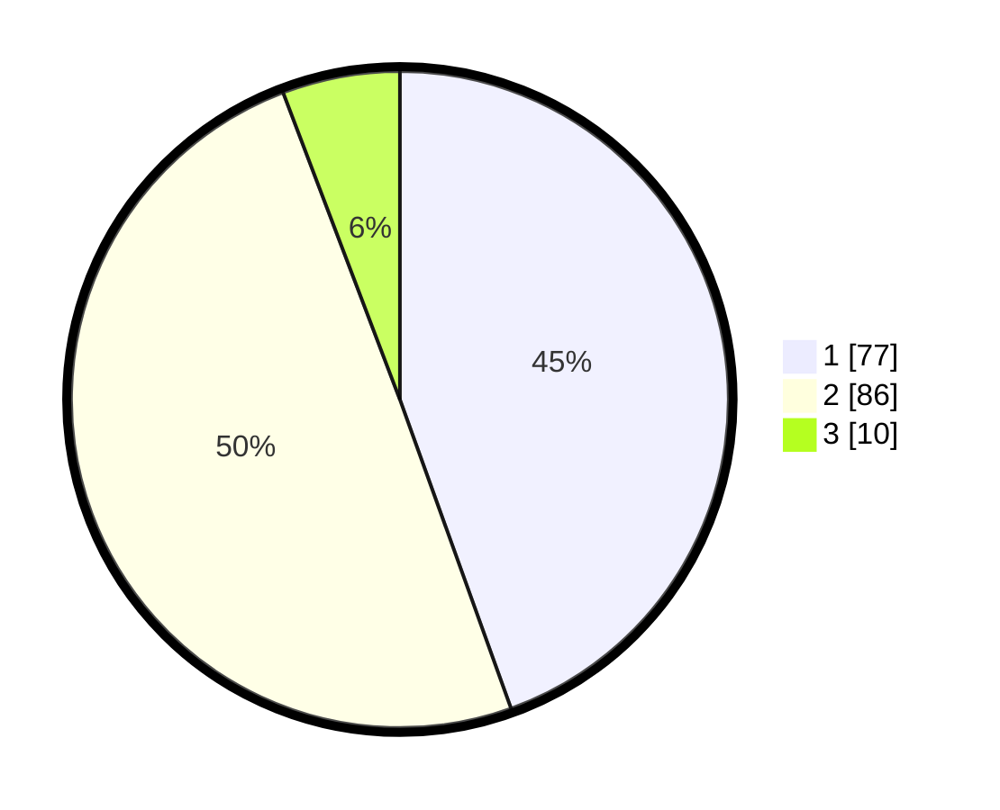

# Hasil

## Grafik

## Tabel

| No. | Nama Paslon    | Suara | Suara (raw) | Persentase |
|:--- |:-------------- | -----:| -----------:| ----------:|
| 1   | ANIES MUHAIMIN | 77    | [77][p-1]   | 44,51      |
| 2   | PRABOWO GIBRAN | 86    | [86][p-2]   | 49,71      |
| 3   | GANJAR MAHFUD  | 10    | [10][p-3]   | 5,78       |

[p-1]: https://github.com/gigit-pemilu/pemilu-2024/blob/main/pilpres/hitung-suara/sub/63-kalimantan-selatan/sub/03-banjar/sub/03-gambut/sub/1001-gambut/sub/022-tps/sub/paslon-1.txt
[p-2]: https://github.com/gigit-pemilu/pemilu-2024/blob/main/pilpres/hitung-suara/sub/63-kalimantan-selatan/sub/03-banjar/sub/03-gambut/sub/1001-gambut/sub/022-tps/sub/paslon-2.txt
[p-3]: https://github.com/gigit-pemilu/pemilu-2024/blob/main/pilpres/hitung-suara/sub/63-kalimantan-selatan/sub/03-banjar/sub/03-gambut/sub/1001-gambut/sub/022-tps/sub/paslon-3.txt

## Foto C Plano

https://sirekap-obj-formc.kpu.go.id/f940/pemilu/ppwp/63/03/03/10/01/6303031001022-20240215-173712--800babdd-6dfd-4dd6-b0da-99e17425f440.jpg

https://sirekap-obj-formc.kpu.go.id/f940/pemilu/ppwp/63/03/03/10/01/6303031001022-20240215-173958--83ccbb81-d5f3-41b6-8a0f-39de960dcc97.jpg

https://sirekap-obj-formc.kpu.go.id/f940/pemilu/ppwp/63/03/03/10/01/6303031001022-20240215-174145--f8ff48dd-a994-4911-87a1-089ec94fd2bb.jpg

## Metadata

| Key        | Value               |
| ---------- | ------------------- |
| Time Stamp | 2024-02-25 16:00:00 |

