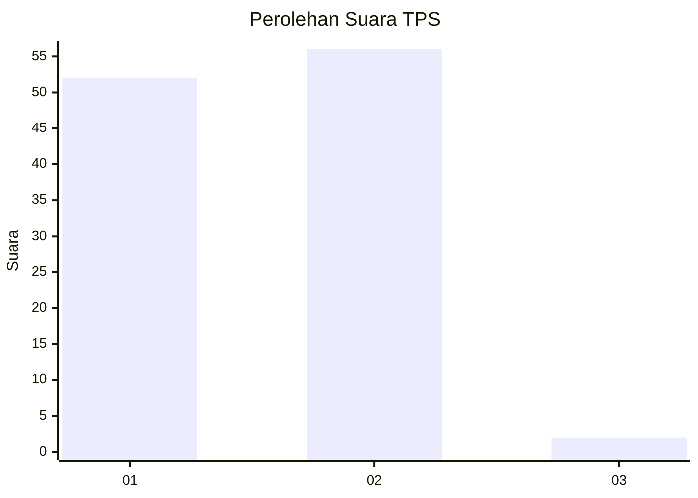
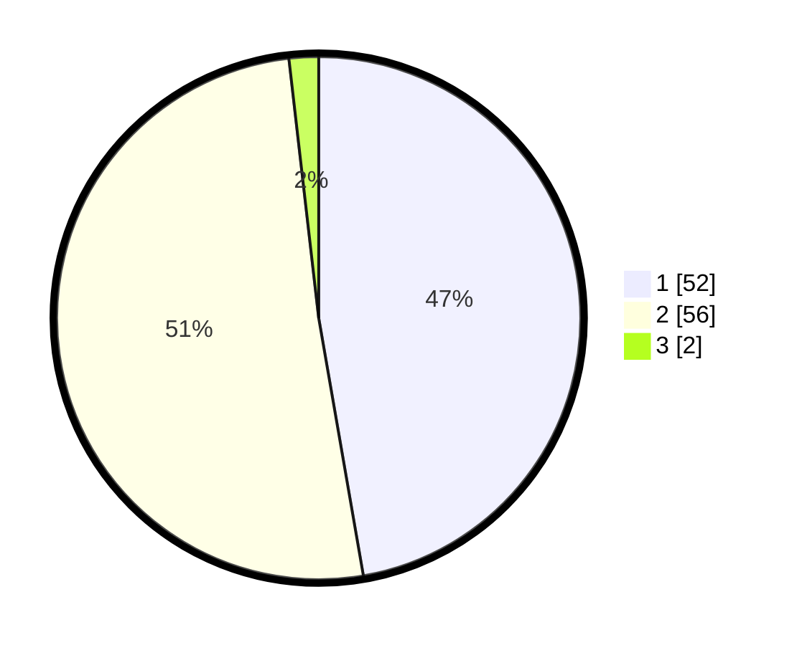

# Hasil

## Grafik

## Tabel

| No. | Nama Paslon    | Suara | Suara (raw) | Persentase |
|:--- |:-------------- | -----:| -----------:| ----------:|
| 1   | ANIES MUHAIMIN | 52    | [52][p-1]   | 47,27      |
| 2   | PRABOWO GIBRAN | 56    | [56][p-2]   | 50,91      |
| 3   | GANJAR MAHFUD  | 2     | [2][p-3]    | 1,82       |

[p-1]: https://github.com/gigit-pemilu/pemilu-2024-63-kalimantan-selatan/blob/main/pilpres/hitung-suara/sub/63-kalimantan-selatan/sub/03-banjar/sub/03-gambut/sub/1014-gambut-barat/sub/014-tps/sub/paslon-1.txt
[p-2]: https://github.com/gigit-pemilu/pemilu-2024-63-kalimantan-selatan/blob/main/pilpres/hitung-suara/sub/63-kalimantan-selatan/sub/03-banjar/sub/03-gambut/sub/1014-gambut-barat/sub/014-tps/sub/paslon-2.txt
[p-3]: https://github.com/gigit-pemilu/pemilu-2024-63-kalimantan-selatan/blob/main/pilpres/hitung-suara/sub/63-kalimantan-selatan/sub/03-banjar/sub/03-gambut/sub/1014-gambut-barat/sub/014-tps/sub/paslon-3.txt

## Foto C Plano

https://sirekap-obj-formc.kpu.go.id/7837/pemilu/ppwp/63/03/03/10/14/6303031014014-20240214-203233--31422619-efa6-4622-993f-ac2d81fd800f.jpg

https://sirekap-obj-formc.kpu.go.id/7837/pemilu/ppwp/63/03/03/10/14/6303031014014-20240214-203405--60b520ed-f2be-4022-8473-87f1df4ed1c4.jpg

https://sirekap-obj-formc.kpu.go.id/7837/pemilu/ppwp/63/03/03/10/14/6303031014014-20240214-203641--454d6ca7-97b0-482d-9069-a4693a21356e.jpg

## Metadata

| Key        | Value               |
| ---------- | ------------------- |
| Time Stamp | 2024-02-25 20:00:00 |

