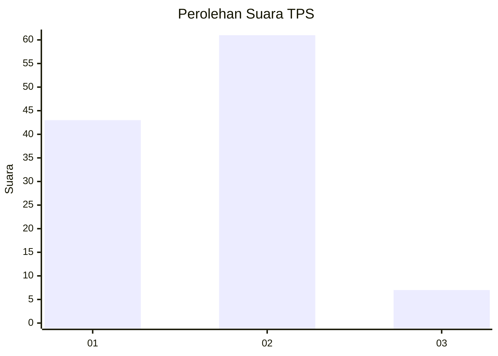
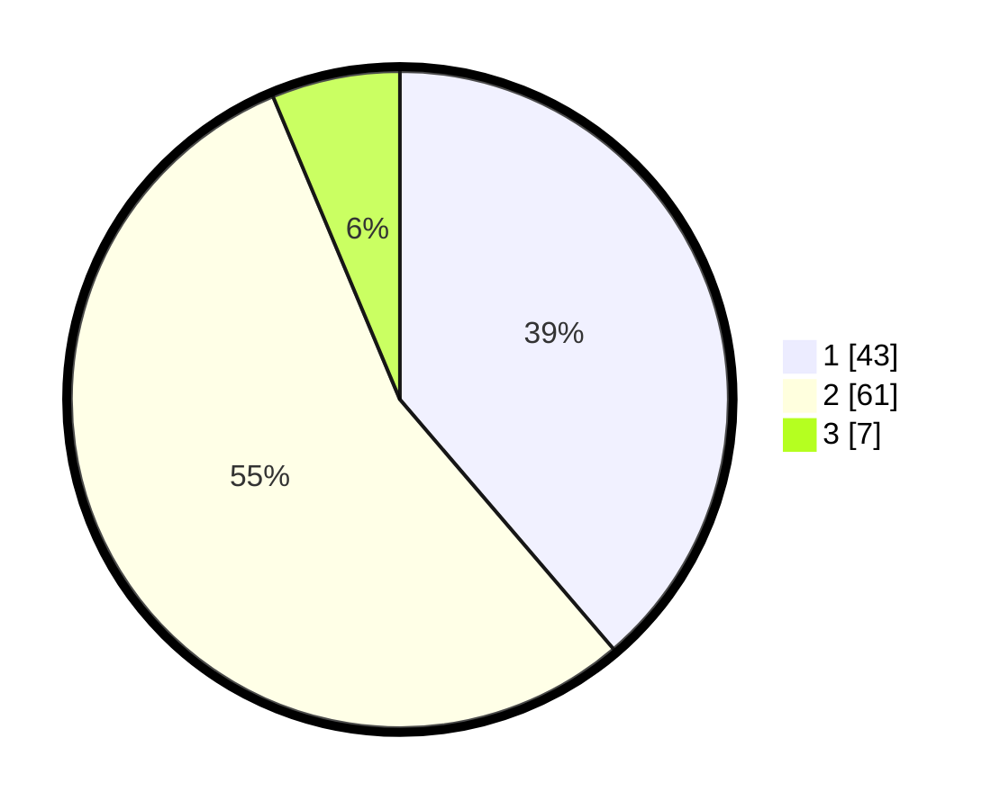

# Hasil

## Grafik

## Tabel

| No. | Nama Paslon    | Suara | Suara (raw) | Persentase |
|:--- |:-------------- | -----:| -----------:| ----------:|
| 1   | ANIES MUHAIMIN | 43    | [43][p-1]   | 38,74      |
| 2   | PRABOWO GIBRAN | 61    | [61][p-2]   | 54,95      |
| 3   | GANJAR MAHFUD  | 7     | [7][p-3]    | 6,31       |

[p-1]: https://github.com/gigit-pemilu/pemilu-2024/blob/main/pilpres/hitung-suara/sub/63-kalimantan-selatan/sub/03-banjar/sub/03-gambut/sub/2005-tambak-sirang-darat/sub/006-tps/sub/paslon-1.txt
[p-2]: https://github.com/gigit-pemilu/pemilu-2024/blob/main/pilpres/hitung-suara/sub/63-kalimantan-selatan/sub/03-banjar/sub/03-gambut/sub/2005-tambak-sirang-darat/sub/006-tps/sub/paslon-2.txt
[p-3]: https://github.com/gigit-pemilu/pemilu-2024/blob/main/pilpres/hitung-suara/sub/63-kalimantan-selatan/sub/03-banjar/sub/03-gambut/sub/2005-tambak-sirang-darat/sub/006-tps/sub/paslon-3.txt

## Foto C Plano

https://sirekap-obj-formc.kpu.go.id/16c4/pemilu/ppwp/63/03/03/20/05/6303032005006-20240214-133007--1a9304be-fd2f-4eac-9db1-b9c02638f889.jpg

https://sirekap-obj-formc.kpu.go.id/16c4/pemilu/ppwp/63/03/03/20/05/6303032005006-20240214-133128--3d0f0b5d-b762-469c-8be0-172f06a35e49.jpg

https://sirekap-obj-formc.kpu.go.id/16c4/pemilu/ppwp/63/03/03/20/05/6303032005006-20240214-133414--ac645d9e-9ef0-4cb8-a2f8-36fb867d53d6.jpg

## Metadata

| Key        | Value               |
| ---------- | ------------------- |
| Time Stamp | 2024-02-24 22:31:28 |

