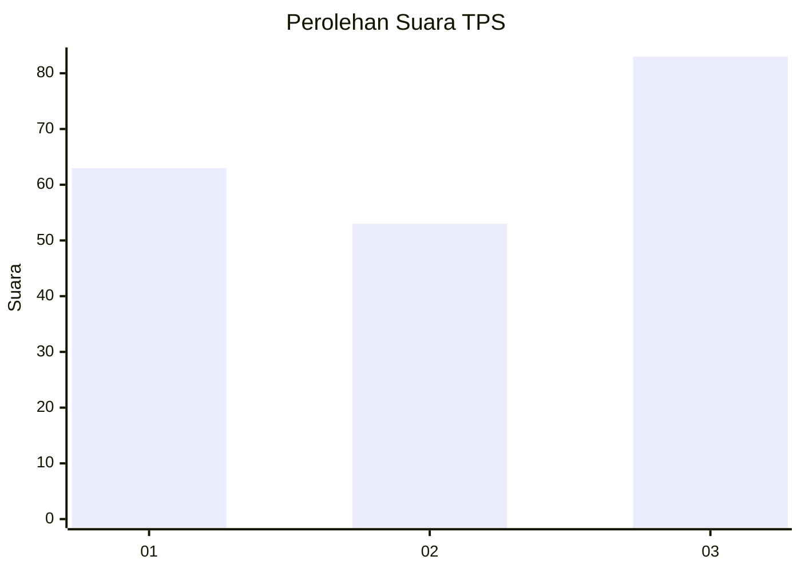
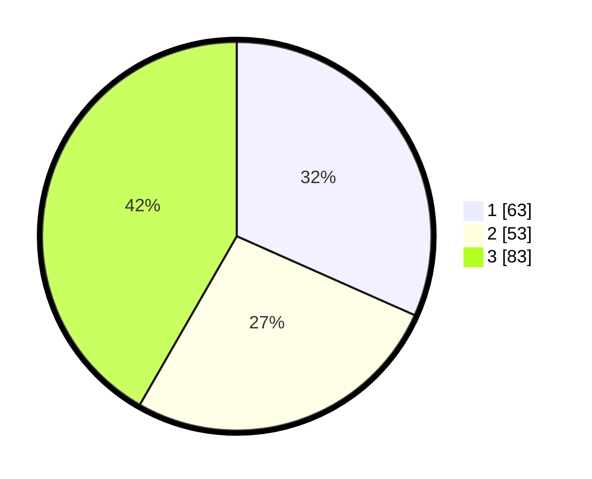

# Hasil

## Grafik

## Tabel

| No. | Nama Paslon    | Suara | Suara (raw) | Persentase |
|:--- |:-------------- | -----:| -----------:| ----------:|
| 1   | ANIES MUHAIMIN | 63    | [63][p-1]   | 31,66      |
| 2   | PRABOWO GIBRAN | 53    | [53][p-2]   | 26,63      |
| 3   | GANJAR MAHFUD  | 83    | [83][p-3]   | 41,71      |

[p-1]: https://github.com/gigit-pemilu/pemilu-2024/blob/main/pilpres/hitung-suara/sub/63-kalimantan-selatan/sub/03-banjar/sub/03-gambut/sub/2006-tambak-sirang-laut/sub/001-tps/sub/paslon-1.txt
[p-2]: https://github.com/gigit-pemilu/pemilu-2024/blob/main/pilpres/hitung-suara/sub/63-kalimantan-selatan/sub/03-banjar/sub/03-gambut/sub/2006-tambak-sirang-laut/sub/001-tps/sub/paslon-2.txt
[p-3]: https://github.com/gigit-pemilu/pemilu-2024/blob/main/pilpres/hitung-suara/sub/63-kalimantan-selatan/sub/03-banjar/sub/03-gambut/sub/2006-tambak-sirang-laut/sub/001-tps/sub/paslon-3.txt

## Foto C Plano

https://sirekap-obj-formc.kpu.go.id/f952/pemilu/ppwp/63/03/03/20/06/6303032006001-20240222-192812--c19be4a9-0a4d-4a4d-91e1-bf18add4bb91.jpg

https://sirekap-obj-formc.kpu.go.id/f952/pemilu/ppwp/63/03/03/20/06/6303032006001-20240222-192912--346ead01-92a1-427c-9308-45c69d15831a.jpg

https://sirekap-obj-formc.kpu.go.id/f952/pemilu/ppwp/63/03/03/20/06/6303032006001-20240222-192944--90acfe57-327f-4fcd-b503-b020b0055ecd.jpg

## Metadata

| Key        | Value               |
| ---------- | ------------------- |
| Time Stamp | 2024-02-22 20:00:00 |

## DATA PEMILIH TETAP

Jumlah pemilih dalam DPT: **255**.
 * L: **39**.
 * P: **84**.

## DATA PENGGUNA HAK PILIH

Jumlah pengguna hak pilih dalam DPT: **334**.
 * L: **62**.
 * P: **72**.

Jumlah pengguna hak pilih dalam DPTb: **888**.
 * L: **8**.
 * P: **8**.

Jumlah pengguna hak pilih dalam DPK: **5**.
 * L: **806**.
 * P: **0**.

Jumlah pengguna hak pilih: **439**.
 * L: **53**.
 * P: **73**.

## JUMLAH SUARA SAH DAN TIDAK SAH

JUMLAH SELURUH SUARA SAH: **127**.

JUMLAH SUARA TIDAK SAH: **8**.

JUMLAH SELURUH SUARA SAH DAN SUARA TIDAK SAH: **135**.

