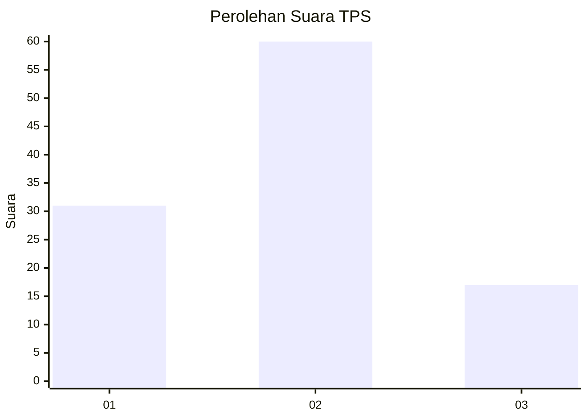
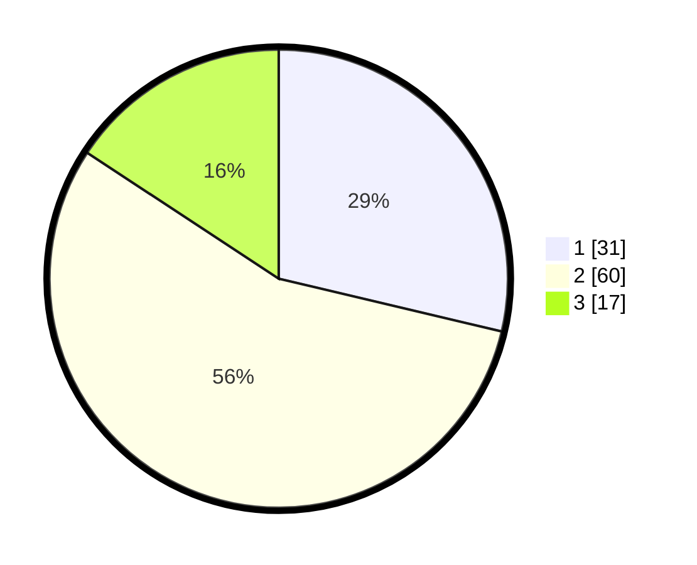

# Hasil

## Grafik

## Tabel

| No. | Nama Paslon    | Suara | Suara (raw) | Persentase |
|:--- |:-------------- | -----:| -----------:| ----------:|
| 1   | ANIES MUHAIMIN | 31    | [31][p-1]   | 28,70      |
| 2   | PRABOWO GIBRAN | 60    | [60][p-2]   | 55,56      |
| 3   | GANJAR MAHFUD  | 17    | [17][p-3]   | 15,74      |

[p-1]: https://github.com/gigit-pemilu/pemilu-2024-63-kalimantan-selatan/blob/main/pilpres/hitung-suara/sub/63-kalimantan-selatan/sub/03-banjar/sub/03-gambut/sub/2010-guntung-ujung/sub/001-tps/sub/paslon-1.txt
[p-2]: https://github.com/gigit-pemilu/pemilu-2024-63-kalimantan-selatan/blob/main/pilpres/hitung-suara/sub/63-kalimantan-selatan/sub/03-banjar/sub/03-gambut/sub/2010-guntung-ujung/sub/001-tps/sub/paslon-2.txt
[p-3]: https://github.com/gigit-pemilu/pemilu-2024-63-kalimantan-selatan/blob/main/pilpres/hitung-suara/sub/63-kalimantan-selatan/sub/03-banjar/sub/03-gambut/sub/2010-guntung-ujung/sub/001-tps/sub/paslon-3.txt

## Foto C Plano

https://sirekap-obj-formc.kpu.go.id/5d38/pemilu/ppwp/63/03/03/20/10/6303032010001-20240222-082911--61dbc0c9-2ced-425b-9420-7e0d0e890bc8.jpg

https://sirekap-obj-formc.kpu.go.id/5d38/pemilu/ppwp/63/03/03/20/10/6303032010001-20240222-083013--6b1160ca-bdb9-4ac0-b592-6b08f607501a.jpg

https://sirekap-obj-formc.kpu.go.id/5d38/pemilu/ppwp/63/03/03/20/10/6303032010001-20240222-083101--6b277ab0-a66b-4536-9f29-47505688816f.jpg

## Metadata

| Key        | Value               |
| ---------- | ------------------- |
| Time Stamp | 2024-02-22 09:00:00 |

## DATA PEMILIH TETAP

Jumlah pemilih dalam DPT: **149**.
 * L: **872**.
 * P: **877**.

## DATA PENGGUNA HAK PILIH

Jumlah pengguna hak pilih dalam DPT: **115**.
 * L: **255**.
 * P: **260**.

Jumlah pengguna hak pilih dalam DPTb: **202**.
 * L: **7**.
 * P: **207**.

Jumlah pengguna hak pilih dalam DPK: **0**.
 * L: **202**.
 * P: **202**.

Jumlah pengguna hak pilih: **115**.
 * L: **855**.
 * P: **460**.

## JUMLAH SUARA SAH DAN TIDAK SAH

JUMLAH SELURUH SUARA SAH: **108**.

JUMLAH SUARA TIDAK SAH: **427**.

JUMLAH SELURUH SUARA SAH DAN SUARA TIDAK SAH: **115**.

