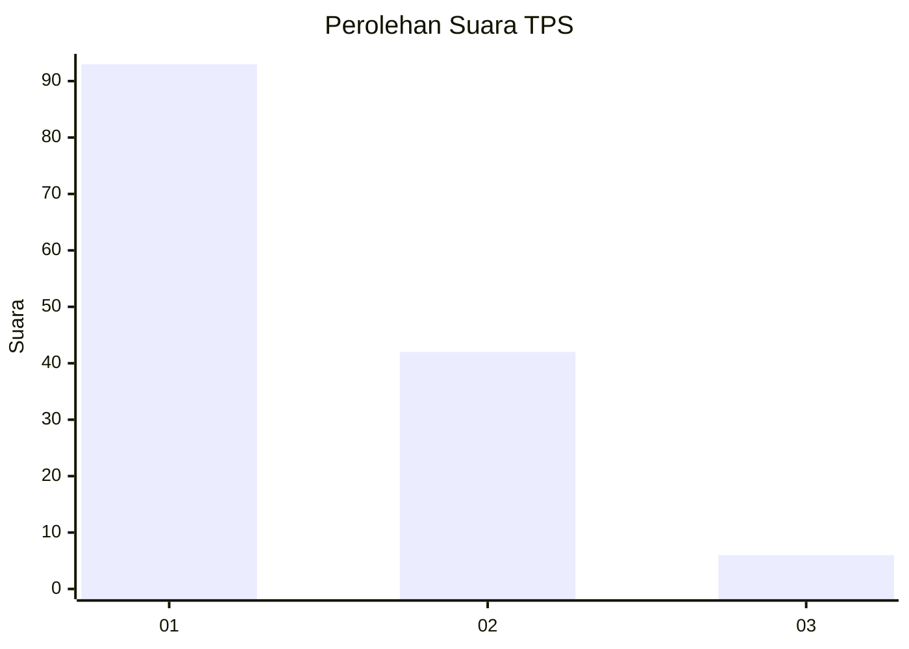
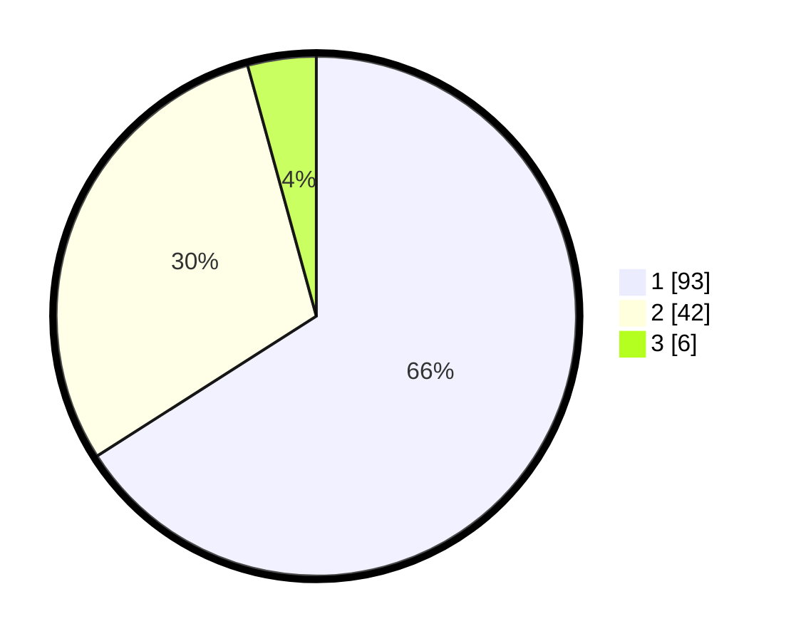

# Hasil

## Grafik

## Tabel

| No. | Nama Paslon    | Suara | Suara (raw) | Persentase |
|:--- |:-------------- | -----:| -----------:| ----------:|
| 1   | ANIES MUHAIMIN | 93    | [93][p-1]   | 65,96      |
| 2   | PRABOWO GIBRAN | 42    | [42][p-2]   | 29,79      |
| 3   | GANJAR MAHFUD  | 6     | [6][p-3]    | 4,26       |

[p-1]: https://github.com/gigit-pemilu/pemilu-2024-63-kalimantan-selatan/blob/main/pilpres/hitung-suara/sub/63-kalimantan-selatan/sub/03-banjar/sub/04-sungai-tabuk/sub/2007-pembantanan/sub/010-tps/sub/paslon-1.txt
[p-2]: https://github.com/gigit-pemilu/pemilu-2024-63-kalimantan-selatan/blob/main/pilpres/hitung-suara/sub/63-kalimantan-selatan/sub/03-banjar/sub/04-sungai-tabuk/sub/2007-pembantanan/sub/010-tps/sub/paslon-2.txt
[p-3]: https://github.com/gigit-pemilu/pemilu-2024-63-kalimantan-selatan/blob/main/pilpres/hitung-suara/sub/63-kalimantan-selatan/sub/03-banjar/sub/04-sungai-tabuk/sub/2007-pembantanan/sub/010-tps/sub/paslon-3.txt

## Foto C Plano

https://sirekap-obj-formc.kpu.go.id/936b/pemilu/ppwp/63/03/04/20/07/6303042007010-20240215-022821--528e6b0c-60a1-4802-9647-fef39349bd18.jpg

https://sirekap-obj-formc.kpu.go.id/936b/pemilu/ppwp/63/03/04/20/07/6303042007010-20240215-024144--45066205-da58-491b-b38d-9fddc73ce63e.jpg

https://sirekap-obj-formc.kpu.go.id/936b/pemilu/ppwp/63/03/04/20/07/6303042007010-20240215-024455--b3728c85-ca6a-4049-ac41-9d35670a7400.jpg

## Metadata

| Key        | Value               |
| ---------- | ------------------- |
| Time Stamp | 2024-02-24 22:31:28 |

