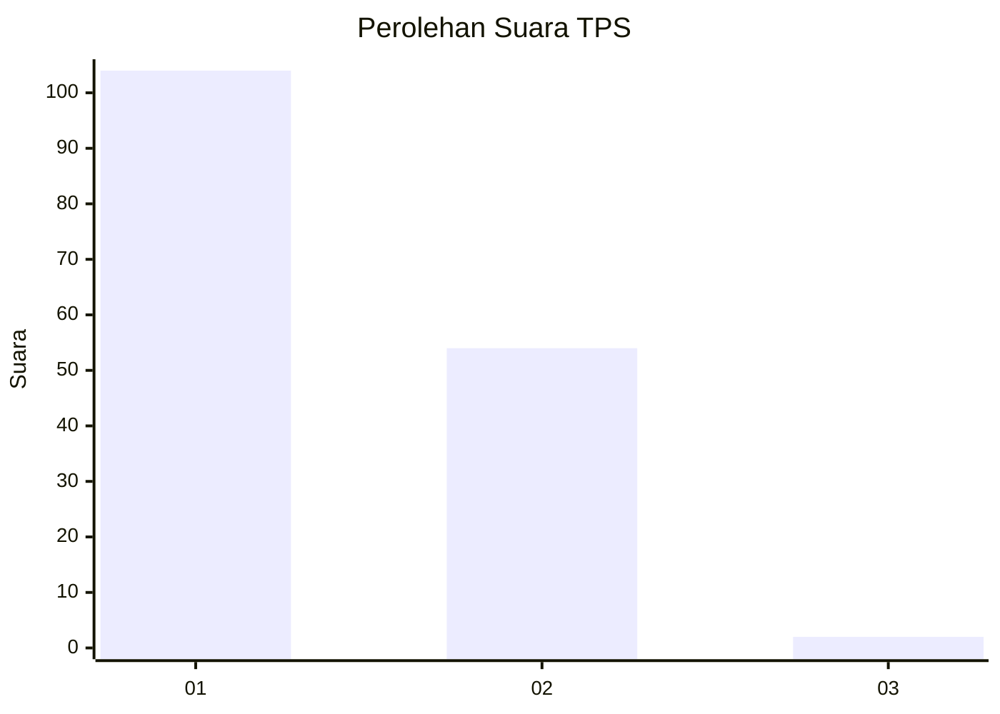
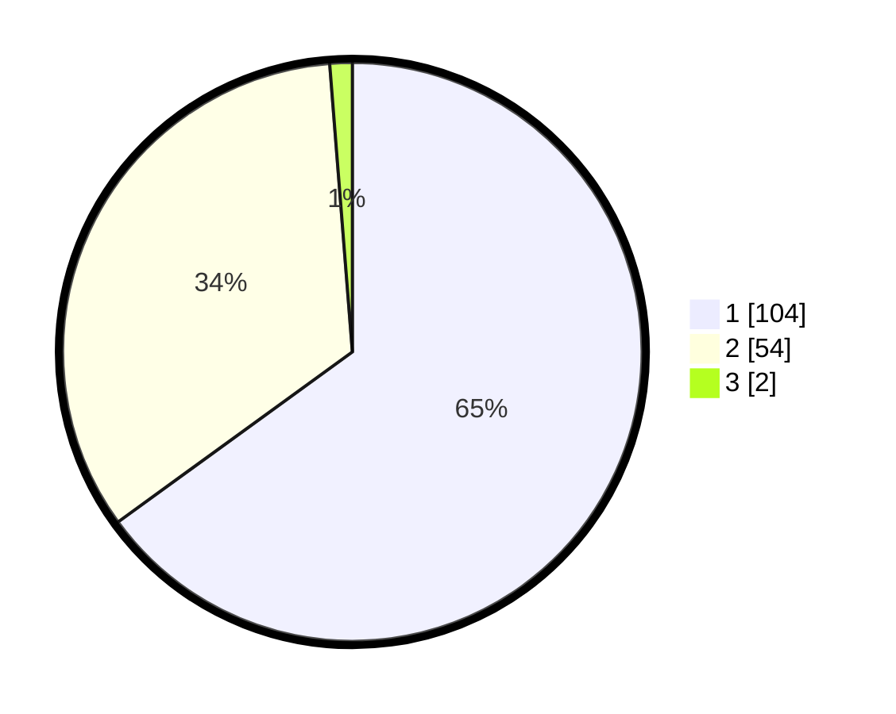

# Hasil

## Grafik

## Tabel

| No. | Nama Paslon    | Suara | Suara (raw) | Persentase |
|:--- |:-------------- | -----:| -----------:| ----------:|
| 1   | ANIES MUHAIMIN | 104   | [104][p-1]  | 65,00      |
| 2   | PRABOWO GIBRAN | 54    | [54][p-2]   | 33,75      |
| 3   | GANJAR MAHFUD  | 2     | [2][p-3]    | 1,25       |

[p-1]: https://github.com/gigit-pemilu/pemilu-2024/blob/main/pilpres/hitung-suara/sub/63-kalimantan-selatan/sub/03-banjar/sub/05-martapura/sub/1001-keraton/sub/009-tps/sub/paslon-1.txt
[p-2]: https://github.com/gigit-pemilu/pemilu-2024/blob/main/pilpres/hitung-suara/sub/63-kalimantan-selatan/sub/03-banjar/sub/05-martapura/sub/1001-keraton/sub/009-tps/sub/paslon-2.txt
[p-3]: https://github.com/gigit-pemilu/pemilu-2024/blob/main/pilpres/hitung-suara/sub/63-kalimantan-selatan/sub/03-banjar/sub/05-martapura/sub/1001-keraton/sub/009-tps/sub/paslon-3.txt

## Foto C Plano

https://sirekap-obj-formc.kpu.go.id/b166/pemilu/ppwp/63/03/05/10/01/6303051001009-20240214-224708--3e5d7748-74de-423b-936f-eebac088f71f.jpg

https://sirekap-obj-formc.kpu.go.id/b166/pemilu/ppwp/63/03/05/10/01/6303051001009-20240214-225034--c9b6e705-120d-4572-9cd0-d77d04fde9e9.jpg

https://sirekap-obj-formc.kpu.go.id/b166/pemilu/ppwp/63/03/05/10/01/6303051001009-20240214-225239--711f1b47-e1b8-40e8-9929-7d4b3c7b3975.jpg

## Metadata

| Key        | Value               |
| ---------- | ------------------- |
| Time Stamp | 2024-02-26 11:00:00 |

