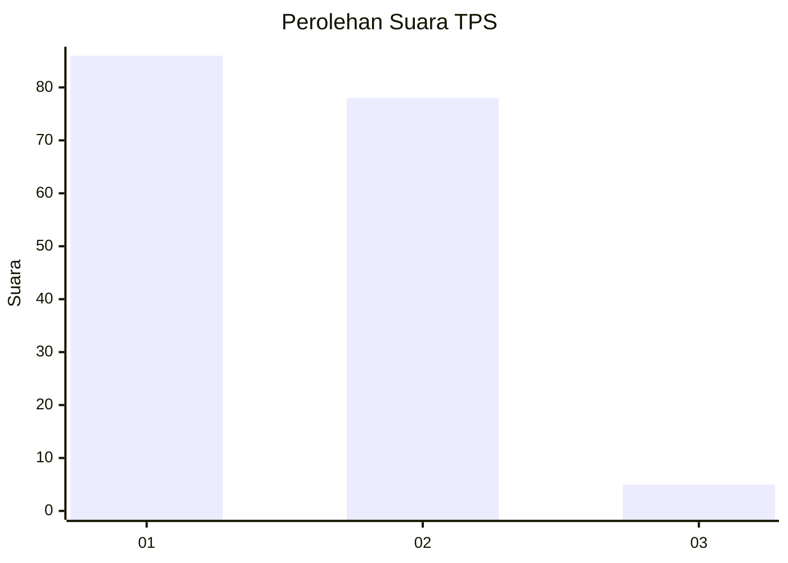
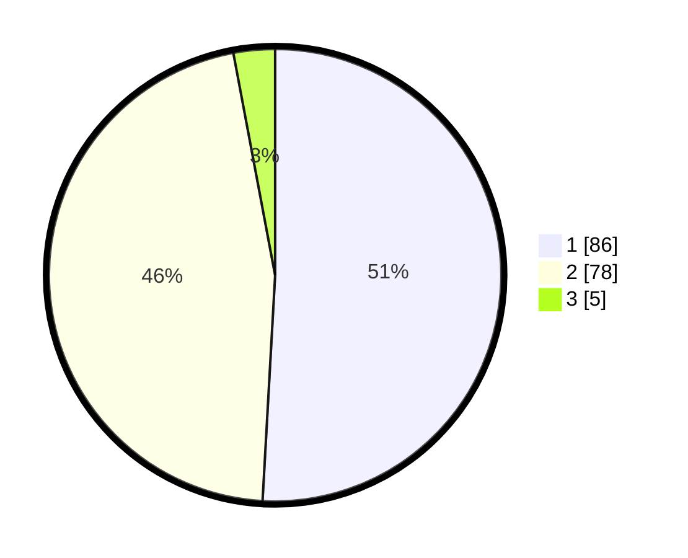

# Hasil

## Grafik

## Tabel

| No. | Nama Paslon    | Suara | Suara (raw) | Persentase |
|:--- |:-------------- | -----:| -----------:| ----------:|
| 1   | ANIES MUHAIMIN | 86    | [86][p-1]   | 50,89      |
| 2   | PRABOWO GIBRAN | 78    | [78][p-2]   | 46,15      |
| 3   | GANJAR MAHFUD  | 5     | [5][p-3]    | 2,96       |

[p-1]: https://github.com/gigit-pemilu/pemilu-2024-63-kalimantan-selatan/blob/main/pilpres/hitung-suara/sub/63-kalimantan-selatan/sub/03-banjar/sub/05-martapura/sub/1001-keraton/sub/017-tps/sub/paslon-1.txt
[p-2]: https://github.com/gigit-pemilu/pemilu-2024-63-kalimantan-selatan/blob/main/pilpres/hitung-suara/sub/63-kalimantan-selatan/sub/03-banjar/sub/05-martapura/sub/1001-keraton/sub/017-tps/sub/paslon-2.txt
[p-3]: https://github.com/gigit-pemilu/pemilu-2024-63-kalimantan-selatan/blob/main/pilpres/hitung-suara/sub/63-kalimantan-selatan/sub/03-banjar/sub/05-martapura/sub/1001-keraton/sub/017-tps/sub/paslon-3.txt

## Foto C Plano

https://sirekap-obj-formc.kpu.go.id/4db9/pemilu/ppwp/63/03/05/10/01/6303051001017-20240215-020257--bfc396fd-99bc-4d21-89f6-a137b84f6dbd.jpg

https://sirekap-obj-formc.kpu.go.id/4db9/pemilu/ppwp/63/03/05/10/01/6303051001017-20240215-020317--931dcea7-ccc6-4e07-a7a4-243d8acab72b.jpg

https://sirekap-obj-formc.kpu.go.id/4db9/pemilu/ppwp/63/03/05/10/01/6303051001017-20240215-020344--dfd403a5-3318-443a-99b0-7abd5ac58448.jpg

## Metadata

| Key        | Value               |
| ---------- | ------------------- |
| Time Stamp | 2024-02-24 22:31:28 |

