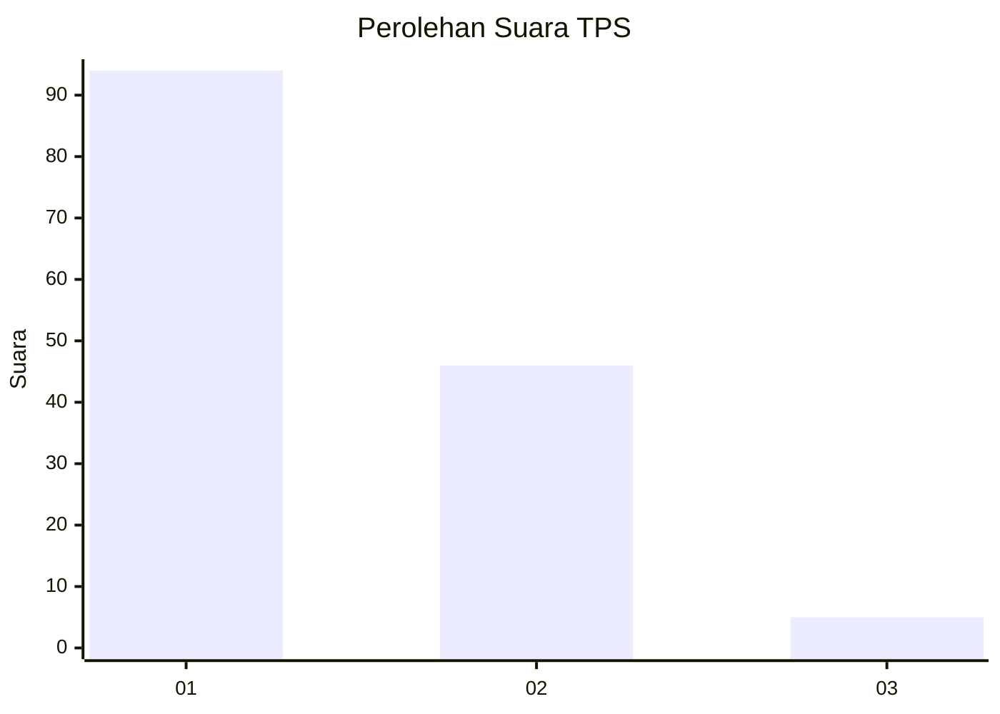
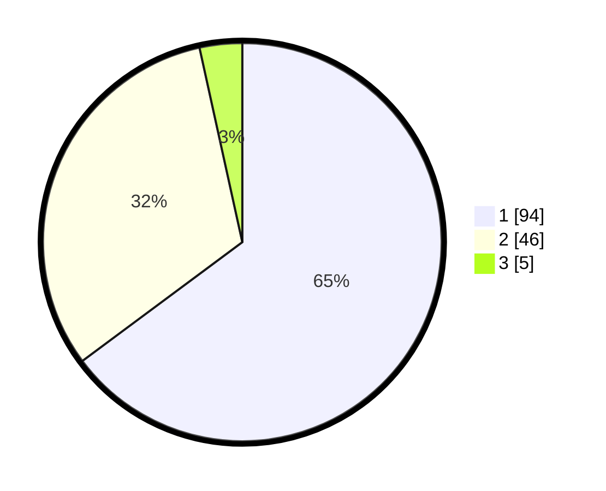

# Hasil

## Grafik

## Tabel

| No. | Nama Paslon    | Suara | Suara (raw) | Persentase |
|:--- |:-------------- | -----:| -----------:| ----------:|
| 1   | ANIES MUHAIMIN | 94    | [94][p-1]   | 64,83      |
| 2   | PRABOWO GIBRAN | 46    | [46][p-2]   | 31,72      |
| 3   | GANJAR MAHFUD  | 5     | [5][p-3]    | 3,45       |

[p-1]: https://github.com/gigit-pemilu/pemilu-2024-63-kalimantan-selatan/blob/main/pilpres/hitung-suara/sub/63-kalimantan-selatan/sub/03-banjar/sub/05-martapura/sub/1001-keraton/sub/018-tps/sub/paslon-1.txt
[p-2]: https://github.com/gigit-pemilu/pemilu-2024-63-kalimantan-selatan/blob/main/pilpres/hitung-suara/sub/63-kalimantan-selatan/sub/03-banjar/sub/05-martapura/sub/1001-keraton/sub/018-tps/sub/paslon-2.txt
[p-3]: https://github.com/gigit-pemilu/pemilu-2024-63-kalimantan-selatan/blob/main/pilpres/hitung-suara/sub/63-kalimantan-selatan/sub/03-banjar/sub/05-martapura/sub/1001-keraton/sub/018-tps/sub/paslon-3.txt

## Foto C Plano

https://sirekap-obj-formc.kpu.go.id/5ffa/pemilu/ppwp/63/03/05/10/01/6303051001018-20240215-141846--6a65ab15-54cd-4a6b-9b29-e52407c23714.jpg

https://sirekap-obj-formc.kpu.go.id/5ffa/pemilu/ppwp/63/03/05/10/01/6303051001018-20240215-141928--993e7062-1645-4a4c-9e68-e06e62adfa69.jpg

https://sirekap-obj-formc.kpu.go.id/5ffa/pemilu/ppwp/63/03/05/10/01/6303051001018-20240215-141952--42c9d2c1-a003-4189-9492-587b227657db.jpg

## Metadata

| Key        | Value               |
| ---------- | ------------------- |
| Time Stamp | 2024-02-24 22:31:28 |

