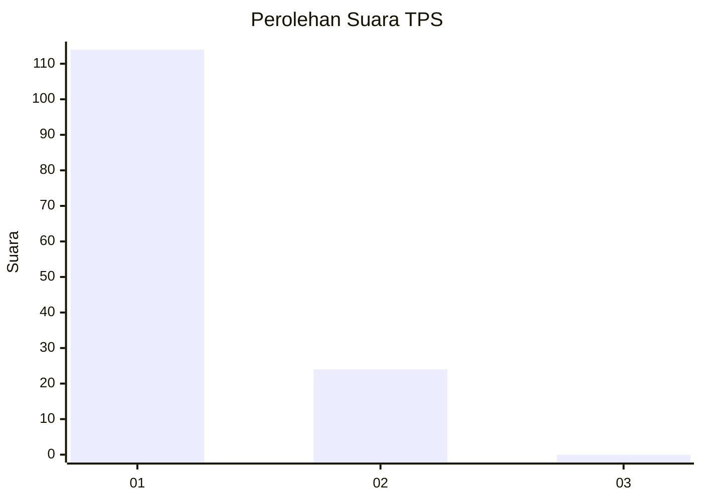
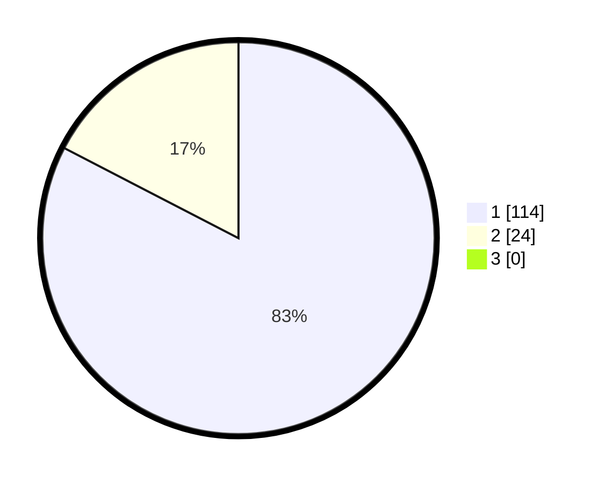

# Hasil

## Grafik

## Tabel

| No. | Nama Paslon    | Suara | Suara (raw) | Persentase |
|:--- |:-------------- | -----:| -----------:| ----------:|
| 1   | ANIES MUHAIMIN | 114   | [114][p-1]  | 82,61      |
| 2   | PRABOWO GIBRAN | 24    | [24][p-2]   | 17,39      |
| 3   | GANJAR MAHFUD  | 0     | [0][p-3]    | 0,00       |

[p-1]: https://github.com/gigit-pemilu/pemilu-2024-63-kalimantan-selatan/blob/main/pilpres/hitung-suara/sub/63-kalimantan-selatan/sub/03-banjar/sub/05-martapura/sub/1002-jawa/sub/004-tps/sub/paslon-1.txt
[p-2]: https://github.com/gigit-pemilu/pemilu-2024-63-kalimantan-selatan/blob/main/pilpres/hitung-suara/sub/63-kalimantan-selatan/sub/03-banjar/sub/05-martapura/sub/1002-jawa/sub/004-tps/sub/paslon-2.txt
[p-3]: https://github.com/gigit-pemilu/pemilu-2024-63-kalimantan-selatan/blob/main/pilpres/hitung-suara/sub/63-kalimantan-selatan/sub/03-banjar/sub/05-martapura/sub/1002-jawa/sub/004-tps/sub/paslon-3.txt

## Foto C Plano

https://sirekap-obj-formc.kpu.go.id/5ea6/pemilu/ppwp/63/03/05/10/02/6303051002004-20240215-002310--cfc689ac-2271-454d-94af-bb52a8f4df44.jpg

https://sirekap-obj-formc.kpu.go.id/5ea6/pemilu/ppwp/63/03/05/10/02/6303051002004-20240215-002439--66a57dcf-7c8c-4010-b327-a08f0d1008c0.jpg

https://sirekap-obj-formc.kpu.go.id/5ea6/pemilu/ppwp/63/03/05/10/02/6303051002004-20240215-002529--fdc8e6bb-3c51-4e3b-8bd1-644cc4e7bbcc.jpg

## Metadata

| Key        | Value               |
| ---------- | ------------------- |
| Time Stamp | 2024-02-25 12:00:00 |

