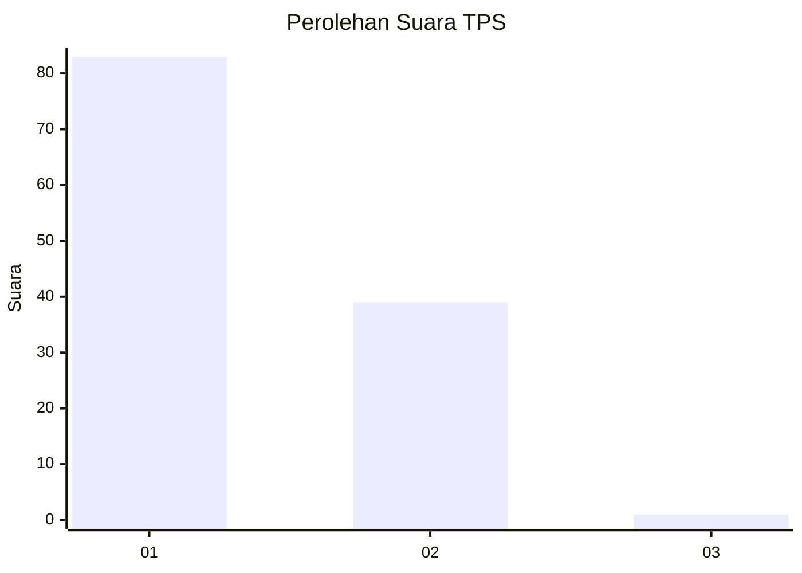
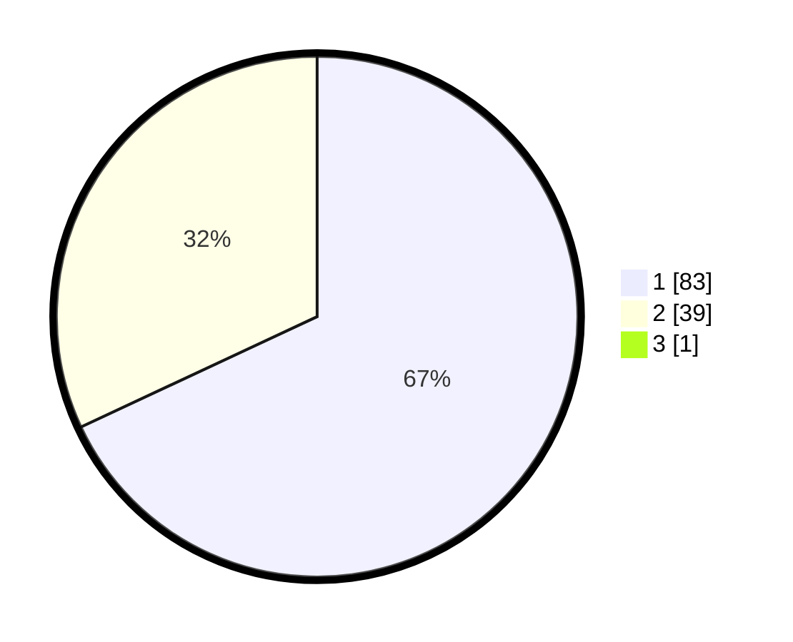

# Hasil

## Grafik

## Tabel

| No. | Nama Paslon    | Suara | Suara (raw) | Persentase |
|:--- |:-------------- | -----:| -----------:| ----------:|
| 1   | ANIES MUHAIMIN | 83    | [83][p-1]   | 67,48      |
| 2   | PRABOWO GIBRAN | 39    | [39][p-2]   | 31,71      |
| 3   | GANJAR MAHFUD  | 1     | [1][p-3]    | 0,81       |

[p-1]: https://github.com/gigit-pemilu/pemilu-2024/blob/main/pilpres/hitung-suara/sub/63-kalimantan-selatan/sub/03-banjar/sub/05-martapura/sub/2034-cindai-alus/sub/901-tps/sub/paslon-1.txt
[p-2]: https://github.com/gigit-pemilu/pemilu-2024/blob/main/pilpres/hitung-suara/sub/63-kalimantan-selatan/sub/03-banjar/sub/05-martapura/sub/2034-cindai-alus/sub/901-tps/sub/paslon-2.txt
[p-3]: https://github.com/gigit-pemilu/pemilu-2024/blob/main/pilpres/hitung-suara/sub/63-kalimantan-selatan/sub/03-banjar/sub/05-martapura/sub/2034-cindai-alus/sub/901-tps/sub/paslon-3.txt

## Foto C Plano

https://sirekap-obj-formc.kpu.go.id/34f3/pemilu/ppwp/63/03/05/20/34/6303052034901-20240214-192355--d7b23fe0-7d90-4d77-9f8a-0c0303f6d2a4.jpg

https://sirekap-obj-formc.kpu.go.id/34f3/pemilu/ppwp/63/03/05/20/34/6303052034901-20240214-192448--a68b9eff-3a4f-4519-a3b2-ddd0efca5669.jpg

https://sirekap-obj-formc.kpu.go.id/34f3/pemilu/ppwp/63/03/05/20/34/6303052034901-20240214-192547--0a1e711f-28fd-46c1-9dfb-f7d95053a007.jpg

## Metadata

| Key        | Value               |
| ---------- | ------------------- |
| Time Stamp | 2024-02-25 15:00:00 |

