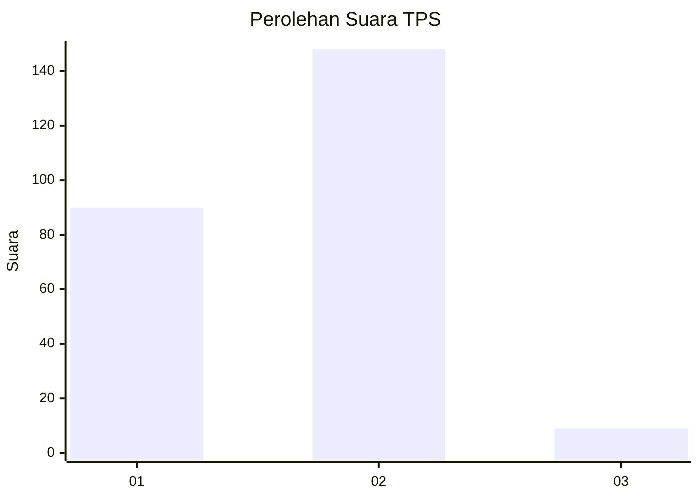
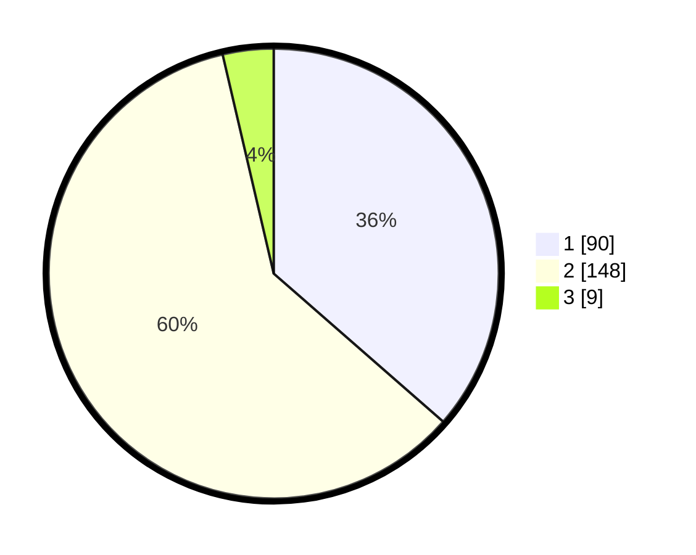

# Hasil

## Grafik

## Tabel

| No. | Nama Paslon    | Suara | Suara (raw) | Persentase |
|:--- |:-------------- | -----:| -----------:| ----------:|
| 1   | ANIES MUHAIMIN | 90    | [90][p-1]   | 36,44      |
| 2   | PRABOWO GIBRAN | 148   | [148][p-2]  | 59,92      |
| 3   | GANJAR MAHFUD  | 9     | [9][p-3]    | 3,64       |

[p-1]: https://github.com/gigit-pemilu/pemilu-2024-63-kalimantan-selatan/blob/main/pilpres/hitung-suara/sub/63-kalimantan-selatan/sub/03-banjar/sub/06-karang-intan/sub/2003-karang-intan/sub/001-tps/sub/paslon-1.txt
[p-2]: https://github.com/gigit-pemilu/pemilu-2024-63-kalimantan-selatan/blob/main/pilpres/hitung-suara/sub/63-kalimantan-selatan/sub/03-banjar/sub/06-karang-intan/sub/2003-karang-intan/sub/001-tps/sub/paslon-2.txt
[p-3]: https://github.com/gigit-pemilu/pemilu-2024-63-kalimantan-selatan/blob/main/pilpres/hitung-suara/sub/63-kalimantan-selatan/sub/03-banjar/sub/06-karang-intan/sub/2003-karang-intan/sub/001-tps/sub/paslon-3.txt

## Foto C Plano

https://sirekap-obj-formc.kpu.go.id/b648/pemilu/ppwp/63/03/06/20/03/6303062003001-20240215-080334--7792c385-c1d0-4738-b2d3-652510085089.jpg

https://sirekap-obj-formc.kpu.go.id/b648/pemilu/ppwp/63/03/06/20/03/6303062003001-20240215-080517--96b8f14b-d8c8-4ccf-af0e-804b0e2290a4.jpg

https://sirekap-obj-formc.kpu.go.id/b648/pemilu/ppwp/63/03/06/20/03/6303062003001-20240215-080611--00d7f992-a447-4ad6-97f6-8f77ce7c0434.jpg

## Metadata

| Key        | Value               |
| ---------- | ------------------- |
| Time Stamp | 2024-02-24 22:31:28 |

