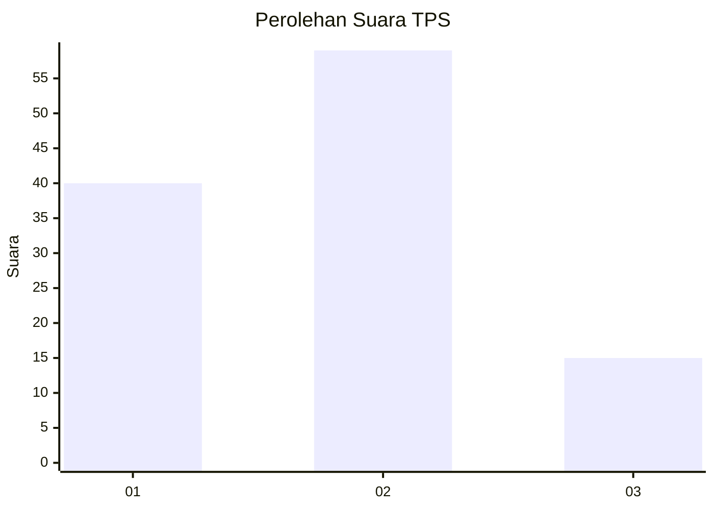
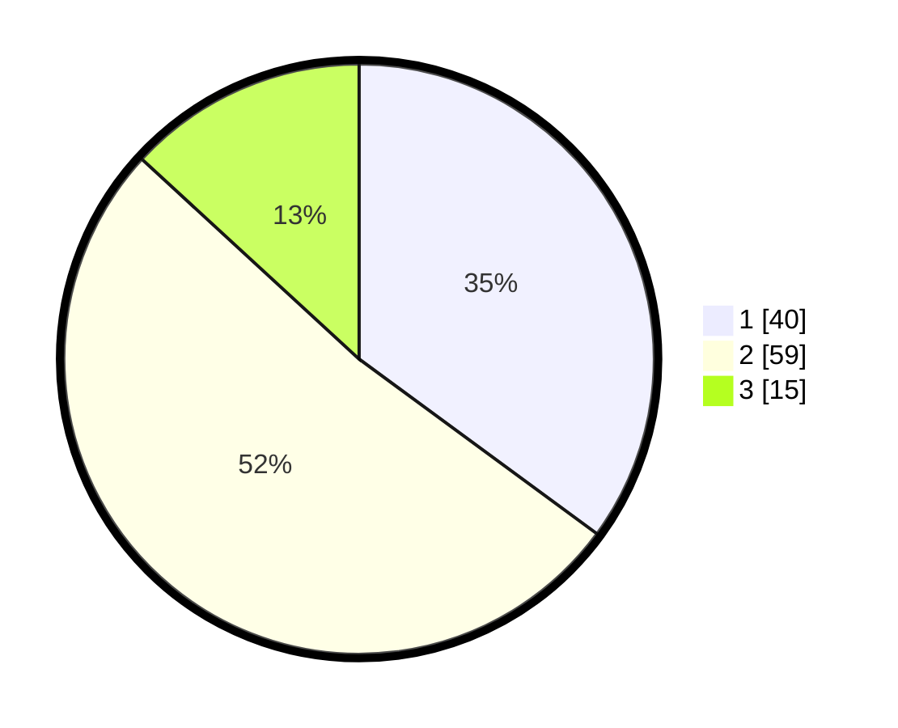

# Hasil

## Grafik

## Tabel

| No. | Nama Paslon    | Suara | Suara (raw) | Persentase |
|:--- |:-------------- | -----:| -----------:| ----------:|
| 1   | ANIES MUHAIMIN | 40    | [40][p-1]   | 35,09      |
| 2   | PRABOWO GIBRAN | 59    | [59][p-2]   | 51,75      |
| 3   | GANJAR MAHFUD  | 15    | [15][p-3]   | 13,16      |

[p-1]: https://github.com/gigit-pemilu/pemilu-2024/blob/main/pilpres/hitung-suara/sub/63-kalimantan-selatan/sub/03-banjar/sub/06-karang-intan/sub/2003-karang-intan/sub/003-tps/sub/paslon-1.txt
[p-2]: https://github.com/gigit-pemilu/pemilu-2024/blob/main/pilpres/hitung-suara/sub/63-kalimantan-selatan/sub/03-banjar/sub/06-karang-intan/sub/2003-karang-intan/sub/003-tps/sub/paslon-2.txt
[p-3]: https://github.com/gigit-pemilu/pemilu-2024/blob/main/pilpres/hitung-suara/sub/63-kalimantan-selatan/sub/03-banjar/sub/06-karang-intan/sub/2003-karang-intan/sub/003-tps/sub/paslon-3.txt

## Foto C Plano

https://sirekap-obj-formc.kpu.go.id/4c98/pemilu/ppwp/63/03/06/20/03/6303062003003-20240214-223429--48ef08a5-c8be-4606-b20e-d8c7d29bb40d.jpg

https://sirekap-obj-formc.kpu.go.id/4c98/pemilu/ppwp/63/03/06/20/03/6303062003003-20240214-223510--5808f86b-dc9b-4323-a84d-8eabf10f6b19.jpg

https://sirekap-obj-formc.kpu.go.id/4c98/pemilu/ppwp/63/03/06/20/03/6303062003003-20240214-223536--35b71665-73b4-4da1-bf9c-db16b1a25ede.jpg

## Metadata

| Key        | Value               |
| ---------- | ------------------- |
| Time Stamp | 2024-02-24 22:31:28 |

