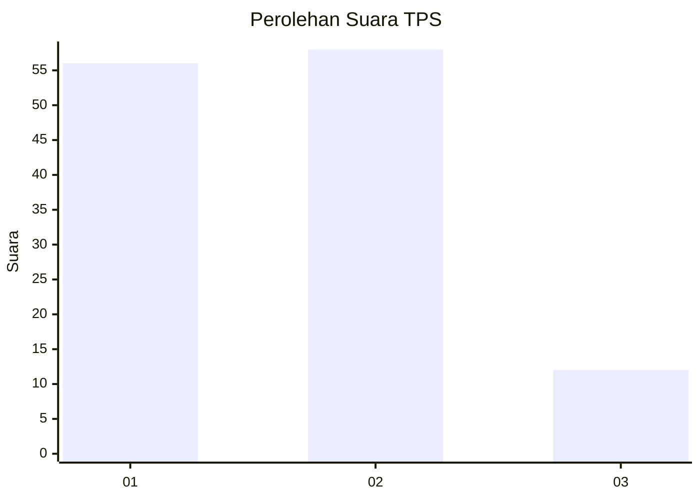
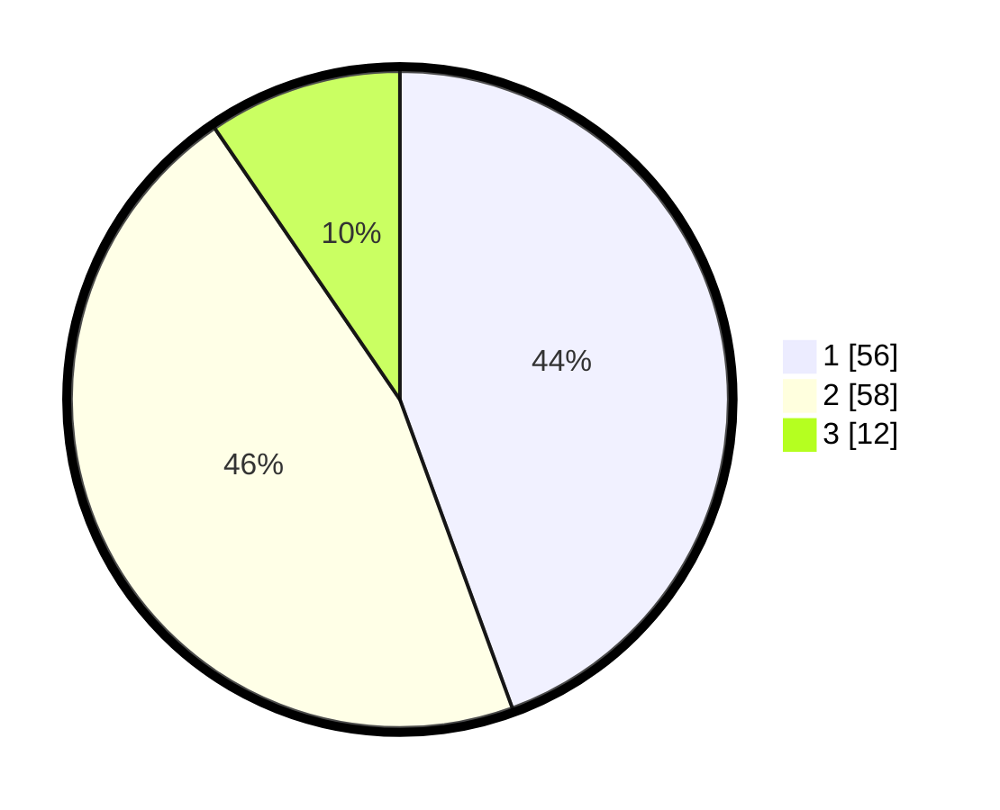

# Hasil

## Grafik

## Tabel

| No. | Nama Paslon    | Suara | Suara (raw) | Persentase |
|:--- |:-------------- | -----:| -----------:| ----------:|
| 1   | ANIES MUHAIMIN | 56    | [56][p-1]   | 44,44      |
| 2   | PRABOWO GIBRAN | 58    | [58][p-2]   | 46,03      |
| 3   | GANJAR MAHFUD  | 12    | [12][p-3]   | 9,52       |

[p-1]: https://github.com/gigit-pemilu/pemilu-2024-63-kalimantan-selatan/blob/main/pilpres/hitung-suara/sub/63-kalimantan-selatan/sub/03-banjar/sub/06-karang-intan/sub/2004-pandak-daun/sub/003-tps/sub/paslon-1.txt
[p-2]: https://github.com/gigit-pemilu/pemilu-2024-63-kalimantan-selatan/blob/main/pilpres/hitung-suara/sub/63-kalimantan-selatan/sub/03-banjar/sub/06-karang-intan/sub/2004-pandak-daun/sub/003-tps/sub/paslon-2.txt
[p-3]: https://github.com/gigit-pemilu/pemilu-2024-63-kalimantan-selatan/blob/main/pilpres/hitung-suara/sub/63-kalimantan-selatan/sub/03-banjar/sub/06-karang-intan/sub/2004-pandak-daun/sub/003-tps/sub/paslon-3.txt

## Foto C Plano

https://sirekap-obj-formc.kpu.go.id/f61d/pemilu/ppwp/63/03/06/20/04/6303062004003-20240218-100420--c1a0e205-aeca-415c-a5cc-b770abab77bf.jpg

https://sirekap-obj-formc.kpu.go.id/f61d/pemilu/ppwp/63/03/06/20/04/6303062004003-20240218-063250--2a23feea-e05f-4ce0-8b87-fdb6975c7262.jpg

https://sirekap-obj-formc.kpu.go.id/f61d/pemilu/ppwp/63/03/06/20/04/6303062004003-20240218-062738--59626daf-00b4-4e15-a895-8cc387551bbb.jpg

## Metadata

| Key        | Value               |
| ---------- | ------------------- |
| Time Stamp | 2024-02-24 22:31:28 |

