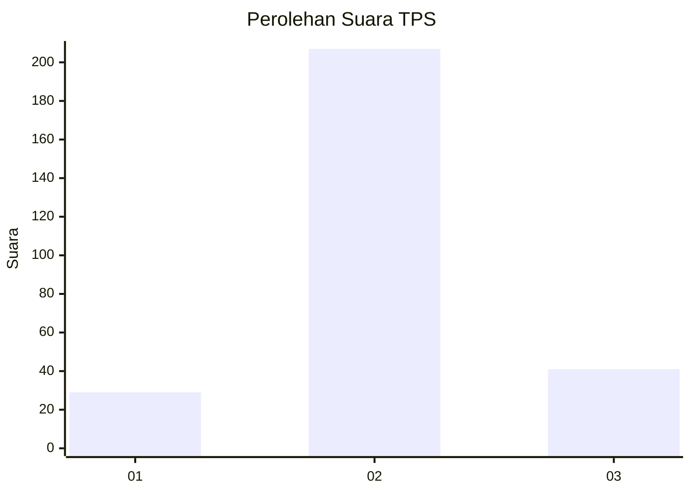

# Hasil

## Grafik

## Tabel

| No. | Nama Paslon    | Suara | Suara (raw) | Persentase |
|:--- |:-------------- | -----:| -----------:| ----------:|
| 1   | ANIES MUHAIMIN | 29    | [29][p-1]   | 10,47      |
| 2   | PRABOWO GIBRAN | 207   | [207][p-2]  | 74,73      |
| 3   | GANJAR MAHFUD  | 41    | [41][p-3]   | 14,80      |

[p-1]: https://github.com/gigit-pemilu/pemilu-2024/blob/main/pilpres/hitung-suara/sub/63-kalimantan-selatan/sub/03-banjar/sub/06-karang-intan/sub/2008-lihung/sub/904-tps/sub/paslon-1.txt
[p-2]: https://github.com/gigit-pemilu/pemilu-2024/blob/main/pilpres/hitung-suara/sub/63-kalimantan-selatan/sub/03-banjar/sub/06-karang-intan/sub/2008-lihung/sub/904-tps/sub/paslon-2.txt
[p-3]: https://github.com/gigit-pemilu/pemilu-2024/blob/main/pilpres/hitung-suara/sub/63-kalimantan-selatan/sub/03-banjar/sub/06-karang-intan/sub/2008-lihung/sub/904-tps/sub/paslon-3.txt

## Foto C Plano

https://sirekap-obj-formc.kpu.go.id/587f/pemilu/ppwp/63/03/06/20/08/6303062008904-20240216-103756--027a549e-f357-42bd-be32-b50549f9b558.jpg

https://sirekap-obj-formc.kpu.go.id/587f/pemilu/ppwp/63/03/06/20/08/6303062008904-20240216-103814--4417e7aa-44ff-432f-92a7-d0f73974de4c.jpg

https://sirekap-obj-formc.kpu.go.id/587f/pemilu/ppwp/63/03/06/20/08/6303062008904-20240216-103819--2c441add-8e67-427b-9ed8-21ac3bae8d3f.jpg

## Metadata

| Key        | Value               |
| ---------- | ------------------- |
| Time Stamp | 2024-02-25 17:00:00 |

