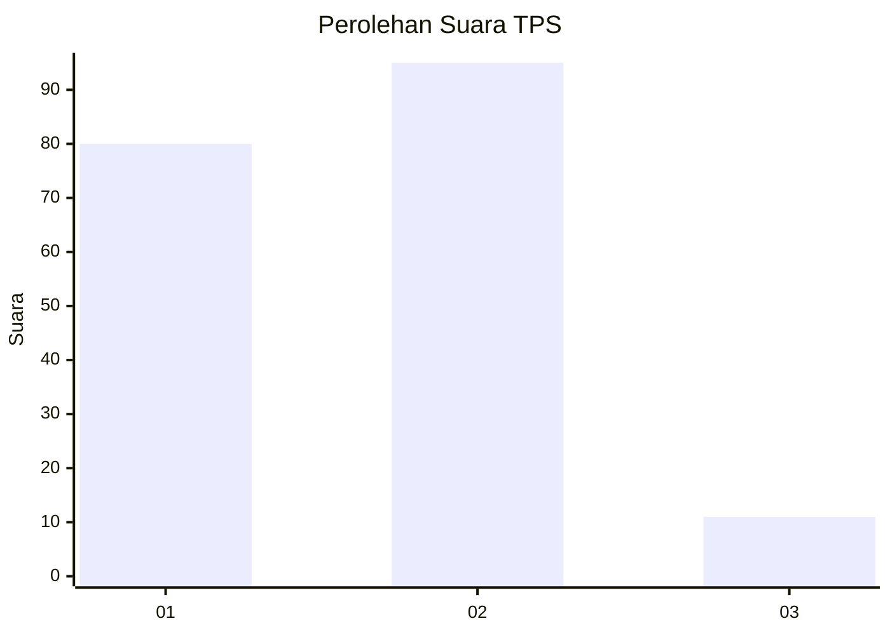
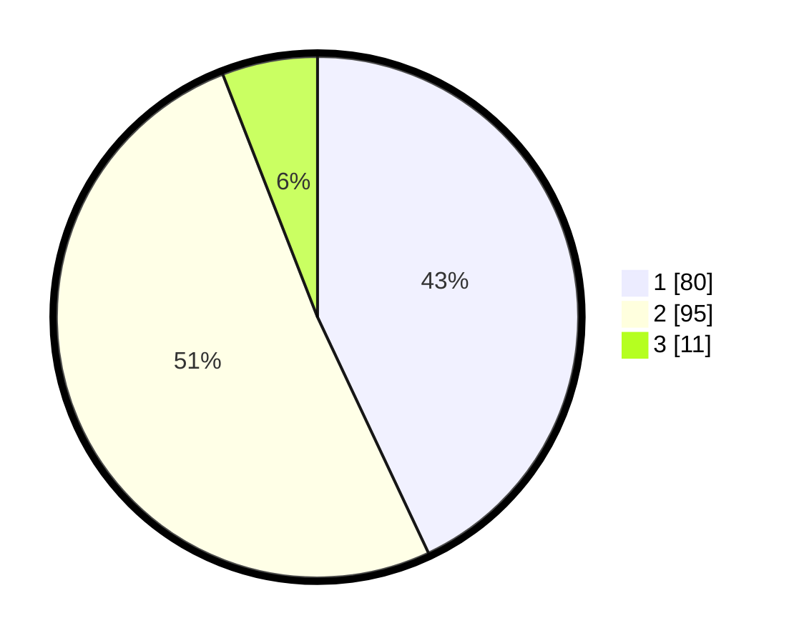

# Hasil

## Grafik

## Tabel

| No. | Nama Paslon    | Suara | Suara (raw) | Persentase |
|:--- |:-------------- | -----:| -----------:| ----------:|
| 1   | ANIES MUHAIMIN | 80    | [80][p-1]   | 43,01      |
| 2   | PRABOWO GIBRAN | 95    | [95][p-2]   | 51,08      |
| 3   | GANJAR MAHFUD  | 11    | [11][p-3]   | 5,91       |

[p-1]: https://github.com/gigit-pemilu/pemilu-2024/blob/main/pilpres/hitung-suara/sub/63-kalimantan-selatan/sub/03-banjar/sub/07-astambul/sub/2002-jati-baru/sub/004-tps/sub/paslon-1.txt
[p-2]: https://github.com/gigit-pemilu/pemilu-2024/blob/main/pilpres/hitung-suara/sub/63-kalimantan-selatan/sub/03-banjar/sub/07-astambul/sub/2002-jati-baru/sub/004-tps/sub/paslon-2.txt
[p-3]: https://github.com/gigit-pemilu/pemilu-2024/blob/main/pilpres/hitung-suara/sub/63-kalimantan-selatan/sub/03-banjar/sub/07-astambul/sub/2002-jati-baru/sub/004-tps/sub/paslon-3.txt

## Foto C Plano

https://sirekap-obj-formc.kpu.go.id/abe1/pemilu/ppwp/63/03/07/20/02/6303072002004-20240215-044442--eff0ffee-62ba-4c53-b72c-3127f362e4c6.jpg

https://sirekap-obj-formc.kpu.go.id/abe1/pemilu/ppwp/63/03/07/20/02/6303072002004-20240215-044525--8e906d05-d413-498e-b6b8-a14b896e8d13.jpg

https://sirekap-obj-formc.kpu.go.id/abe1/pemilu/ppwp/63/03/07/20/02/6303072002004-20240215-045156--1c9e343e-567d-429e-9d70-2ac9c0614210.jpg

## Metadata

| Key        | Value               |
| ---------- | ------------------- |
| Time Stamp | 2024-02-25 16:00:00 |

