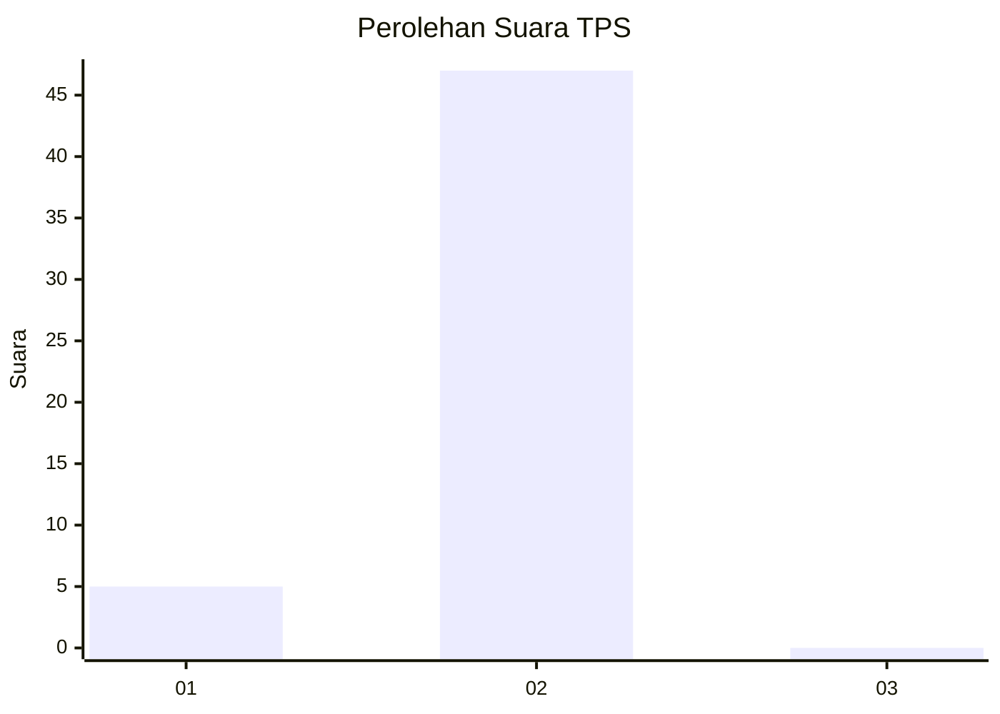
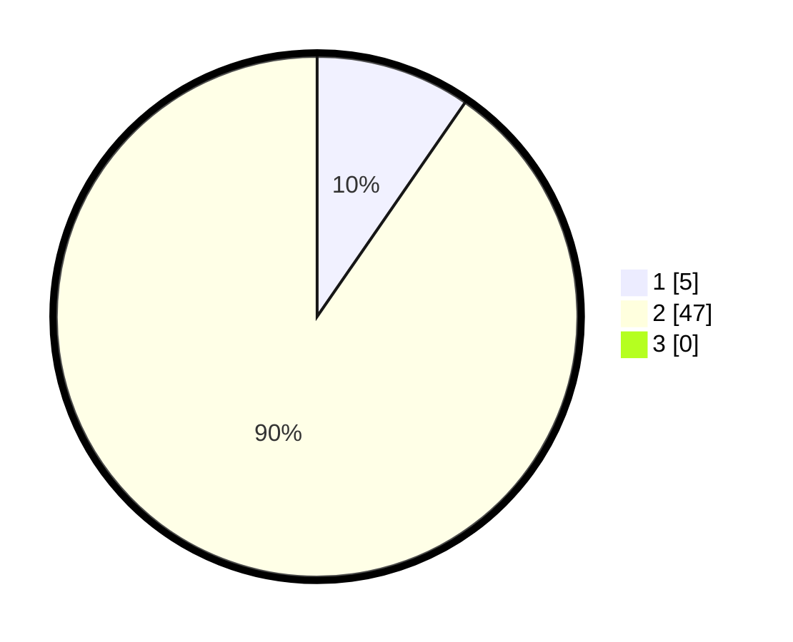

# Hasil

## Grafik

## Tabel

| No. | Nama Paslon    | Suara | Suara (raw) | Persentase |
|:--- |:-------------- | -----:| -----------:| ----------:|
| 1   | ANIES MUHAIMIN | 5     | [5][p-1]    | 9,62       |
| 2   | PRABOWO GIBRAN | 47    | [47][p-2]   | 90,38      |
| 3   | GANJAR MAHFUD  | 0     | [0][p-3]    | 0,00       |

[p-1]: https://github.com/gigit-pemilu/pemilu-2024-63-kalimantan-selatan/blob/main/pilpres/hitung-suara/sub/63-kalimantan-selatan/sub/03-banjar/sub/07-astambul/sub/2004-danau-salak/sub/009-tps/sub/paslon-1.txt
[p-2]: https://github.com/gigit-pemilu/pemilu-2024-63-kalimantan-selatan/blob/main/pilpres/hitung-suara/sub/63-kalimantan-selatan/sub/03-banjar/sub/07-astambul/sub/2004-danau-salak/sub/009-tps/sub/paslon-2.txt
[p-3]: https://github.com/gigit-pemilu/pemilu-2024-63-kalimantan-selatan/blob/main/pilpres/hitung-suara/sub/63-kalimantan-selatan/sub/03-banjar/sub/07-astambul/sub/2004-danau-salak/sub/009-tps/sub/paslon-3.txt

## Foto C Plano

https://sirekap-obj-formc.kpu.go.id/bfe5/pemilu/ppwp/63/03/07/20/04/6303072004009-20240215-003603--97a61055-ec7f-4b48-ad16-6dd0cb5f9841.jpg

https://sirekap-obj-formc.kpu.go.id/bfe5/pemilu/ppwp/63/03/07/20/04/6303072004009-20240215-003732--54da76ad-2deb-4bb5-b8bf-cdad285871ef.jpg

https://sirekap-obj-formc.kpu.go.id/bfe5/pemilu/ppwp/63/03/07/20/04/6303072004009-20240215-003902--f2ffdc76-f8f0-411a-b1fc-d89109b3078f.jpg

## Metadata

| Key        | Value               |
| ---------- | ------------------- |
| Time Stamp | 2024-02-26 03:00:00 |

