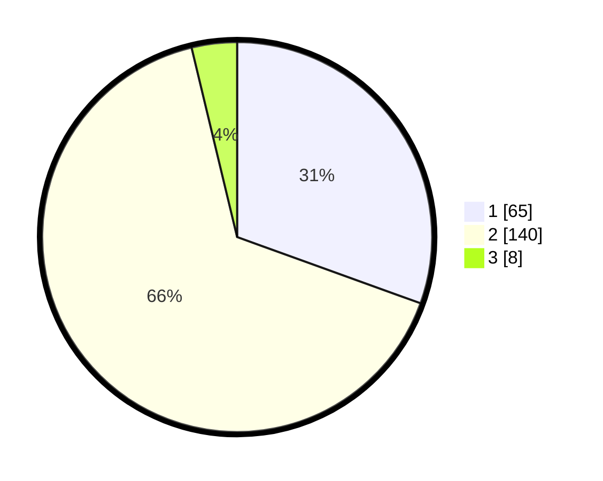

# Hasil

## Grafik

## Tabel

| No. | Nama Paslon    | Suara | Suara (raw) | Persentase |
|:--- |:-------------- | -----:| -----------:| ----------:|
| 1   | ANIES MUHAIMIN | 65    | [65][p-1]   | 30,52      |
| 2   | PRABOWO GIBRAN | 140   | [140][p-2]  | 65,73      |
| 3   | GANJAR MAHFUD  | 8     | [8][p-3]    | 3,76       |

[p-1]: https://github.com/gigit-pemilu/pemilu-2024/blob/main/pilpres/hitung-suara/sub/63-kalimantan-selatan/sub/03-banjar/sub/07-astambul/sub/2017-pematang-hambawang/sub/002-tps/sub/paslon-1.txt
[p-2]: https://github.com/gigit-pemilu/pemilu-2024/blob/main/pilpres/hitung-suara/sub/63-kalimantan-selatan/sub/03-banjar/sub/07-astambul/sub/2017-pematang-hambawang/sub/002-tps/sub/paslon-2.txt
[p-3]: https://github.com/gigit-pemilu/pemilu-2024/blob/main/pilpres/hitung-suara/sub/63-kalimantan-selatan/sub/03-banjar/sub/07-astambul/sub/2017-pematang-hambawang/sub/002-tps/sub/paslon-3.txt

## Foto C Plano

https://sirekap-obj-formc.kpu.go.id/dc1e/pemilu/ppwp/63/03/07/20/17/6303072017002-20240214-215449--cb26c344-80f4-4a9d-9e59-628272d2b6b2.jpg

https://sirekap-obj-formc.kpu.go.id/dc1e/pemilu/ppwp/63/03/07/20/17/6303072017002-20240214-215628--ab1f7650-8de1-4912-a39b-3452a4c662e8.jpg

https://sirekap-obj-formc.kpu.go.id/dc1e/pemilu/ppwp/63/03/07/20/17/6303072017002-20240214-215826--d27442f5-c475-4a8e-a838-ce40b41c0184.jpg

## Metadata

| Key        | Value               |
| ---------- | ------------------- |
| Time Stamp | 2024-02-25 11:00:00 |

