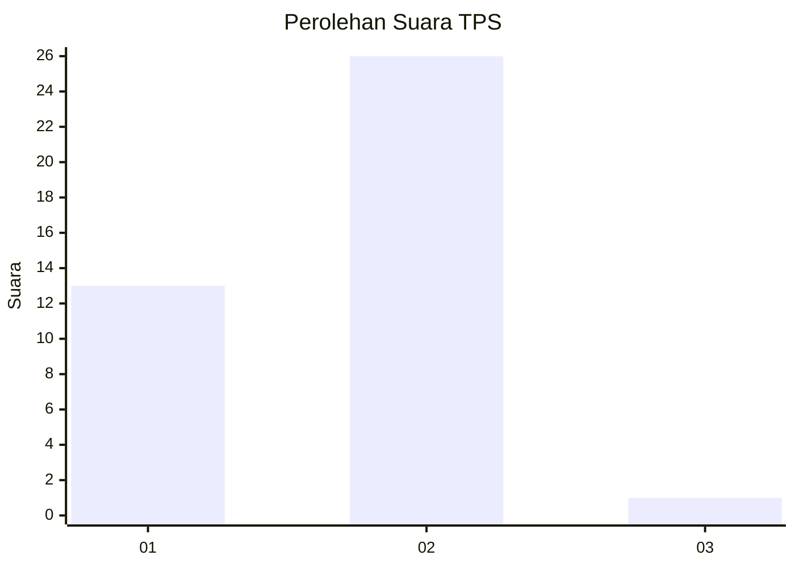
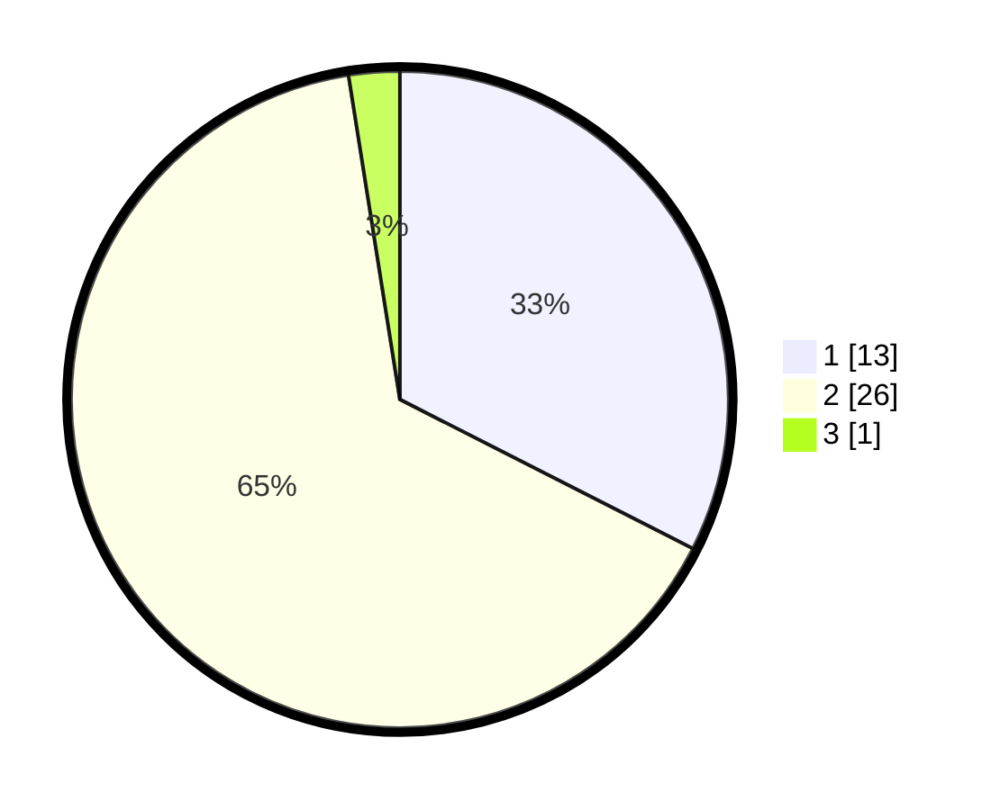

# Hasil

## Grafik

## Tabel

| No. | Nama Paslon    | Suara | Suara (raw) | Persentase |
|:--- |:-------------- | -----:| -----------:| ----------:|
| 1   | ANIES MUHAIMIN | 13    | [13][p-1]   | 32,50      |
| 2   | PRABOWO GIBRAN | 26    | [26][p-2]   | 65,00      |
| 3   | GANJAR MAHFUD  | 1     | [1][p-3]    | 2,50       |

[p-1]: https://github.com/gigit-pemilu/pemilu-2024-63-kalimantan-selatan/blob/main/pilpres/hitung-suara/sub/63-kalimantan-selatan/sub/03-banjar/sub/07-astambul/sub/2020-banua-anyar-danau-salak/sub/004-tps/sub/paslon-1.txt
[p-2]: https://github.com/gigit-pemilu/pemilu-2024-63-kalimantan-selatan/blob/main/pilpres/hitung-suara/sub/63-kalimantan-selatan/sub/03-banjar/sub/07-astambul/sub/2020-banua-anyar-danau-salak/sub/004-tps/sub/paslon-2.txt
[p-3]: https://github.com/gigit-pemilu/pemilu-2024-63-kalimantan-selatan/blob/main/pilpres/hitung-suara/sub/63-kalimantan-selatan/sub/03-banjar/sub/07-astambul/sub/2020-banua-anyar-danau-salak/sub/004-tps/sub/paslon-3.txt

## Foto C Plano

https://sirekap-obj-formc.kpu.go.id/df46/pemilu/ppwp/63/03/07/20/20/6303072020004-20240215-044916--0824514a-dea2-4c5c-9ccd-ca109f9a51c2.jpg

https://sirekap-obj-formc.kpu.go.id/df46/pemilu/ppwp/63/03/07/20/20/6303072020004-20240214-233244--0b902e6b-347f-4741-8082-b5dde3c58529.jpg

https://sirekap-obj-formc.kpu.go.id/df46/pemilu/ppwp/63/03/07/20/20/6303072020004-20240214-233421--a7f90280-c226-4f87-a264-98d2e9a4e868.jpg

## Metadata

| Key        | Value               |
| ---------- | ------------------- |
| Time Stamp | 2024-02-24 23:00:00 |

