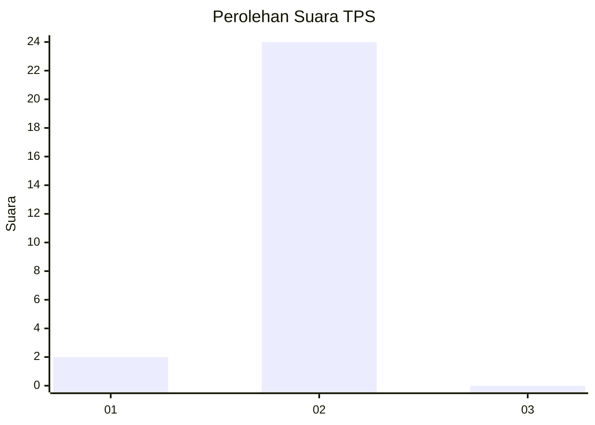
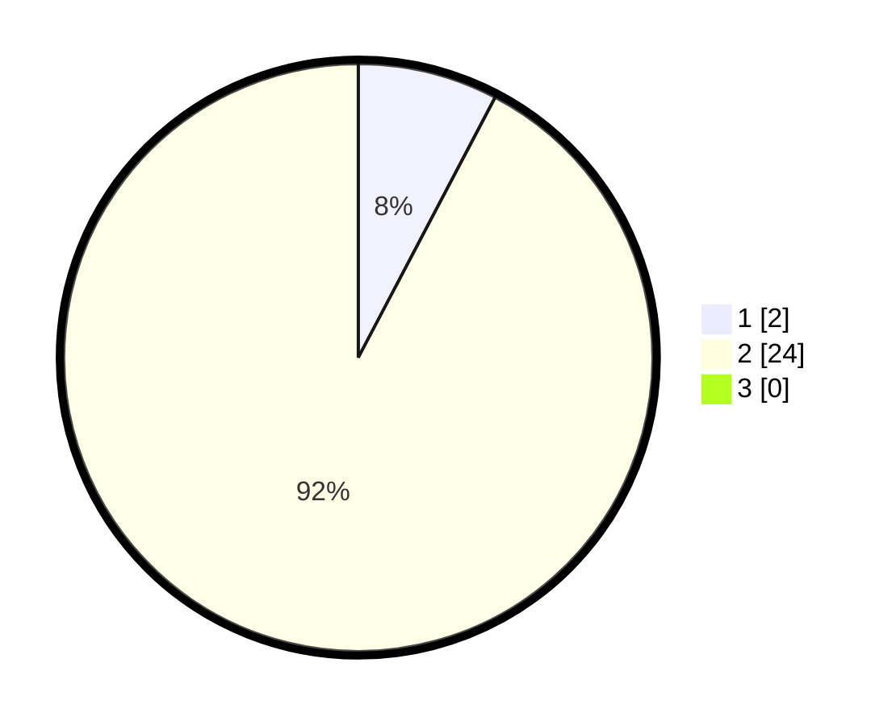

# Hasil

## Grafik

## Tabel

| No. | Nama Paslon    | Suara | Suara (raw) | Persentase |
|:--- |:-------------- | -----:| -----------:| ----------:|
| 1   | ANIES MUHAIMIN | 2     | [2][p-1]    | 7,69       |
| 2   | PRABOWO GIBRAN | 24    | [24][p-2]   | 92,31      |
| 3   | GANJAR MAHFUD  | 0     | [0][p-3]    | 0,00       |

[p-1]: https://github.com/gigit-pemilu/pemilu-2024/blob/main/pilpres/hitung-suara/sub/63-kalimantan-selatan/sub/03-banjar/sub/07-astambul/sub/2020-banua-anyar-danau-salak/sub/006-tps/sub/paslon-1.txt
[p-2]: https://github.com/gigit-pemilu/pemilu-2024/blob/main/pilpres/hitung-suara/sub/63-kalimantan-selatan/sub/03-banjar/sub/07-astambul/sub/2020-banua-anyar-danau-salak/sub/006-tps/sub/paslon-2.txt
[p-3]: https://github.com/gigit-pemilu/pemilu-2024/blob/main/pilpres/hitung-suara/sub/63-kalimantan-selatan/sub/03-banjar/sub/07-astambul/sub/2020-banua-anyar-danau-salak/sub/006-tps/sub/paslon-3.txt

## Foto C Plano

https://sirekap-obj-formc.kpu.go.id/86ab/pemilu/ppwp/63/03/07/20/20/6303072020006-20240215-013537--a66708c9-632d-4532-87ac-8b8009320a5f.jpg

https://sirekap-obj-formc.kpu.go.id/86ab/pemilu/ppwp/63/03/07/20/20/6303072020006-20240215-013617--4b9ad7b4-b191-41ae-a77c-9e4e9f4774b4.jpg

https://sirekap-obj-formc.kpu.go.id/86ab/pemilu/ppwp/63/03/07/20/20/6303072020006-20240215-013731--92f9f8c2-c57a-433e-83c7-27bf779529ff.jpg

## Metadata

| Key        | Value               |
| ---------- | ------------------- |
| Time Stamp | 2024-02-25 18:00:00 |

