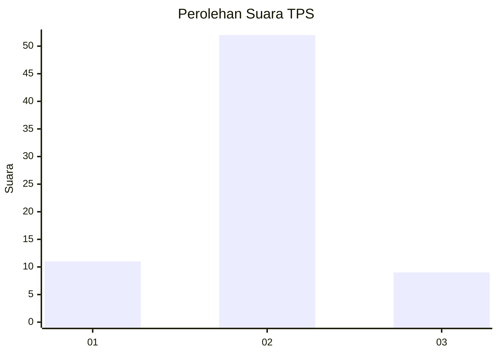
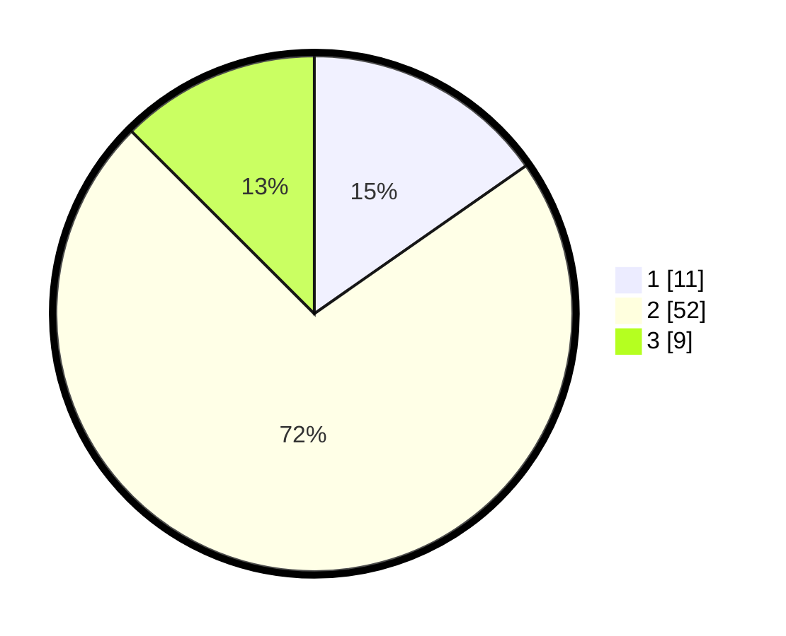

# Hasil

## Grafik

## Tabel

| No. | Nama Paslon    | Suara | Suara (raw) | Persentase |
|:--- |:-------------- | -----:| -----------:| ----------:|
| 1   | ANIES MUHAIMIN | 11    | [11][p-1]   | 15,28      |
| 2   | PRABOWO GIBRAN | 52    | [52][p-2]   | 72,22      |
| 3   | GANJAR MAHFUD  | 9     | [9][p-3]    | 12,50      |

[p-1]: https://github.com/gigit-pemilu/pemilu-2024-63-kalimantan-selatan/blob/main/pilpres/hitung-suara/sub/63-kalimantan-selatan/sub/03-banjar/sub/08-simpang-empat/sub/2011-sungai-langsat/sub/003-tps/sub/paslon-1.txt
[p-2]: https://github.com/gigit-pemilu/pemilu-2024-63-kalimantan-selatan/blob/main/pilpres/hitung-suara/sub/63-kalimantan-selatan/sub/03-banjar/sub/08-simpang-empat/sub/2011-sungai-langsat/sub/003-tps/sub/paslon-2.txt
[p-3]: https://github.com/gigit-pemilu/pemilu-2024-63-kalimantan-selatan/blob/main/pilpres/hitung-suara/sub/63-kalimantan-selatan/sub/03-banjar/sub/08-simpang-empat/sub/2011-sungai-langsat/sub/003-tps/sub/paslon-3.txt

## Foto C Plano

https://sirekap-obj-formc.kpu.go.id/65ca/pemilu/ppwp/63/03/08/20/11/6303082011003-20240215-015827--a122a649-c961-4ff9-a527-4cbd3ea636b0.jpg

https://sirekap-obj-formc.kpu.go.id/65ca/pemilu/ppwp/63/03/08/20/11/6303082011003-20240215-020839--cdcf75ed-6ae3-45a8-8e7c-863933ea53ab.jpg

https://sirekap-obj-formc.kpu.go.id/65ca/pemilu/ppwp/63/03/08/20/11/6303082011003-20240215-020705--bbcb76e9-930e-434c-95bc-7ded62f9a0e6.jpg

## Metadata

| Key        | Value               |
| ---------- | ------------------- |
| Time Stamp | 2024-02-26 15:00:00 |

