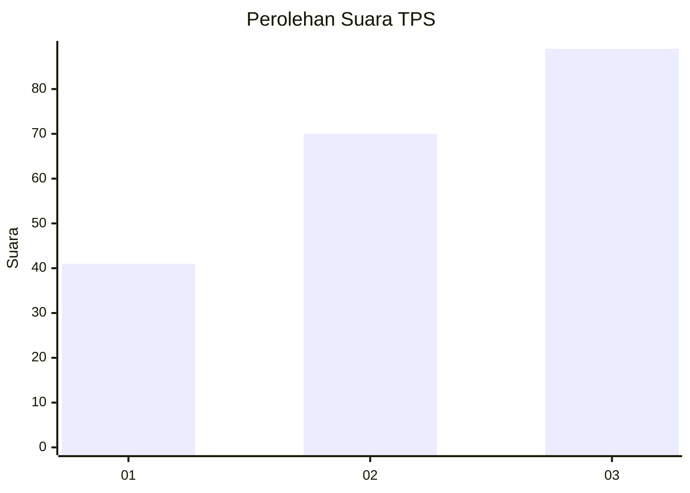
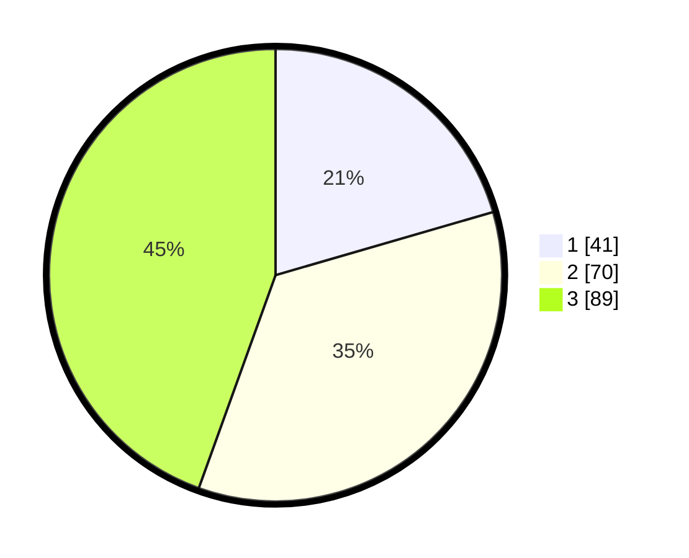

# Hasil

## Grafik

## Tabel

| No. | Nama Paslon    | Suara | Suara (raw) | Persentase |
|:--- |:-------------- | -----:| -----------:| ----------:|
| 1   | ANIES MUHAIMIN | 41    | [41][p-1]   | 20,50      |
| 2   | PRABOWO GIBRAN | 70    | [70][p-2]   | 35,00      |
| 3   | GANJAR MAHFUD  | 89    | [89][p-3]   | 44,50      |

[p-1]: https://github.com/gigit-pemilu/pemilu-2024-63-kalimantan-selatan/blob/main/pilpres/hitung-suara/sub/63-kalimantan-selatan/sub/03-banjar/sub/10-sungai-pinang/sub/2003-kahelaan/sub/010-tps/sub/paslon-1.txt
[p-2]: https://github.com/gigit-pemilu/pemilu-2024-63-kalimantan-selatan/blob/main/pilpres/hitung-suara/sub/63-kalimantan-selatan/sub/03-banjar/sub/10-sungai-pinang/sub/2003-kahelaan/sub/010-tps/sub/paslon-2.txt
[p-3]: https://github.com/gigit-pemilu/pemilu-2024-63-kalimantan-selatan/blob/main/pilpres/hitung-suara/sub/63-kalimantan-selatan/sub/03-banjar/sub/10-sungai-pinang/sub/2003-kahelaan/sub/010-tps/sub/paslon-3.txt

## Foto C Plano

https://sirekap-obj-formc.kpu.go.id/5ed6/pemilu/ppwp/63/03/10/20/03/6303102003010-20240220-073356--84038302-0892-4db5-a766-6c966de60a72.jpg

https://sirekap-obj-formc.kpu.go.id/5ed6/pemilu/ppwp/63/03/10/20/03/6303102003010-20240220-073108--45ffc58d-d4fc-445c-b82b-aad46cfa6bb1.jpg

https://sirekap-obj-formc.kpu.go.id/5ed6/pemilu/ppwp/63/03/10/20/03/6303102003010-20240220-073457--5461bc25-58bf-41c1-85f8-8671199b9e22.jpg

## Metadata

| Key        | Value               |
| ---------- | ------------------- |
| Time Stamp | 2024-02-26 11:00:00 |

