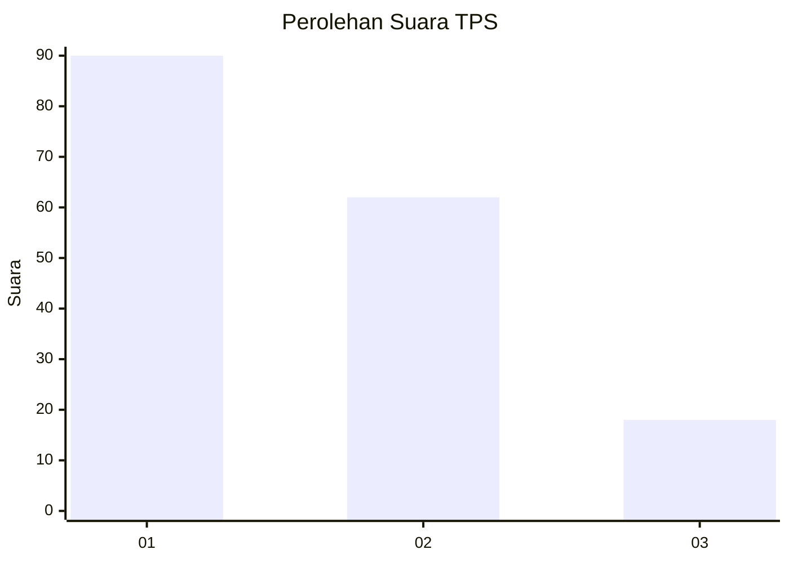
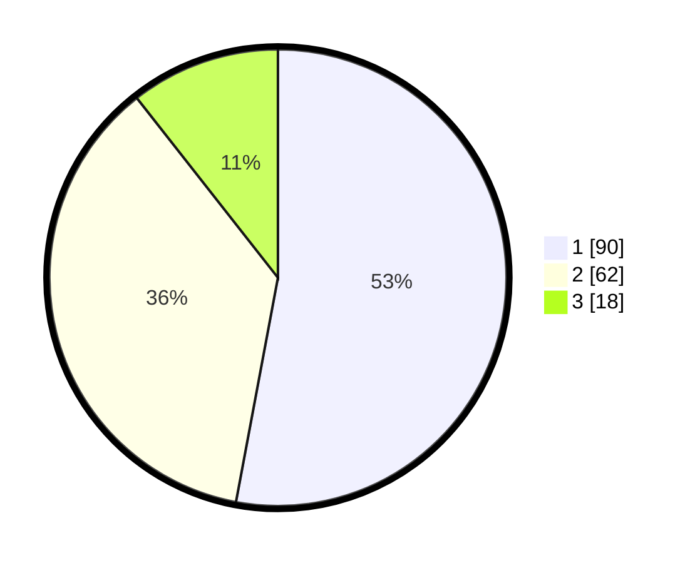

# Hasil

## Grafik

## Tabel

| No. | Nama Paslon    | Suara | Suara (raw) | Persentase |
|:--- |:-------------- | -----:| -----------:| ----------:|
| 1   | ANIES MUHAIMIN | 90    | [90][p-1]   | 52,94      |
| 2   | PRABOWO GIBRAN | 62    | [62][p-2]   | 36,47      |
| 3   | GANJAR MAHFUD  | 18    | [18][p-3]   | 10,59      |

[p-1]: https://github.com/gigit-pemilu/pemilu-2024/blob/main/pilpres/hitung-suara/sub/63-kalimantan-selatan/sub/03-banjar/sub/13-beruntung-baru/sub/2001-pindahan-baru/sub/001-tps/sub/paslon-1.txt
[p-2]: https://github.com/gigit-pemilu/pemilu-2024/blob/main/pilpres/hitung-suara/sub/63-kalimantan-selatan/sub/03-banjar/sub/13-beruntung-baru/sub/2001-pindahan-baru/sub/001-tps/sub/paslon-2.txt
[p-3]: https://github.com/gigit-pemilu/pemilu-2024/blob/main/pilpres/hitung-suara/sub/63-kalimantan-selatan/sub/03-banjar/sub/13-beruntung-baru/sub/2001-pindahan-baru/sub/001-tps/sub/paslon-3.txt

## Foto C Plano

https://sirekap-obj-formc.kpu.go.id/67b6/pemilu/ppwp/63/03/13/20/01/6303132001001-20240215-170359--4a47f254-4536-442e-814c-61fca9366a36.jpg

https://sirekap-obj-formc.kpu.go.id/67b6/pemilu/ppwp/63/03/13/20/01/6303132001001-20240215-000233--39e74e1c-9848-4422-9ba2-9f602a4ea9ab.jpg

https://sirekap-obj-formc.kpu.go.id/67b6/pemilu/ppwp/63/03/13/20/01/6303132001001-20240215-150129--f1176a5b-c6af-40c7-9747-715eefa77cd7.jpg

## Metadata

| Key        | Value               |
| ---------- | ------------------- |
| Time Stamp | 2024-02-15 20:30:46 |

