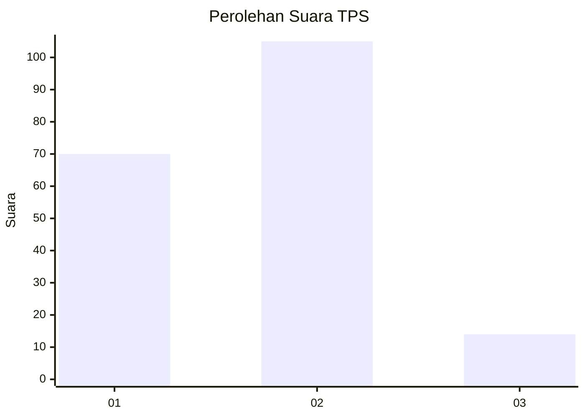

# Hasil

## Grafik

## Tabel

| No. | Nama Paslon    | Suara | Suara (raw) | Persentase |
|:--- |:-------------- | -----:| -----------:| ----------:|
| 1   | ANIES MUHAIMIN | 70    | [70][p-1]   | 37,04      |
| 2   | PRABOWO GIBRAN | 105   | [105][p-2]  | 55,56      |
| 3   | GANJAR MAHFUD  | 14    | [14][p-3]   | 7,41       |

[p-1]: https://github.com/gigit-pemilu/pemilu-2024/blob/main/pilpres/hitung-suara/sub/63-kalimantan-selatan/sub/03-banjar/sub/13-beruntung-baru/sub/2005-babirik/sub/001-tps/sub/paslon-1.txt
[p-2]: https://github.com/gigit-pemilu/pemilu-2024/blob/main/pilpres/hitung-suara/sub/63-kalimantan-selatan/sub/03-banjar/sub/13-beruntung-baru/sub/2005-babirik/sub/001-tps/sub/paslon-2.txt
[p-3]: https://github.com/gigit-pemilu/pemilu-2024/blob/main/pilpres/hitung-suara/sub/63-kalimantan-selatan/sub/03-banjar/sub/13-beruntung-baru/sub/2005-babirik/sub/001-tps/sub/paslon-3.txt

## Foto C Plano

https://sirekap-obj-formc.kpu.go.id/3f6d/pemilu/ppwp/63/03/13/20/05/6303132005001-20240215-112752--d3e5735e-7cfb-4886-a07d-70b340471011.jpg

https://sirekap-obj-formc.kpu.go.id/3f6d/pemilu/ppwp/63/03/13/20/05/6303132005001-20240216-071903--5cc3562b-822d-41d7-98be-5db96b4c2ac9.jpg

https://sirekap-obj-formc.kpu.go.id/3f6d/pemilu/ppwp/63/03/13/20/05/6303132005001-20240215-113855--3f0a8ab6-06ba-4168-89ab-cd752ca71ae9.jpg

## Metadata

| Key        | Value               |
| ---------- | ------------------- |
| Time Stamp | 2024-02-24 22:31:28 |

