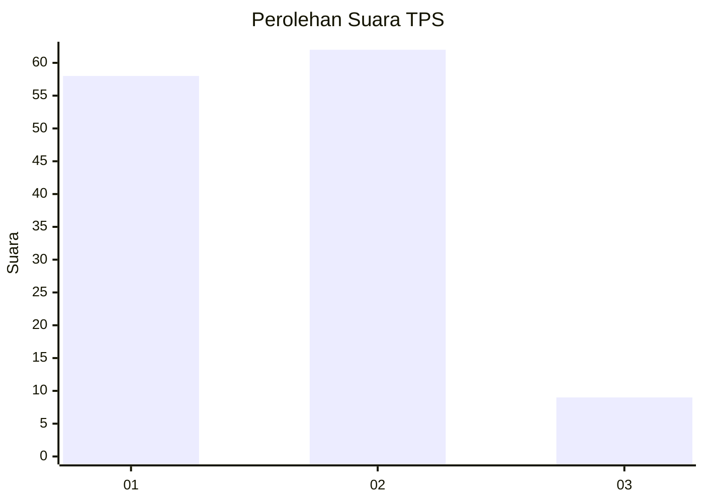
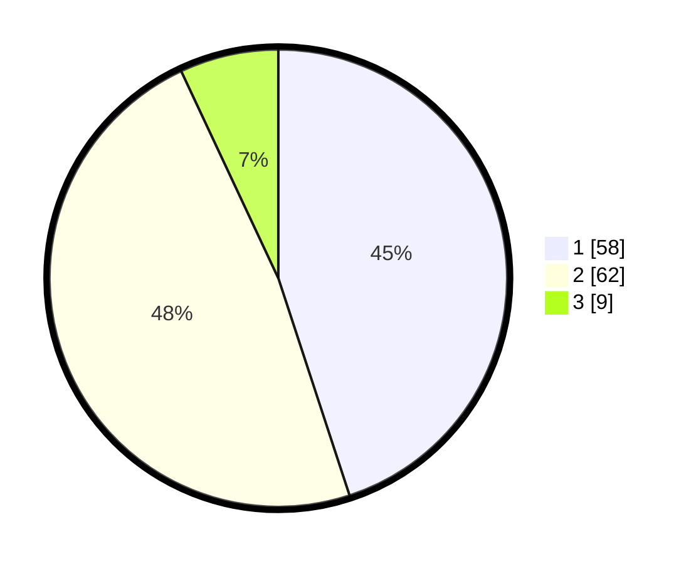

# Hasil

## Grafik

## Tabel

| No. | Nama Paslon    | Suara | Suara (raw) | Persentase |
|:--- |:-------------- | -----:| -----------:| ----------:|
| 1   | ANIES MUHAIMIN | 58    | [58][p-1]   | 44,96      |
| 2   | PRABOWO GIBRAN | 62    | [62][p-2]   | 48,06      |
| 3   | GANJAR MAHFUD  | 9     | [9][p-3]    | 6,98       |

[p-1]: https://github.com/gigit-pemilu/pemilu-2024-63-kalimantan-selatan/blob/main/pilpres/hitung-suara/sub/63-kalimantan-selatan/sub/03-banjar/sub/14-martapura-barat/sub/2002-sungai-batang/sub/004-tps/sub/paslon-1.txt
[p-2]: https://github.com/gigit-pemilu/pemilu-2024-63-kalimantan-selatan/blob/main/pilpres/hitung-suara/sub/63-kalimantan-selatan/sub/03-banjar/sub/14-martapura-barat/sub/2002-sungai-batang/sub/004-tps/sub/paslon-2.txt
[p-3]: https://github.com/gigit-pemilu/pemilu-2024-63-kalimantan-selatan/blob/main/pilpres/hitung-suara/sub/63-kalimantan-selatan/sub/03-banjar/sub/14-martapura-barat/sub/2002-sungai-batang/sub/004-tps/sub/paslon-3.txt

## Foto C Plano

https://sirekap-obj-formc.kpu.go.id/3f0c/pemilu/ppwp/63/03/14/20/02/6303142002004-20240215-083831--b8858bd4-df58-4cc3-90f6-71a6b2ef0281.jpg

https://sirekap-obj-formc.kpu.go.id/3f0c/pemilu/ppwp/63/03/14/20/02/6303142002004-20240215-083931--9f2dfacb-a84d-4378-99a1-87688c434a7f.jpg

https://sirekap-obj-formc.kpu.go.id/3f0c/pemilu/ppwp/63/03/14/20/02/6303142002004-20240215-084024--140d3aa2-6f8f-446a-a4ee-c1f3f21e660e.jpg

## Metadata

| Key        | Value               |
| ---------- | ------------------- |
| Time Stamp | 2024-02-25 11:00:00 |

