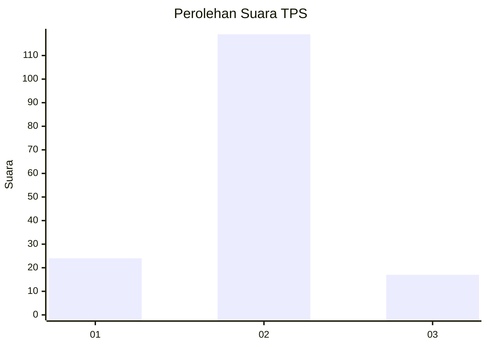
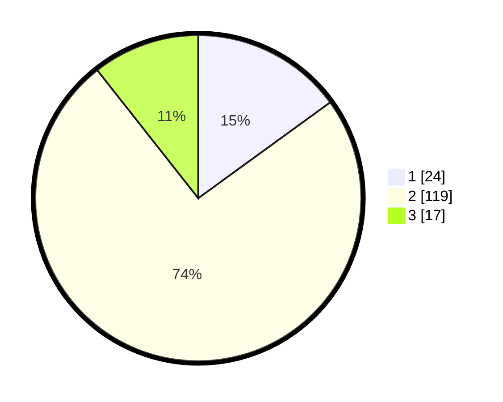

# Hasil

## Grafik

## Tabel

| No. | Nama Paslon    | Suara | Suara (raw) | Persentase |
|:--- |:-------------- | -----:| -----------:| ----------:|
| 1   | ANIES MUHAIMIN | 24    | [24][p-1]   | 15,00      |
| 2   | PRABOWO GIBRAN | 119   | [119][p-2]  | 74,38      |
| 3   | GANJAR MAHFUD  | 17    | [17][p-3]   | 10,63      |

[p-1]: https://github.com/gigit-pemilu/pemilu-2024/blob/main/pilpres/hitung-suara/sub/63-kalimantan-selatan/sub/03-banjar/sub/14-martapura-barat/sub/2002-sungai-batang/sub/006-tps/sub/paslon-1.txt
[p-2]: https://github.com/gigit-pemilu/pemilu-2024/blob/main/pilpres/hitung-suara/sub/63-kalimantan-selatan/sub/03-banjar/sub/14-martapura-barat/sub/2002-sungai-batang/sub/006-tps/sub/paslon-2.txt
[p-3]: https://github.com/gigit-pemilu/pemilu-2024/blob/main/pilpres/hitung-suara/sub/63-kalimantan-selatan/sub/03-banjar/sub/14-martapura-barat/sub/2002-sungai-batang/sub/006-tps/sub/paslon-3.txt

## Foto C Plano

https://sirekap-obj-formc.kpu.go.id/8b52/pemilu/ppwp/63/03/14/20/02/6303142002006-20240215-020958--f6564cb7-b27f-4419-9df4-6b0ad8ba9713.jpg

https://sirekap-obj-formc.kpu.go.id/8b52/pemilu/ppwp/63/03/14/20/02/6303142002006-20240215-015655--3d88d6a3-2cb8-479b-92d9-9e65b6aee4a8.jpg

https://sirekap-obj-formc.kpu.go.id/8b52/pemilu/ppwp/63/03/14/20/02/6303142002006-20240215-015733--e201f32e-0aff-46bc-a66b-aaf9c22231b3.jpg

## Metadata

| Key        | Value               |
| ---------- | ------------------- |
| Time Stamp | 2024-02-25 11:00:00 |

