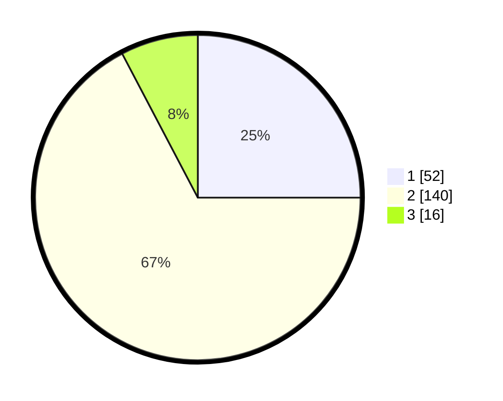

# Hasil

## Grafik

## Tabel

| No. | Nama Paslon    | Suara | Suara (raw) | Persentase |
|:--- |:-------------- | -----:| -----------:| ----------:|
| 1   | ANIES MUHAIMIN | 52    | [52][p-1]   | 25,00      |
| 2   | PRABOWO GIBRAN | 140   | [140][p-2]  | 67,31      |
| 3   | GANJAR MAHFUD  | 16    | [16][p-3]   | 7,69       |

[p-1]: https://github.com/gigit-pemilu/pemilu-2024-63-kalimantan-selatan/blob/main/pilpres/hitung-suara/sub/63-kalimantan-selatan/sub/03-banjar/sub/14-martapura-barat/sub/2002-sungai-batang/sub/007-tps/sub/paslon-1.txt
[p-2]: https://github.com/gigit-pemilu/pemilu-2024-63-kalimantan-selatan/blob/main/pilpres/hitung-suara/sub/63-kalimantan-selatan/sub/03-banjar/sub/14-martapura-barat/sub/2002-sungai-batang/sub/007-tps/sub/paslon-2.txt
[p-3]: https://github.com/gigit-pemilu/pemilu-2024-63-kalimantan-selatan/blob/main/pilpres/hitung-suara/sub/63-kalimantan-selatan/sub/03-banjar/sub/14-martapura-barat/sub/2002-sungai-batang/sub/007-tps/sub/paslon-3.txt

## Foto C Plano

https://sirekap-obj-formc.kpu.go.id/e056/pemilu/ppwp/63/03/14/20/02/6303142002007-20240215-004218--08381c1f-7a49-45ec-899d-c6da33948121.jpg

https://sirekap-obj-formc.kpu.go.id/e056/pemilu/ppwp/63/03/14/20/02/6303142002007-20240214-224745--7e20c8bd-0ae9-4b10-ab6e-5e7e8e28089a.jpg

https://sirekap-obj-formc.kpu.go.id/e056/pemilu/ppwp/63/03/14/20/02/6303142002007-20240215-032149--5e2fcd4e-f7df-460a-b99e-e40ae0e05ee3.jpg

## Metadata

| Key        | Value               |
| ---------- | ------------------- |
| Time Stamp | 2024-02-25 17:00:00 |

