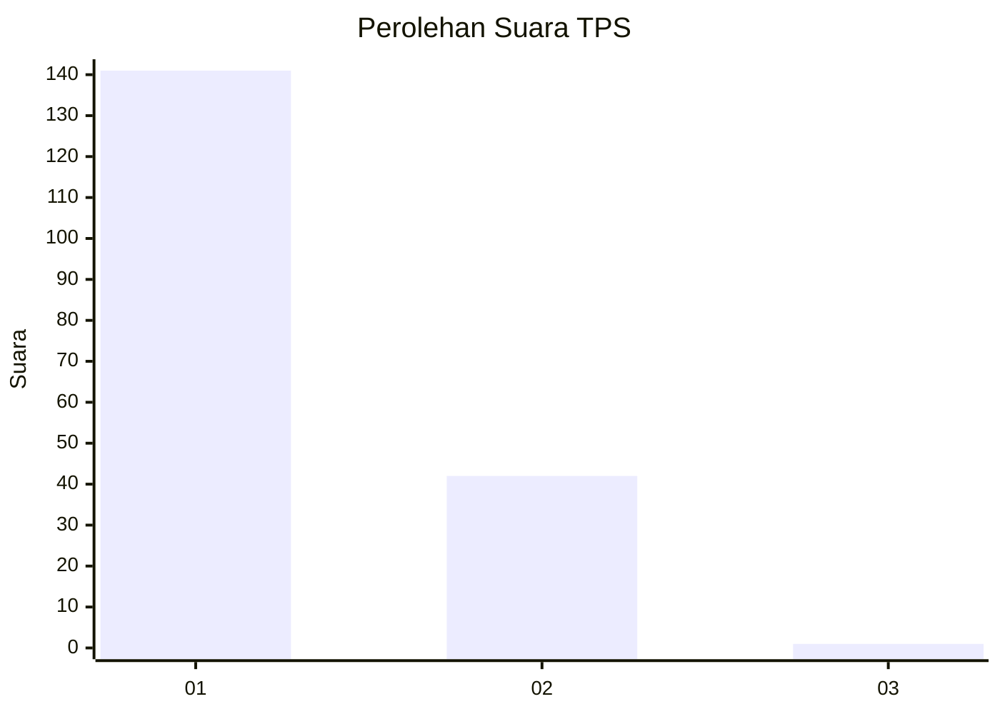
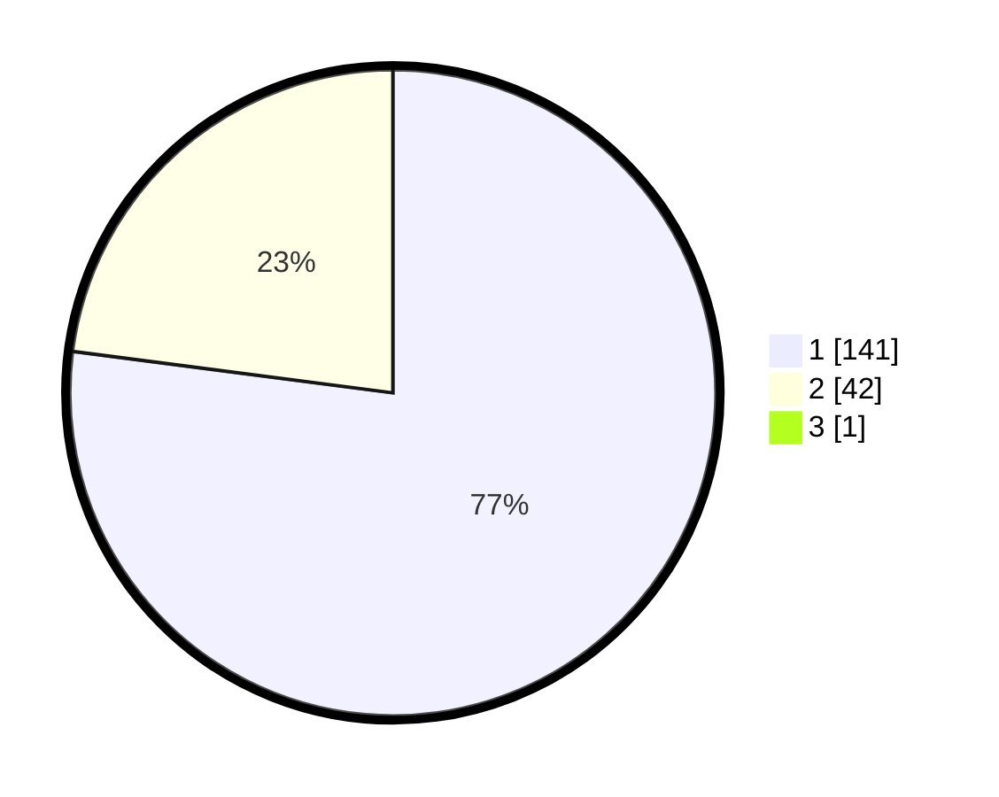

# Hasil

## Grafik

## Tabel

| No. | Nama Paslon    | Suara | Suara (raw) | Persentase |
|:--- |:-------------- | -----:| -----------:| ----------:|
| 1   | ANIES MUHAIMIN | 141   | [141][p-1]  | 76,63      |
| 2   | PRABOWO GIBRAN | 42    | [42][p-2]   | 22,83      |
| 3   | GANJAR MAHFUD  | 1     | [1][p-3]    | 0,54       |

[p-1]: https://github.com/gigit-pemilu/pemilu-2024/blob/main/pilpres/hitung-suara/sub/63-kalimantan-selatan/sub/03-banjar/sub/14-martapura-barat/sub/2003-sungai-batang-ilir/sub/005-tps/sub/paslon-1.txt
[p-2]: https://github.com/gigit-pemilu/pemilu-2024/blob/main/pilpres/hitung-suara/sub/63-kalimantan-selatan/sub/03-banjar/sub/14-martapura-barat/sub/2003-sungai-batang-ilir/sub/005-tps/sub/paslon-2.txt
[p-3]: https://github.com/gigit-pemilu/pemilu-2024/blob/main/pilpres/hitung-suara/sub/63-kalimantan-selatan/sub/03-banjar/sub/14-martapura-barat/sub/2003-sungai-batang-ilir/sub/005-tps/sub/paslon-3.txt

## Foto C Plano

https://sirekap-obj-formc.kpu.go.id/301c/pemilu/ppwp/63/03/14/20/03/6303142003005-20240215-003619--c36846ed-11c4-4f61-b453-75f42adba451.jpg

https://sirekap-obj-formc.kpu.go.id/301c/pemilu/ppwp/63/03/14/20/03/6303142003005-20240215-004938--04d99d62-e84f-4b30-90fe-d94e38a8cd18.jpg

https://sirekap-obj-formc.kpu.go.id/301c/pemilu/ppwp/63/03/14/20/03/6303142003005-20240215-005528--bcc7b4db-c8b0-4fd3-b7c0-11b6bb114328.jpg

## Metadata

| Key        | Value               |
| ---------- | ------------------- |
| Time Stamp | 2024-02-24 22:31:28 |

