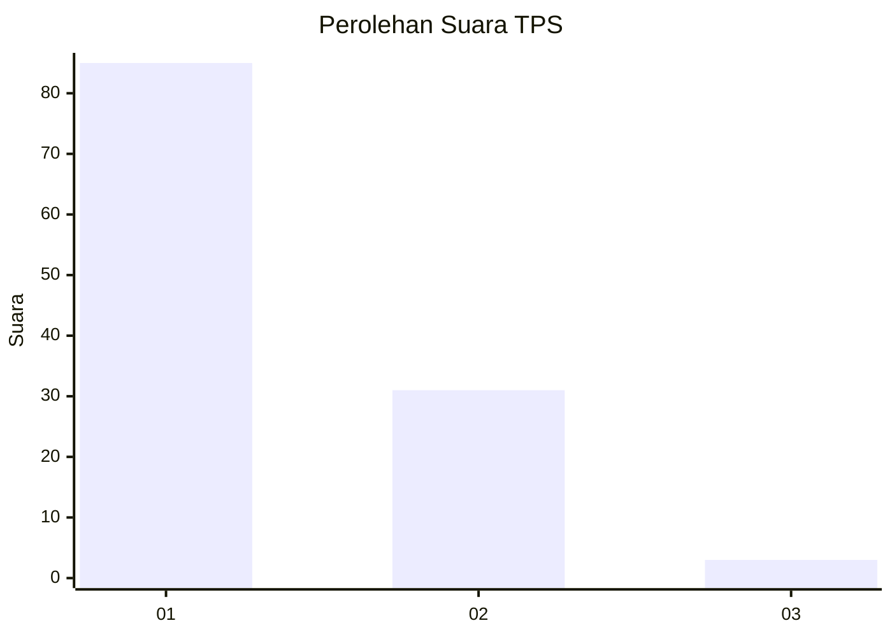
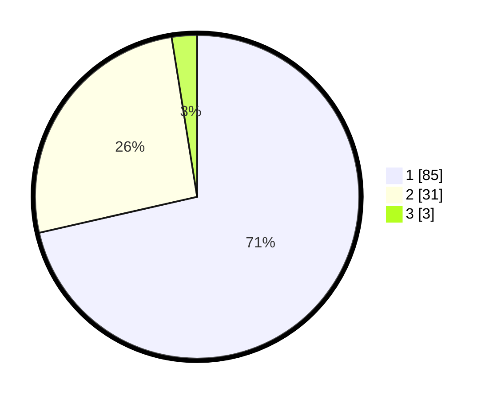

# Hasil

## Grafik

## Tabel

| No. | Nama Paslon    | Suara | Suara (raw) | Persentase |
|:--- |:-------------- | -----:| -----------:| ----------:|
| 1   | ANIES MUHAIMIN | 85    | [85][p-1]   | 71,43      |
| 2   | PRABOWO GIBRAN | 31    | [31][p-2]   | 26,05      |
| 3   | GANJAR MAHFUD  | 3     | [3][p-3]    | 2,52       |

[p-1]: https://github.com/gigit-pemilu/pemilu-2024/blob/main/pilpres/hitung-suara/sub/63-kalimantan-selatan/sub/03-banjar/sub/15-martapura-timur/sub/2002-keramat/sub/004-tps/sub/paslon-1.txt
[p-2]: https://github.com/gigit-pemilu/pemilu-2024/blob/main/pilpres/hitung-suara/sub/63-kalimantan-selatan/sub/03-banjar/sub/15-martapura-timur/sub/2002-keramat/sub/004-tps/sub/paslon-2.txt
[p-3]: https://github.com/gigit-pemilu/pemilu-2024/blob/main/pilpres/hitung-suara/sub/63-kalimantan-selatan/sub/03-banjar/sub/15-martapura-timur/sub/2002-keramat/sub/004-tps/sub/paslon-3.txt

## Foto C Plano

https://sirekap-obj-formc.kpu.go.id/905f/pemilu/ppwp/63/03/15/20/02/6303152002004-20240214-212656--b27aa3c4-c33c-4d1b-ad79-cf3866757905.jpg

https://sirekap-obj-formc.kpu.go.id/905f/pemilu/ppwp/63/03/15/20/02/6303152002004-20240214-212726--e9d432c4-a639-4314-b0db-c0ff10133324.jpg

https://sirekap-obj-formc.kpu.go.id/905f/pemilu/ppwp/63/03/15/20/02/6303152002004-20240214-212754--b4105383-1c7c-4ccb-9e59-e1e8859fb2ab.jpg

## Metadata

| Key        | Value               |
| ---------- | ------------------- |
| Time Stamp | 2024-02-15 21:01:18 |

