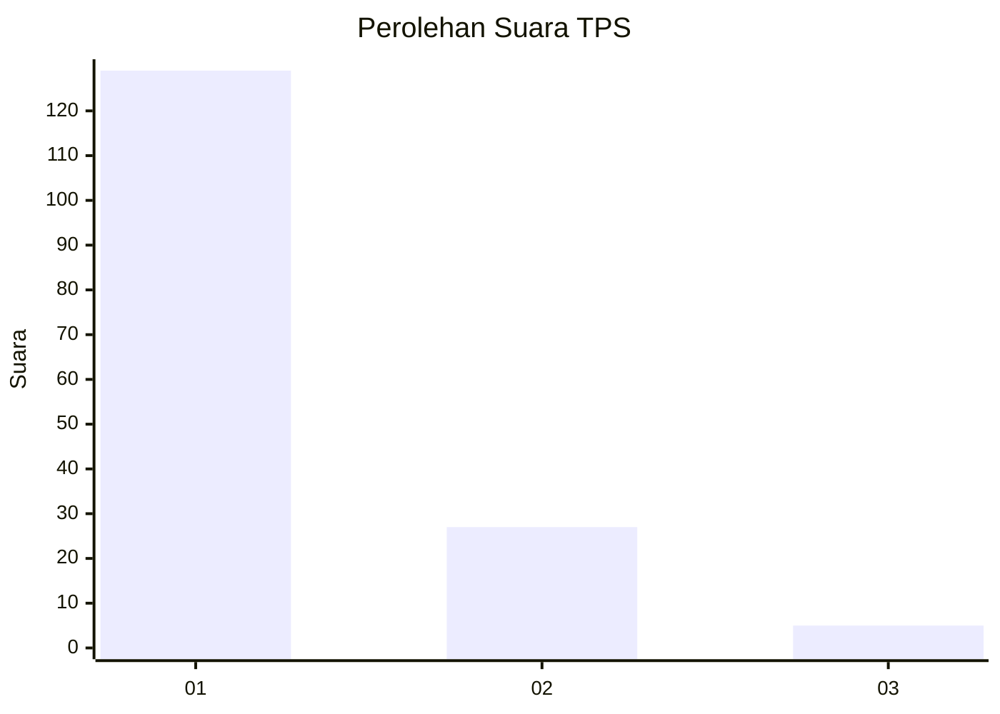
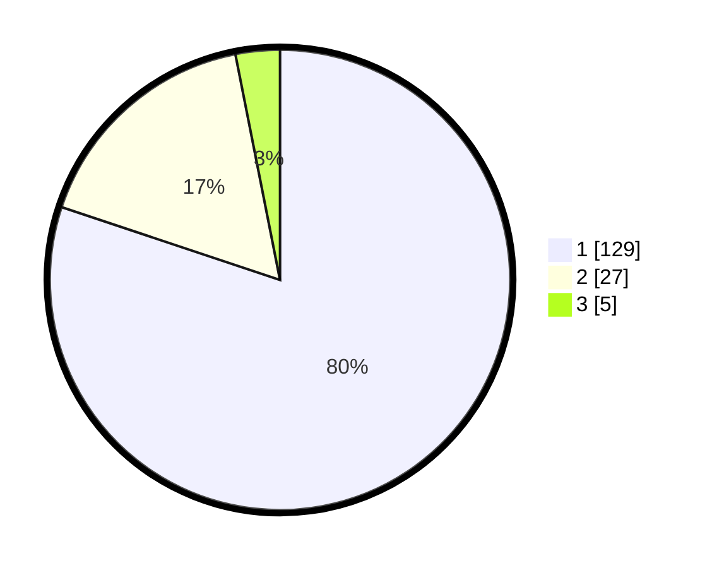

# Hasil

## Grafik

## Tabel

| No. | Nama Paslon    | Suara | Suara (raw) | Persentase |
|:--- |:-------------- | -----:| -----------:| ----------:|
| 1   | ANIES MUHAIMIN | 129   | [129][p-1]  | 80,12      |
| 2   | PRABOWO GIBRAN | 27    | [27][p-2]   | 16,77      |
| 3   | GANJAR MAHFUD  | 5     | [5][p-3]    | 3,11       |

[p-1]: https://github.com/gigit-pemilu/pemilu-2024-63-kalimantan-selatan/blob/main/pilpres/hitung-suara/sub/63-kalimantan-selatan/sub/03-banjar/sub/16-sambung-makmur/sub/2001-madurejo/sub/002-tps/sub/paslon-1.txt
[p-2]: https://github.com/gigit-pemilu/pemilu-2024-63-kalimantan-selatan/blob/main/pilpres/hitung-suara/sub/63-kalimantan-selatan/sub/03-banjar/sub/16-sambung-makmur/sub/2001-madurejo/sub/002-tps/sub/paslon-2.txt
[p-3]: https://github.com/gigit-pemilu/pemilu-2024-63-kalimantan-selatan/blob/main/pilpres/hitung-suara/sub/63-kalimantan-selatan/sub/03-banjar/sub/16-sambung-makmur/sub/2001-madurejo/sub/002-tps/sub/paslon-3.txt

## Foto C Plano

https://sirekap-obj-formc.kpu.go.id/b282/pemilu/ppwp/63/03/16/20/01/6303162001002-20240215-003147--d6d66708-764c-4954-9dd4-adba62decf98.jpg

https://sirekap-obj-formc.kpu.go.id/b282/pemilu/ppwp/63/03/16/20/01/6303162001002-20240215-003445--01c77fea-6cac-4d2e-aacb-f694b6cd1987.jpg

https://sirekap-obj-formc.kpu.go.id/b282/pemilu/ppwp/63/03/16/20/01/6303162001002-20240215-003845--bbbad2f4-22f9-495c-a373-9cec45344226.jpg

## Metadata

| Key        | Value               |
| ---------- | ------------------- |
| Time Stamp | 2024-02-15 18:00:26 |

