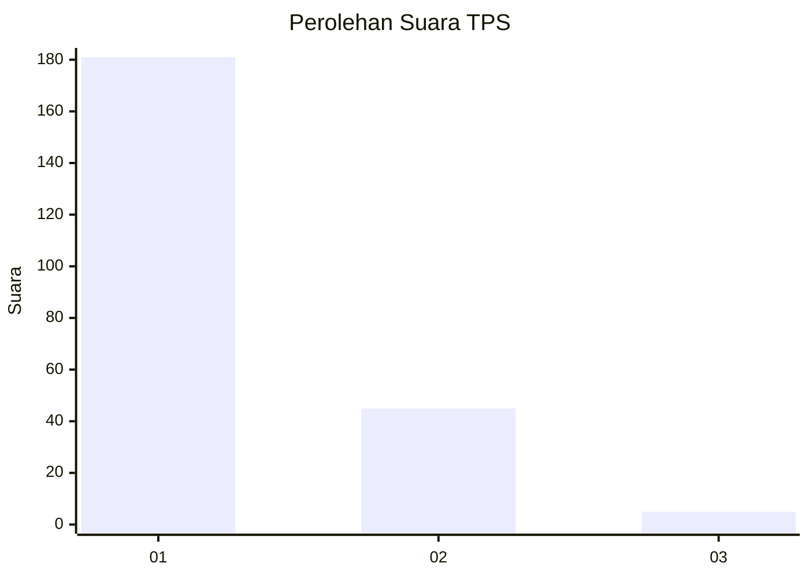
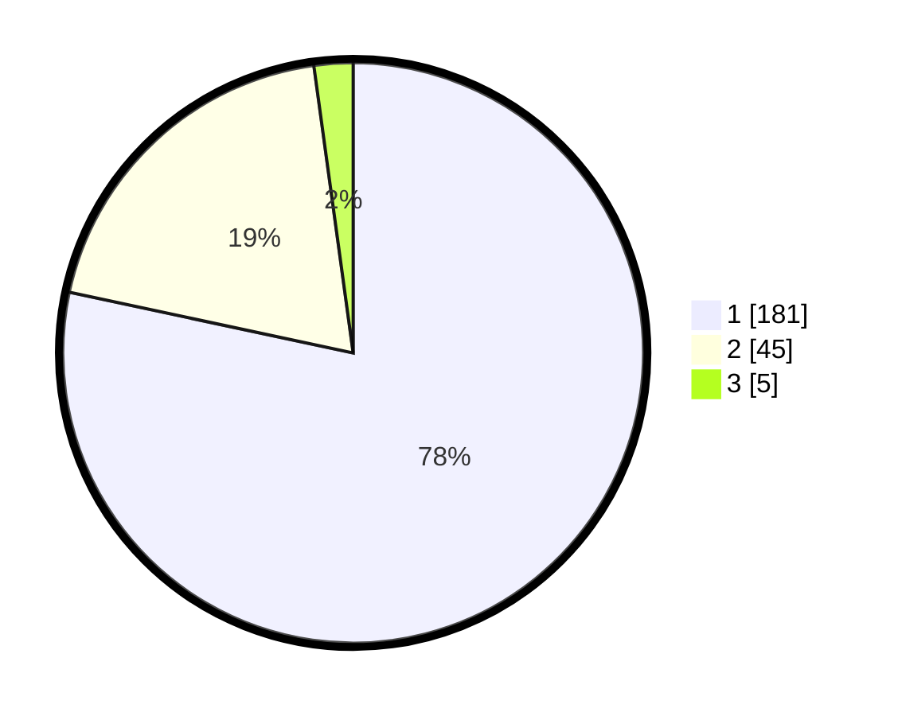

# Hasil

## Grafik

## Tabel

| No. | Nama Paslon    | Suara | Suara (raw) | Persentase |
|:--- |:-------------- | -----:| -----------:| ----------:|
| 1   | ANIES MUHAIMIN | 181   | [181][p-1]  | 78,35      |
| 2   | PRABOWO GIBRAN | 45    | [45][p-2]   | 19,48      |
| 3   | GANJAR MAHFUD  | 5     | [5][p-3]    | 2,16       |

[p-1]: https://github.com/gigit-pemilu/pemilu-2024-63-kalimantan-selatan/blob/main/pilpres/hitung-suara/sub/63-kalimantan-selatan/sub/03-banjar/sub/16-sambung-makmur/sub/2001-madurejo/sub/005-tps/sub/paslon-1.txt
[p-2]: https://github.com/gigit-pemilu/pemilu-2024-63-kalimantan-selatan/blob/main/pilpres/hitung-suara/sub/63-kalimantan-selatan/sub/03-banjar/sub/16-sambung-makmur/sub/2001-madurejo/sub/005-tps/sub/paslon-2.txt
[p-3]: https://github.com/gigit-pemilu/pemilu-2024-63-kalimantan-selatan/blob/main/pilpres/hitung-suara/sub/63-kalimantan-selatan/sub/03-banjar/sub/16-sambung-makmur/sub/2001-madurejo/sub/005-tps/sub/paslon-3.txt

## Foto C Plano

https://sirekap-obj-formc.kpu.go.id/0849/pemilu/ppwp/63/03/16/20/01/6303162001005-20240215-121706--297afb7c-a275-4efc-9fe1-790ef2da23d3.jpg

https://sirekap-obj-formc.kpu.go.id/0849/pemilu/ppwp/63/03/16/20/01/6303162001005-20240215-121933--412c88e2-0bec-4bf6-bfc8-43f4243d1183.jpg

https://sirekap-obj-formc.kpu.go.id/0849/pemilu/ppwp/63/03/16/20/01/6303162001005-20240221-113345--e97b98be-0f02-4319-ae87-b9597c03c9a8.jpg

## Metadata

| Key        | Value               |
| ---------- | ------------------- |
| Time Stamp | 2024-02-21 12:00:00 |

## DATA PEMILIH TETAP

Jumlah pemilih dalam DPT: **278**.
 * L: **442**.
 * P: **436**.

## DATA PENGGUNA HAK PILIH

Jumlah pengguna hak pilih dalam DPT: **234**.
 * L: **424**.
 * P: **843**.

Jumlah pengguna hak pilih dalam DPTb: **0**.
 * L: **900**.
 * P: **200**.

Jumlah pengguna hak pilih dalam DPK: **0**.
 * L: **1**.
 * P: **204**.

Jumlah pengguna hak pilih: **403**.
 * L: **235**.
 * P: **422**.

## JUMLAH SUARA SAH DAN TIDAK SAH

JUMLAH SELURUH SUARA SAH: **231**.

JUMLAH SUARA TIDAK SAH: **4**.

JUMLAH SELURUH SUARA SAH DAN SUARA TIDAK SAH: **235**.

