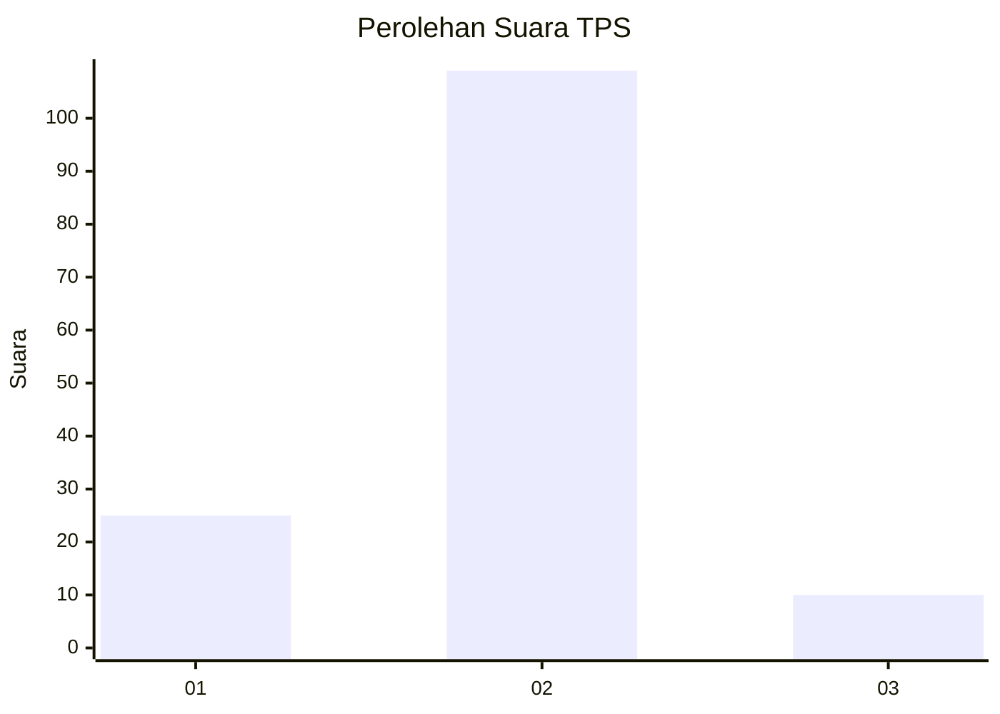
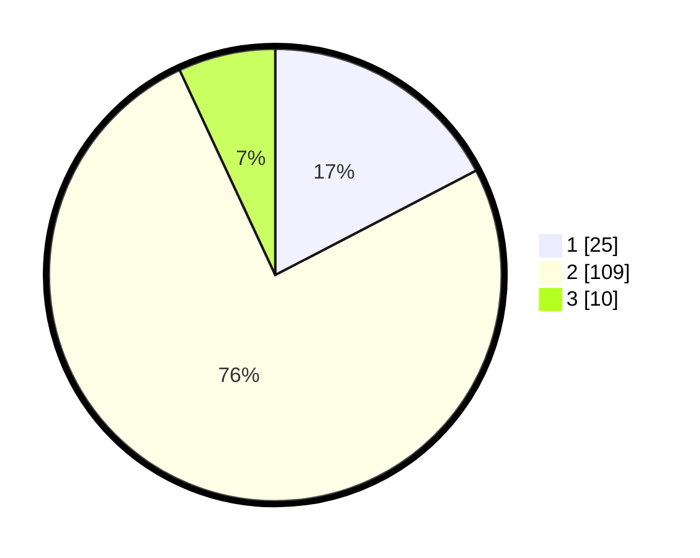

# Hasil

## Grafik

## Tabel

| No. | Nama Paslon    | Suara | Suara (raw) | Persentase |
|:--- |:-------------- | -----:| -----------:| ----------:|
| 1   | ANIES MUHAIMIN | 25    | [25][p-1]   | 17,36      |
| 2   | PRABOWO GIBRAN | 109   | [109][p-2]  | 75,69      |
| 3   | GANJAR MAHFUD  | 10    | [10][p-3]   | 6,94       |

[p-1]: https://github.com/gigit-pemilu/pemilu-2024/blob/main/pilpres/hitung-suara/sub/63-kalimantan-selatan/sub/03-banjar/sub/18-telaga-bauntung/sub/2001-rantau-bujur/sub/002-tps/sub/paslon-1.txt
[p-2]: https://github.com/gigit-pemilu/pemilu-2024/blob/main/pilpres/hitung-suara/sub/63-kalimantan-selatan/sub/03-banjar/sub/18-telaga-bauntung/sub/2001-rantau-bujur/sub/002-tps/sub/paslon-2.txt
[p-3]: https://github.com/gigit-pemilu/pemilu-2024/blob/main/pilpres/hitung-suara/sub/63-kalimantan-selatan/sub/03-banjar/sub/18-telaga-bauntung/sub/2001-rantau-bujur/sub/002-tps/sub/paslon-3.txt

## Foto C Plano

https://sirekap-obj-formc.kpu.go.id/f634/pemilu/ppwp/63/03/18/20/01/6303182001002-20240215-004836--ded7c5dc-1043-4b7c-9f89-39efb9d4aa76.jpg

https://sirekap-obj-formc.kpu.go.id/f634/pemilu/ppwp/63/03/18/20/01/6303182001002-20240215-004902--4facb7c9-629c-46ae-8fdd-880eaf0c058f.jpg

https://sirekap-obj-formc.kpu.go.id/f634/pemilu/ppwp/63/03/18/20/01/6303182001002-20240215-004920--4f85c0d6-ac60-4afd-87c4-724e18dd5f76.jpg

## Metadata

| Key        | Value               |
| ---------- | ------------------- |
| Time Stamp | 2024-02-25 14:00:00 |

