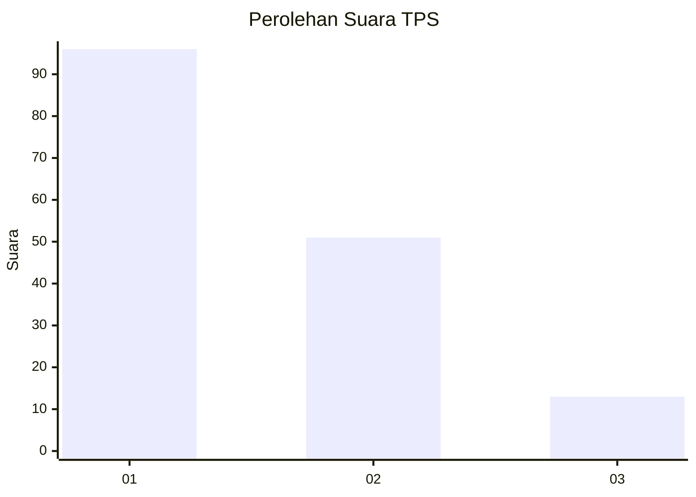
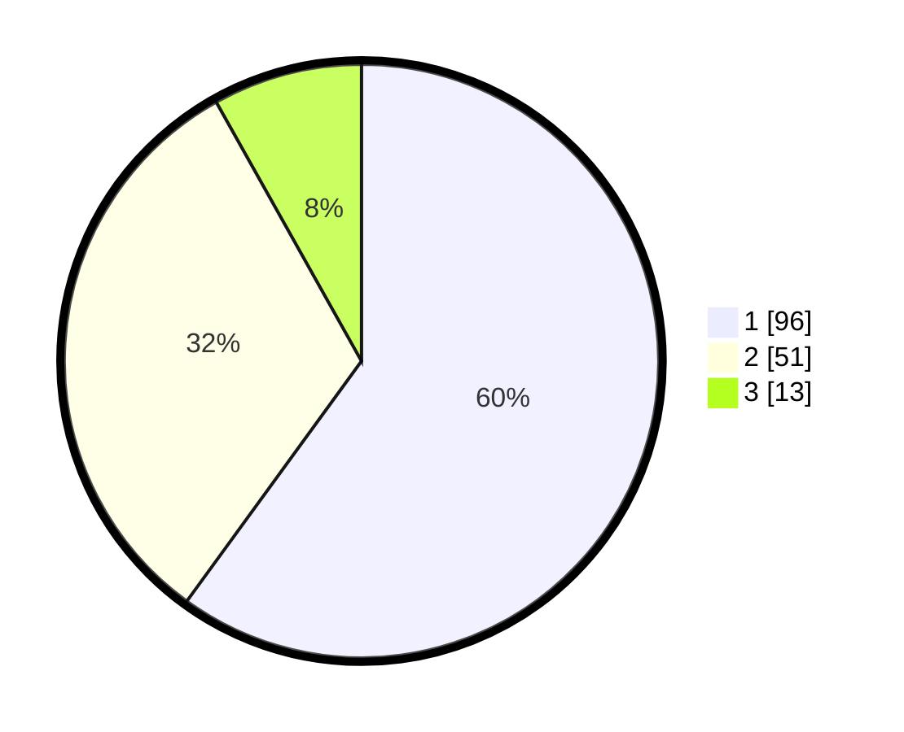

# Hasil

## Grafik

## Tabel

| No. | Nama Paslon    | Suara | Suara (raw) | Persentase |
|:--- |:-------------- | -----:| -----------:| ----------:|
| 1   | ANIES MUHAIMIN | 96    | [96][p-1]   | 60,00      |
| 2   | PRABOWO GIBRAN | 51    | [51][p-2]   | 31,88      |
| 3   | GANJAR MAHFUD  | 13    | [13][p-3]   | 8,13       |

[p-1]: https://github.com/gigit-pemilu/pemilu-2024/blob/main/pilpres/hitung-suara/sub/63-kalimantan-selatan/sub/03-banjar/sub/19-tatah-makmur/sub/2001-tatah-bangkal/sub/001-tps/sub/paslon-1.txt
[p-2]: https://github.com/gigit-pemilu/pemilu-2024/blob/main/pilpres/hitung-suara/sub/63-kalimantan-selatan/sub/03-banjar/sub/19-tatah-makmur/sub/2001-tatah-bangkal/sub/001-tps/sub/paslon-2.txt
[p-3]: https://github.com/gigit-pemilu/pemilu-2024/blob/main/pilpres/hitung-suara/sub/63-kalimantan-selatan/sub/03-banjar/sub/19-tatah-makmur/sub/2001-tatah-bangkal/sub/001-tps/sub/paslon-3.txt

## Foto C Plano

https://sirekap-obj-formc.kpu.go.id/55b9/pemilu/ppwp/63/03/19/20/01/6303192001001-20240215-001909--29e9906b-cbdb-4666-ac9c-a97c159f5f37.jpg

https://sirekap-obj-formc.kpu.go.id/55b9/pemilu/ppwp/63/03/19/20/01/6303192001001-20240215-001914--5b3b433f-1395-4ef3-9ef3-de3f6ec41996.jpg

https://sirekap-obj-formc.kpu.go.id/55b9/pemilu/ppwp/63/03/19/20/01/6303192001001-20240215-001918--9d60a6fe-951d-4248-939e-e610996aef83.jpg

## Metadata

| Key        | Value               |
| ---------- | ------------------- |
| Time Stamp | 2024-02-25 15:00:00 |

