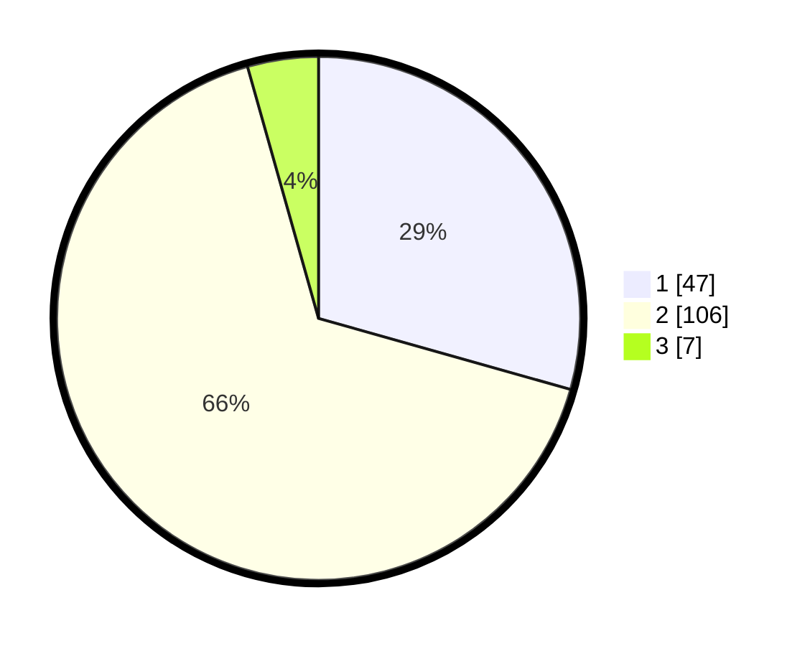

# Hasil

## Grafik

## Tabel

| No. | Nama Paslon    | Suara | Suara (raw) | Persentase |
|:--- |:-------------- | -----:| -----------:| ----------:|
| 1   | ANIES MUHAIMIN | 47    | [47][p-1]   | 29,38      |
| 2   | PRABOWO GIBRAN | 106   | [106][p-2]  | 66,25      |
| 3   | GANJAR MAHFUD  | 7     | [7][p-3]    | 4,38       |

[p-1]: https://github.com/gigit-pemilu/pemilu-2024/blob/main/pilpres/hitung-suara/sub/63-kalimantan-selatan/sub/03-banjar/sub/20-cintapuri-darussalam/sub/2001-keramat-mina/sub/002-tps/sub/paslon-1.txt
[p-2]: https://github.com/gigit-pemilu/pemilu-2024/blob/main/pilpres/hitung-suara/sub/63-kalimantan-selatan/sub/03-banjar/sub/20-cintapuri-darussalam/sub/2001-keramat-mina/sub/002-tps/sub/paslon-2.txt
[p-3]: https://github.com/gigit-pemilu/pemilu-2024/blob/main/pilpres/hitung-suara/sub/63-kalimantan-selatan/sub/03-banjar/sub/20-cintapuri-darussalam/sub/2001-keramat-mina/sub/002-tps/sub/paslon-3.txt

## Foto C Plano

https://sirekap-obj-formc.kpu.go.id/375b/pemilu/ppwp/63/03/20/20/01/6303202001002-20240215-072432--04498f14-2975-49ba-bb14-56ac459a3bb4.jpg

https://sirekap-obj-formc.kpu.go.id/375b/pemilu/ppwp/63/03/20/20/01/6303202001002-20240215-072744--d9ab7c0c-2c97-467f-9849-abefacedd653.jpg

https://sirekap-obj-formc.kpu.go.id/375b/pemilu/ppwp/63/03/20/20/01/6303202001002-20240215-073037--0760e58a-f512-4246-931e-60ae5d36d5de.jpg

## Metadata

| Key        | Value               |
| ---------- | ------------------- |
| Time Stamp | 2024-02-16 10:00:28 |

