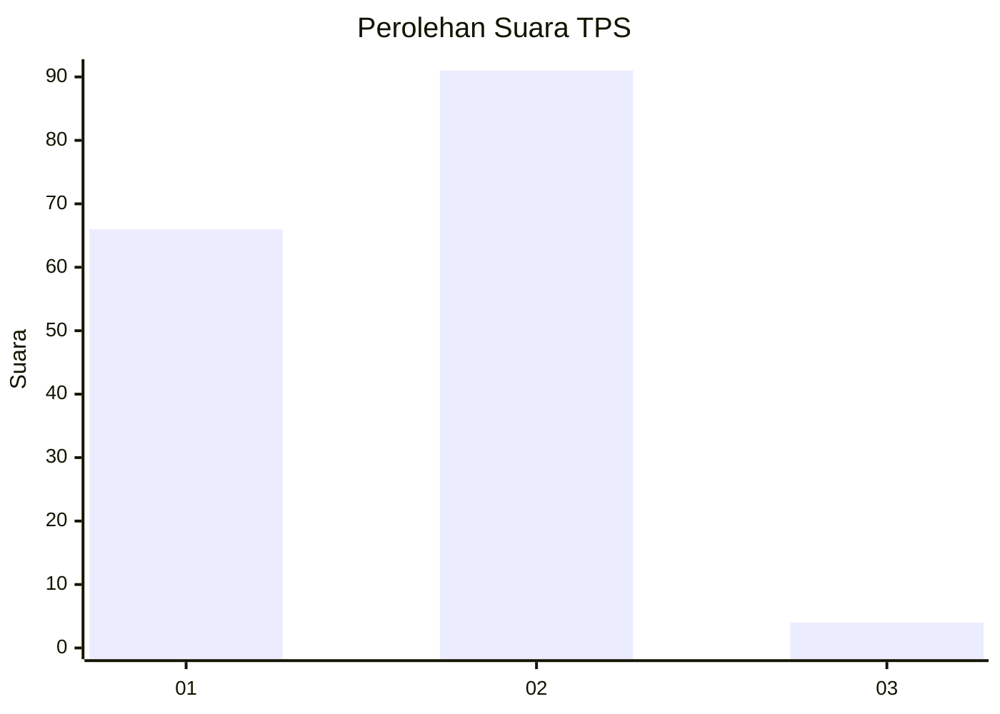
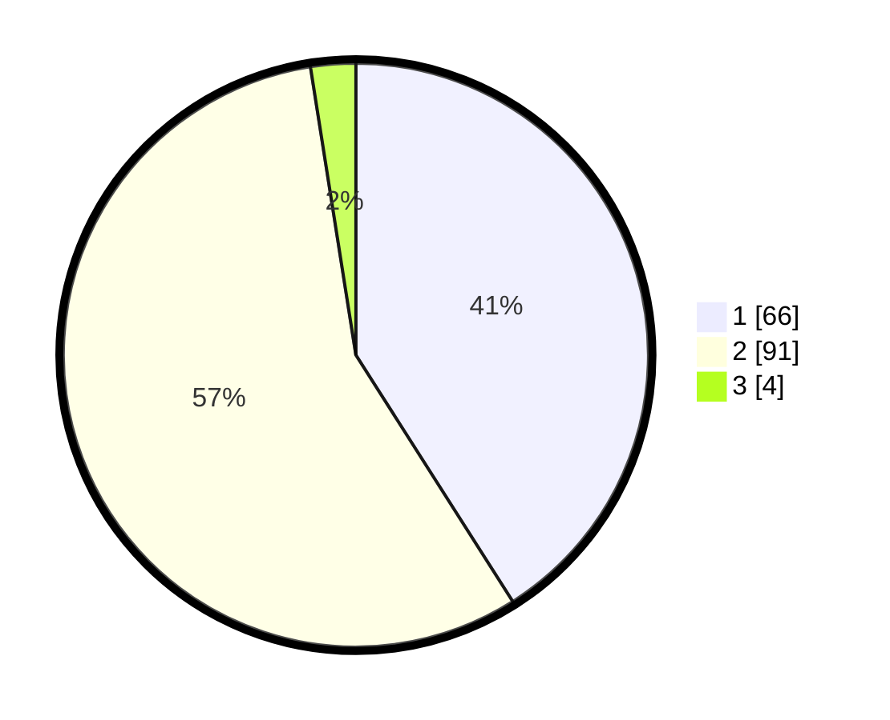

# Hasil

## Grafik

## Tabel

| No. | Nama Paslon    | Suara | Suara (raw) | Persentase |
|:--- |:-------------- | -----:| -----------:| ----------:|
| 1   | ANIES MUHAIMIN | 66    | [66][p-1]   | 40,99      |
| 2   | PRABOWO GIBRAN | 91    | [91][p-2]   | 56,52      |
| 3   | GANJAR MAHFUD  | 4     | [4][p-3]    | 2,48       |

[p-1]: https://github.com/gigit-pemilu/pemilu-2024/blob/main/pilpres/hitung-suara/sub/63-kalimantan-selatan/sub/03-banjar/sub/20-cintapuri-darussalam/sub/2001-keramat-mina/sub/005-tps/sub/paslon-1.txt
[p-2]: https://github.com/gigit-pemilu/pemilu-2024/blob/main/pilpres/hitung-suara/sub/63-kalimantan-selatan/sub/03-banjar/sub/20-cintapuri-darussalam/sub/2001-keramat-mina/sub/005-tps/sub/paslon-2.txt
[p-3]: https://github.com/gigit-pemilu/pemilu-2024/blob/main/pilpres/hitung-suara/sub/63-kalimantan-selatan/sub/03-banjar/sub/20-cintapuri-darussalam/sub/2001-keramat-mina/sub/005-tps/sub/paslon-3.txt

## Foto C Plano

https://sirekap-obj-formc.kpu.go.id/4b83/pemilu/ppwp/63/03/20/20/01/6303202001005-20240215-004758--4f2c7847-38d8-4c42-a21a-4bb83ea450f5.jpg

https://sirekap-obj-formc.kpu.go.id/4b83/pemilu/ppwp/63/03/20/20/01/6303202001005-20240215-005038--f872820c-f766-47f2-a9eb-d6ceedb73e29.jpg

https://sirekap-obj-formc.kpu.go.id/4b83/pemilu/ppwp/63/03/20/20/01/6303202001005-20240215-005201--75ddebc0-bab0-4739-a24a-c524b94bc0f2.jpg

## Metadata

| Key        | Value               |
| ---------- | ------------------- |
| Time Stamp | 2024-02-24 22:31:28 |

