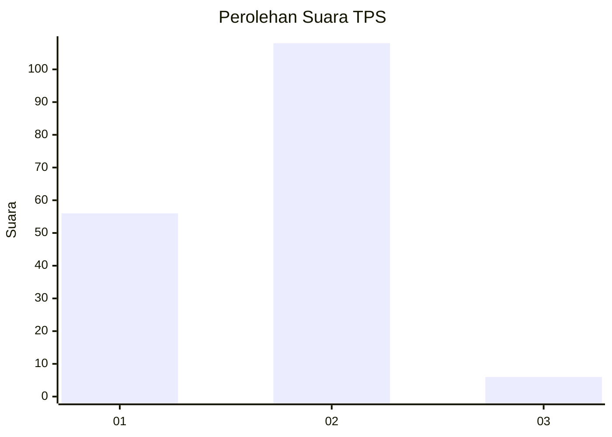
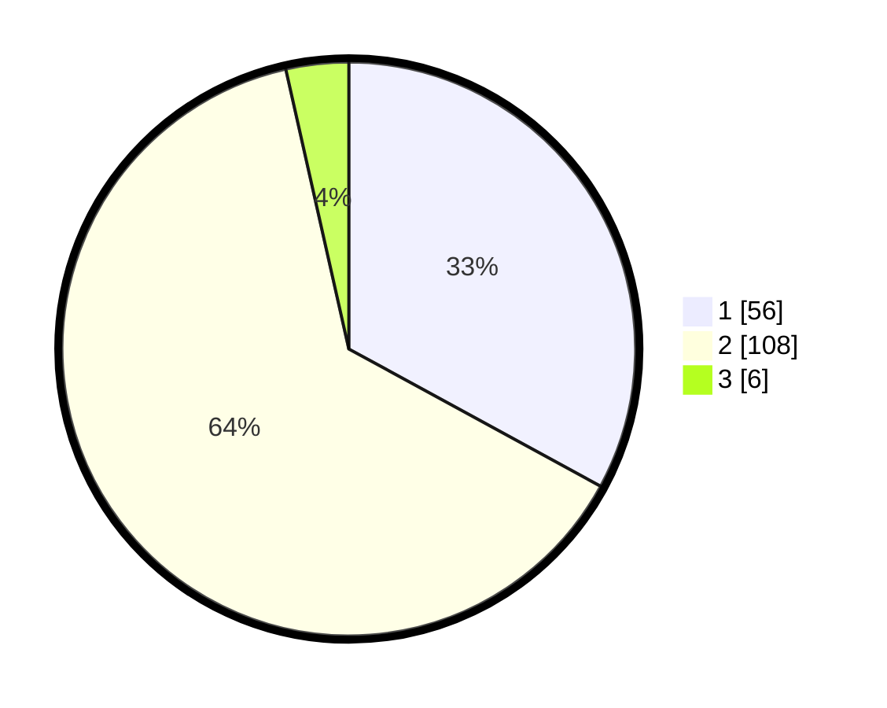

# Hasil

## Grafik

## Tabel

| No. | Nama Paslon    | Suara | Suara (raw) | Persentase |
|:--- |:-------------- | -----:| -----------:| ----------:|
| 1   | ANIES MUHAIMIN | 56    | [56][p-1]   | 32,94      |
| 2   | PRABOWO GIBRAN | 108   | [108][p-2]  | 63,53      |
| 3   | GANJAR MAHFUD  | 6     | [6][p-3]    | 3,53       |

[p-1]: https://github.com/gigit-pemilu/pemilu-2024-63-kalimantan-selatan/blob/main/pilpres/hitung-suara/sub/63-kalimantan-selatan/sub/03-banjar/sub/20-cintapuri-darussalam/sub/2002-garis-hanyar/sub/001-tps/sub/paslon-1.txt
[p-2]: https://github.com/gigit-pemilu/pemilu-2024-63-kalimantan-selatan/blob/main/pilpres/hitung-suara/sub/63-kalimantan-selatan/sub/03-banjar/sub/20-cintapuri-darussalam/sub/2002-garis-hanyar/sub/001-tps/sub/paslon-2.txt
[p-3]: https://github.com/gigit-pemilu/pemilu-2024-63-kalimantan-selatan/blob/main/pilpres/hitung-suara/sub/63-kalimantan-selatan/sub/03-banjar/sub/20-cintapuri-darussalam/sub/2002-garis-hanyar/sub/001-tps/sub/paslon-3.txt

## Foto C Plano

https://sirekap-obj-formc.kpu.go.id/0d88/pemilu/ppwp/63/03/20/20/02/6303202002001-20240214-220028--a133c6bb-15ad-4a1a-9890-7bd51f84719d.jpg

https://sirekap-obj-formc.kpu.go.id/0d88/pemilu/ppwp/63/03/20/20/02/6303202002001-20240214-220042--507b22f1-1afa-4ed4-8529-06015b3cef34.jpg

https://sirekap-obj-formc.kpu.go.id/0d88/pemilu/ppwp/63/03/20/20/02/6303202002001-20240214-220050--154a1809-8581-4913-bc62-ec8f265bcb83.jpg

## Metadata

| Key        | Value               |
| ---------- | ------------------- |
| Time Stamp | 2024-02-16 10:00:28 |

