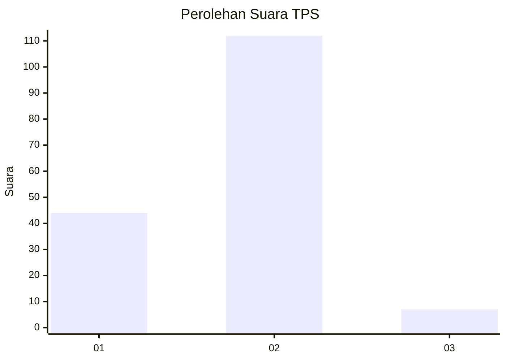
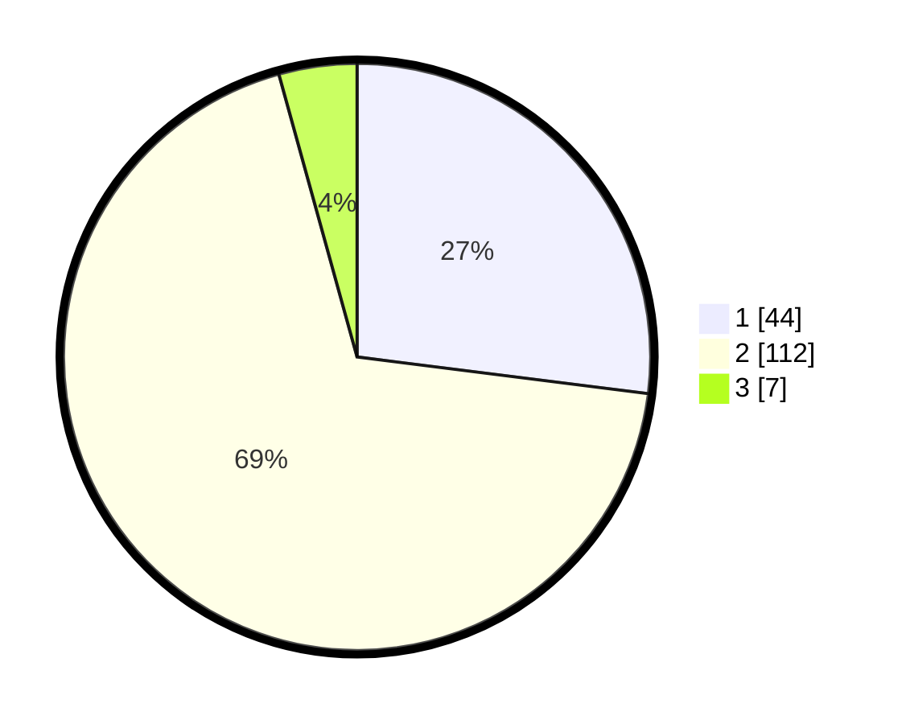

# Hasil

## Grafik

## Tabel

| No. | Nama Paslon    | Suara | Suara (raw) | Persentase |
|:--- |:-------------- | -----:| -----------:| ----------:|
| 1   | ANIES MUHAIMIN | 44    | [44][p-1]   | 26,99      |
| 2   | PRABOWO GIBRAN | 112   | [112][p-2]  | 68,71      |
| 3   | GANJAR MAHFUD  | 7     | [7][p-3]    | 4,29       |

[p-1]: https://github.com/gigit-pemilu/pemilu-2024/blob/main/pilpres/hitung-suara/sub/63-kalimantan-selatan/sub/03-banjar/sub/20-cintapuri-darussalam/sub/2002-garis-hanyar/sub/002-tps/sub/paslon-1.txt
[p-2]: https://github.com/gigit-pemilu/pemilu-2024/blob/main/pilpres/hitung-suara/sub/63-kalimantan-selatan/sub/03-banjar/sub/20-cintapuri-darussalam/sub/2002-garis-hanyar/sub/002-tps/sub/paslon-2.txt
[p-3]: https://github.com/gigit-pemilu/pemilu-2024/blob/main/pilpres/hitung-suara/sub/63-kalimantan-selatan/sub/03-banjar/sub/20-cintapuri-darussalam/sub/2002-garis-hanyar/sub/002-tps/sub/paslon-3.txt

## Foto C Plano

https://sirekap-obj-formc.kpu.go.id/bac3/pemilu/ppwp/63/03/20/20/02/6303202002002-20240215-013438--1cad63dc-7ea3-4506-934d-a3c6851ca8db.jpg

https://sirekap-obj-formc.kpu.go.id/bac3/pemilu/ppwp/63/03/20/20/02/6303202002002-20240215-013702--5d7b157b-62f8-4f21-a777-8ee9254539dc.jpg

https://sirekap-obj-formc.kpu.go.id/bac3/pemilu/ppwp/63/03/20/20/02/6303202002002-20240215-012106--1c7f4b1f-3774-492a-a7f8-01d59c53e54e.jpg

## Metadata

| Key        | Value               |
| ---------- | ------------------- |
| Time Stamp | 2024-02-24 22:31:28 |

