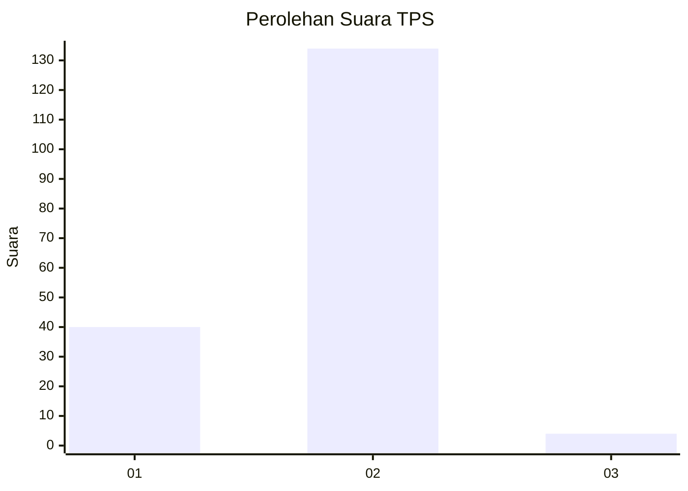
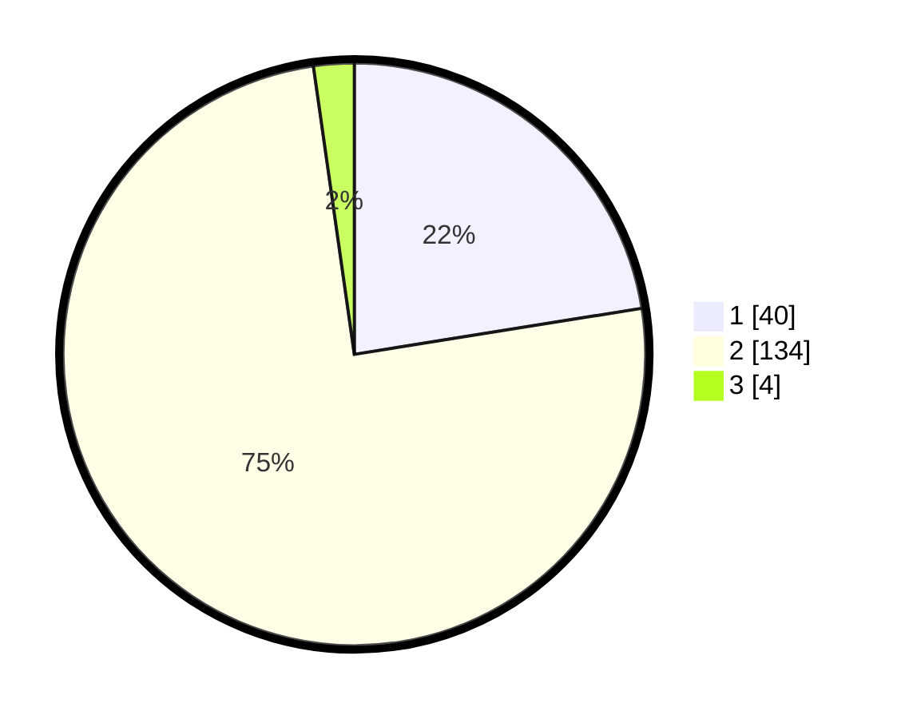

# Hasil

## Grafik

## Tabel

| No. | Nama Paslon    | Suara | Suara (raw) | Persentase |
|:--- |:-------------- | -----:| -----------:| ----------:|
| 1   | ANIES MUHAIMIN | 40    | [40][p-1]   | 22,47      |
| 2   | PRABOWO GIBRAN | 134   | [134][p-2]  | 75,28      |
| 3   | GANJAR MAHFUD  | 4     | [4][p-3]    | 2,25       |

[p-1]: https://github.com/gigit-pemilu/pemilu-2024-63-kalimantan-selatan/blob/main/pilpres/hitung-suara/sub/63-kalimantan-selatan/sub/03-banjar/sub/20-cintapuri-darussalam/sub/2003-cintapuri/sub/001-tps/sub/paslon-1.txt
[p-2]: https://github.com/gigit-pemilu/pemilu-2024-63-kalimantan-selatan/blob/main/pilpres/hitung-suara/sub/63-kalimantan-selatan/sub/03-banjar/sub/20-cintapuri-darussalam/sub/2003-cintapuri/sub/001-tps/sub/paslon-2.txt
[p-3]: https://github.com/gigit-pemilu/pemilu-2024-63-kalimantan-selatan/blob/main/pilpres/hitung-suara/sub/63-kalimantan-selatan/sub/03-banjar/sub/20-cintapuri-darussalam/sub/2003-cintapuri/sub/001-tps/sub/paslon-3.txt

## Foto C Plano

https://sirekap-obj-formc.kpu.go.id/b9db/pemilu/ppwp/63/03/20/20/03/6303202003001-20240215-201419--695fd5d0-ecda-4923-b1d4-288ca34f849d.jpg

https://sirekap-obj-formc.kpu.go.id/b9db/pemilu/ppwp/63/03/20/20/03/6303202003001-20240215-201522--025f5c1f-aa97-4140-b7ae-a06fe6a4d6af.jpg

https://sirekap-obj-formc.kpu.go.id/b9db/pemilu/ppwp/63/03/20/20/03/6303202003001-20240215-201623--c1559850-b707-4145-a3af-351a83222e70.jpg

## Metadata

| Key        | Value               |
| ---------- | ------------------- |
| Time Stamp | 2024-02-25 12:00:00 |

