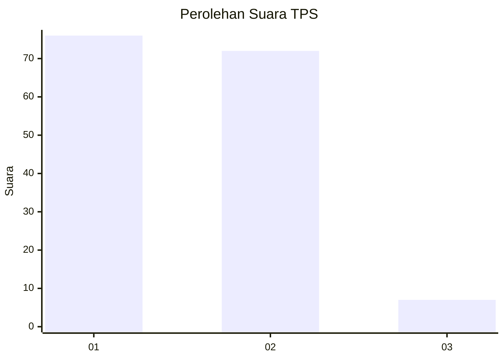
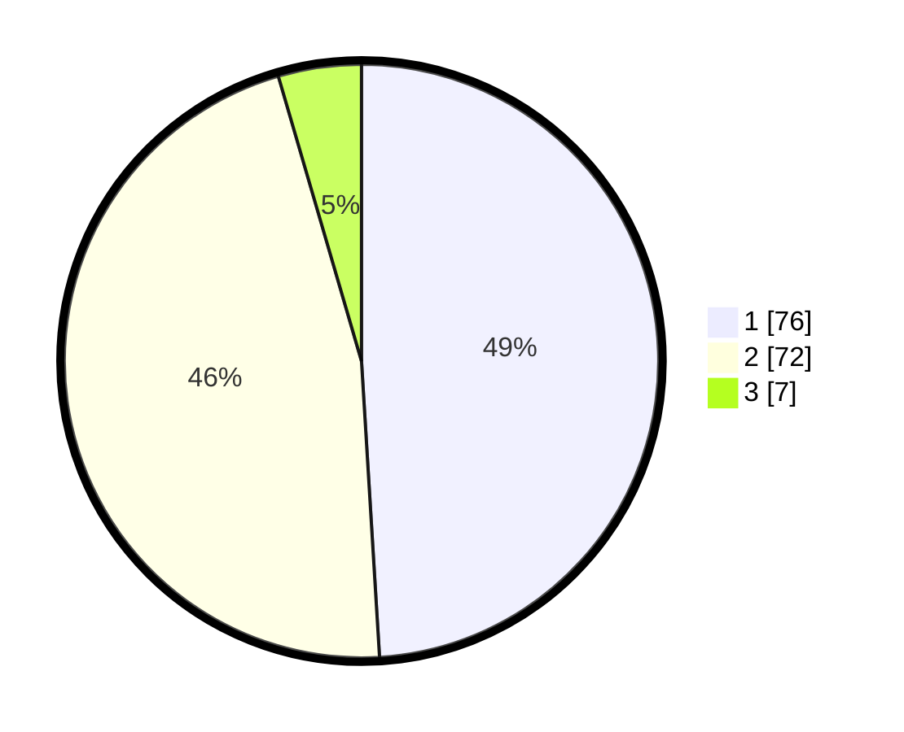

# Hasil

## Grafik

## Tabel

| No. | Nama Paslon    | Suara | Suara (raw) | Persentase |
|:--- |:-------------- | -----:| -----------:| ----------:|
| 1   | ANIES MUHAIMIN | 76    | [76][p-1]   | 49,03      |
| 2   | PRABOWO GIBRAN | 72    | [72][p-2]   | 46,45      |
| 3   | GANJAR MAHFUD  | 7     | [7][p-3]    | 4,52       |

[p-1]: https://github.com/gigit-pemilu/pemilu-2024/blob/main/pilpres/hitung-suara/sub/63-kalimantan-selatan/sub/04-barito-kuala/sub/03-anjir-pasar/sub/2001-andaman/sub/001-tps/sub/paslon-1.txt
[p-2]: https://github.com/gigit-pemilu/pemilu-2024/blob/main/pilpres/hitung-suara/sub/63-kalimantan-selatan/sub/04-barito-kuala/sub/03-anjir-pasar/sub/2001-andaman/sub/001-tps/sub/paslon-2.txt
[p-3]: https://github.com/gigit-pemilu/pemilu-2024/blob/main/pilpres/hitung-suara/sub/63-kalimantan-selatan/sub/04-barito-kuala/sub/03-anjir-pasar/sub/2001-andaman/sub/001-tps/sub/paslon-3.txt

## Foto C Plano

https://sirekap-obj-formc.kpu.go.id/9c36/pemilu/ppwp/63/04/03/20/01/6304032001001-20240217-160534--824da173-4593-464d-8aff-8be07698359d.jpg

https://sirekap-obj-formc.kpu.go.id/9c36/pemilu/ppwp/63/04/03/20/01/6304032001001-20240217-161456--4571b4b8-b805-4f4c-a066-ad084a9c83c1.jpg

https://sirekap-obj-formc.kpu.go.id/9c36/pemilu/ppwp/63/04/03/20/01/6304032001001-20240217-161347--b98af18a-9090-4b67-ac3d-47267d07ad59.jpg

## Metadata

| Key        | Value               |
| ---------- | ------------------- |
| Time Stamp | 2024-02-19 06:16:00 |

