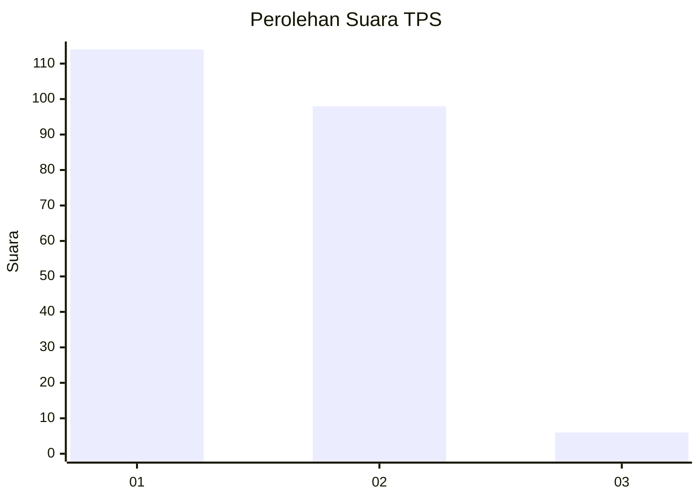
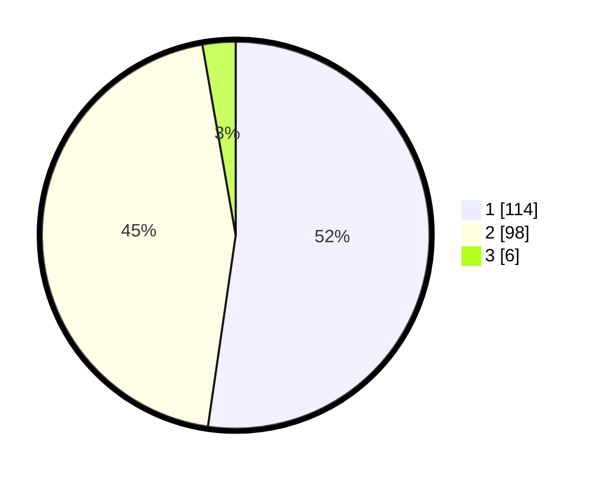

# Hasil

## Grafik

## Tabel

| No. | Nama Paslon    | Suara | Suara (raw) | Persentase |
|:--- |:-------------- | -----:| -----------:| ----------:|
| 1   | ANIES MUHAIMIN | 114   | [114][p-1]  | 52,29      |
| 2   | PRABOWO GIBRAN | 98    | [98][p-2]   | 44,95      |
| 3   | GANJAR MAHFUD  | 6     | [6][p-3]    | 2,75       |

[p-1]: https://github.com/gigit-pemilu/pemilu-2024-63-kalimantan-selatan/blob/main/pilpres/hitung-suara/sub/63-kalimantan-selatan/sub/04-barito-kuala/sub/03-anjir-pasar/sub/2001-andaman/sub/003-tps/sub/paslon-1.txt
[p-2]: https://github.com/gigit-pemilu/pemilu-2024-63-kalimantan-selatan/blob/main/pilpres/hitung-suara/sub/63-kalimantan-selatan/sub/04-barito-kuala/sub/03-anjir-pasar/sub/2001-andaman/sub/003-tps/sub/paslon-2.txt
[p-3]: https://github.com/gigit-pemilu/pemilu-2024-63-kalimantan-selatan/blob/main/pilpres/hitung-suara/sub/63-kalimantan-selatan/sub/04-barito-kuala/sub/03-anjir-pasar/sub/2001-andaman/sub/003-tps/sub/paslon-3.txt

## Foto C Plano

https://sirekap-obj-formc.kpu.go.id/03bb/pemilu/ppwp/63/04/03/20/01/6304032001003-20240218-125431--ceff2891-3e42-4702-8246-9008f5c3974a.jpg

https://sirekap-obj-formc.kpu.go.id/03bb/pemilu/ppwp/63/04/03/20/01/6304032001003-20240219-093327--d54efa87-f476-422d-b44d-f087e572e2b0.jpg

https://sirekap-obj-formc.kpu.go.id/03bb/pemilu/ppwp/63/04/03/20/01/6304032001003-20240219-093356--d5ce2593-c16e-49a7-ae32-ad17b91eb757.jpg

## Metadata

| Key        | Value               |
| ---------- | ------------------- |
| Time Stamp | 2024-02-19 10:00:00 |

