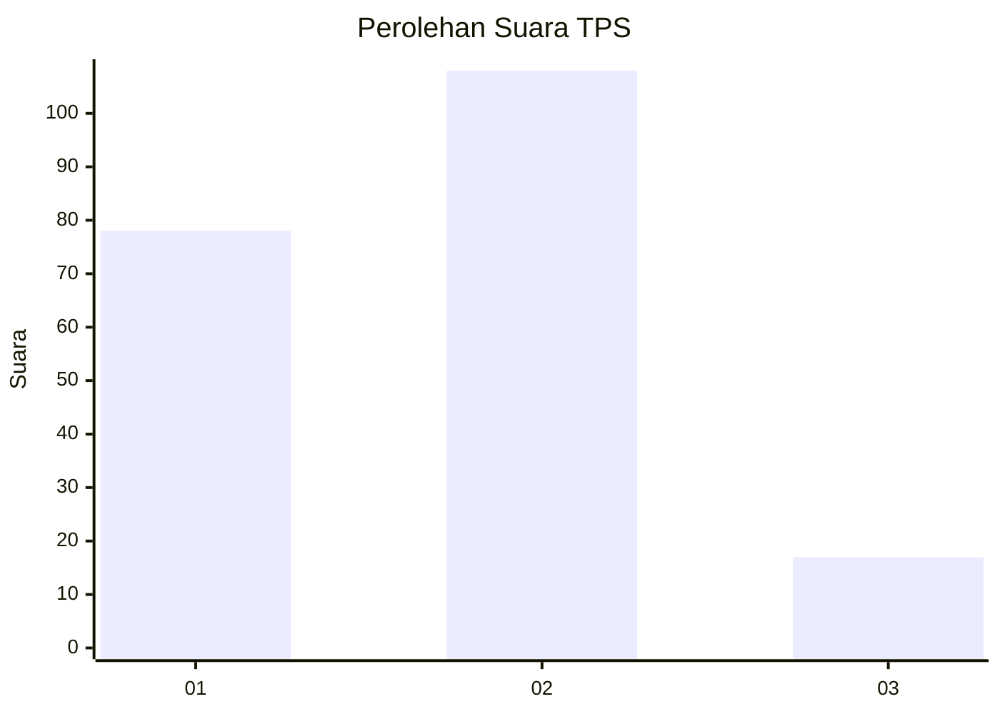
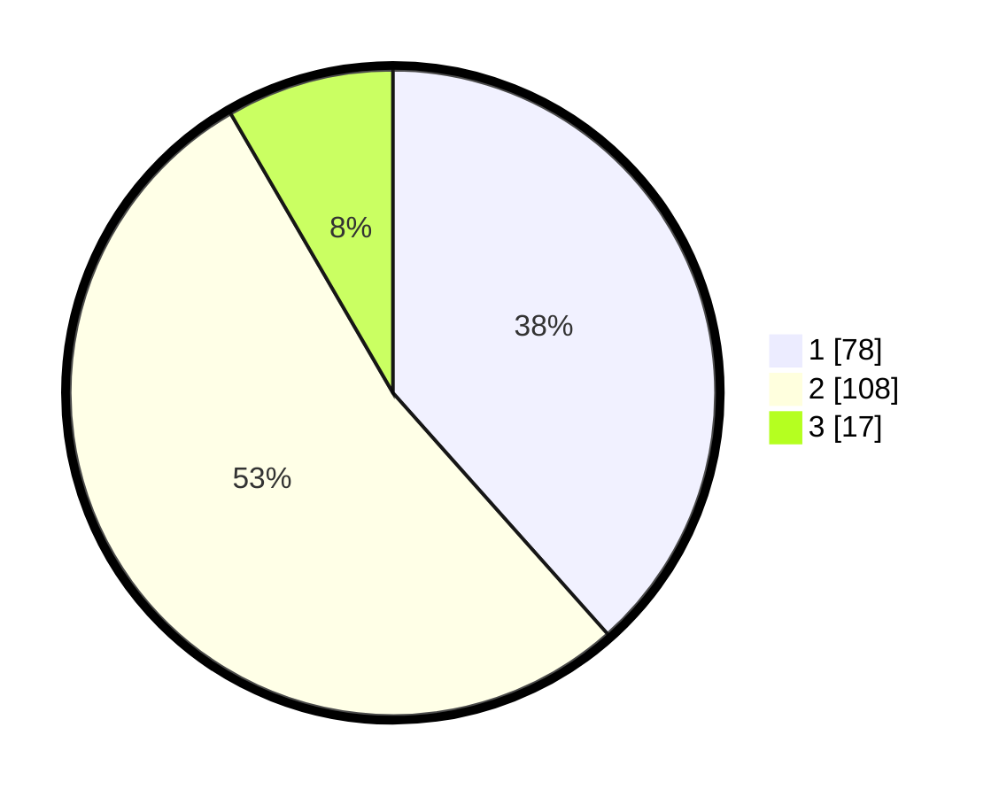

# Hasil

## Grafik

## Tabel

| No. | Nama Paslon    | Suara | Suara (raw) | Persentase |
|:--- |:-------------- | -----:| -----------:| ----------:|
| 1   | ANIES MUHAIMIN | 78    | [78][p-1]   | 38,42      |
| 2   | PRABOWO GIBRAN | 108   | [108][p-2]  | 53,20      |
| 3   | GANJAR MAHFUD  | 17    | [17][p-3]   | 8,37       |

[p-1]: https://github.com/gigit-pemilu/pemilu-2024-63-kalimantan-selatan/blob/main/pilpres/hitung-suara/sub/63-kalimantan-selatan/sub/04-barito-kuala/sub/03-anjir-pasar/sub/2002-hilir-mesjid/sub/001-tps/sub/paslon-1.txt
[p-2]: https://github.com/gigit-pemilu/pemilu-2024-63-kalimantan-selatan/blob/main/pilpres/hitung-suara/sub/63-kalimantan-selatan/sub/04-barito-kuala/sub/03-anjir-pasar/sub/2002-hilir-mesjid/sub/001-tps/sub/paslon-2.txt
[p-3]: https://github.com/gigit-pemilu/pemilu-2024-63-kalimantan-selatan/blob/main/pilpres/hitung-suara/sub/63-kalimantan-selatan/sub/04-barito-kuala/sub/03-anjir-pasar/sub/2002-hilir-mesjid/sub/001-tps/sub/paslon-3.txt

## Foto C Plano

https://sirekap-obj-formc.kpu.go.id/45b9/pemilu/ppwp/63/04/03/20/02/6304032002001-20240216-202900--46e3ac43-872f-44dc-8337-70c1bb734b69.jpg

https://sirekap-obj-formc.kpu.go.id/45b9/pemilu/ppwp/63/04/03/20/02/6304032002001-20240214-215956--174b5d59-5d0f-4d51-af76-3eb20e797034.jpg

https://sirekap-obj-formc.kpu.go.id/45b9/pemilu/ppwp/63/04/03/20/02/6304032002001-20240214-220014--3d170a3b-3c6b-4a13-9aae-4855b0219003.jpg

## Metadata

| Key        | Value               |
| ---------- | ------------------- |
| Time Stamp | 2024-02-16 21:01:00 |

