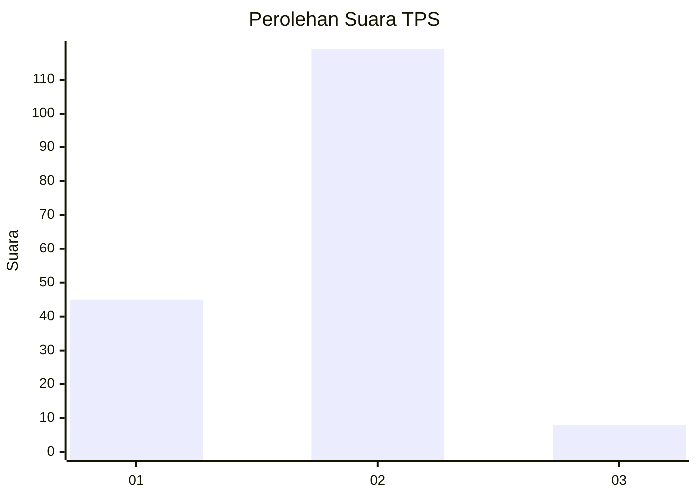
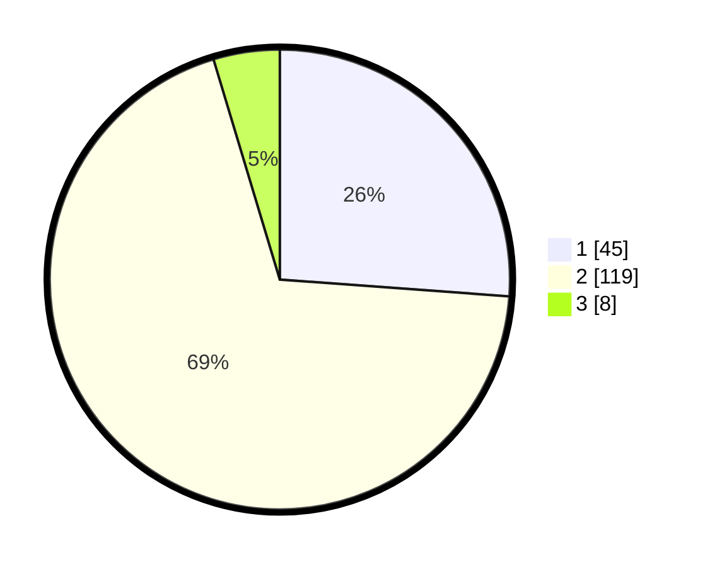

# Hasil

## Grafik

## Tabel

| No. | Nama Paslon    | Suara | Suara (raw) | Persentase |
|:--- |:-------------- | -----:| -----------:| ----------:|
| 1   | ANIES MUHAIMIN | 45    | [45][p-1]   | 26,16      |
| 2   | PRABOWO GIBRAN | 119   | [119][p-2]  | 69,19      |
| 3   | GANJAR MAHFUD  | 8     | [8][p-3]    | 4,65       |

[p-1]: https://github.com/gigit-pemilu/pemilu-2024-63-kalimantan-selatan/blob/main/pilpres/hitung-suara/sub/63-kalimantan-selatan/sub/04-barito-kuala/sub/04-anjir-muara/sub/2001-anjir-serapat-muara/sub/002-tps/sub/paslon-1.txt
[p-2]: https://github.com/gigit-pemilu/pemilu-2024-63-kalimantan-selatan/blob/main/pilpres/hitung-suara/sub/63-kalimantan-selatan/sub/04-barito-kuala/sub/04-anjir-muara/sub/2001-anjir-serapat-muara/sub/002-tps/sub/paslon-2.txt
[p-3]: https://github.com/gigit-pemilu/pemilu-2024-63-kalimantan-selatan/blob/main/pilpres/hitung-suara/sub/63-kalimantan-selatan/sub/04-barito-kuala/sub/04-anjir-muara/sub/2001-anjir-serapat-muara/sub/002-tps/sub/paslon-3.txt

## Foto C Plano

https://sirekap-obj-formc.kpu.go.id/37d9/pemilu/ppwp/63/04/04/20/01/6304042001002-20240215-073529--ffd8ba05-dcc6-462b-9ccf-8d4f7ae238e0.jpg

https://sirekap-obj-formc.kpu.go.id/37d9/pemilu/ppwp/63/04/04/20/01/6304042001002-20240215-073704--54b7ff33-f362-46b9-aefe-68028040a049.jpg

https://sirekap-obj-formc.kpu.go.id/37d9/pemilu/ppwp/63/04/04/20/01/6304042001002-20240215-073801--a4c6e31f-2cca-44f2-8c8a-da0457ee69f9.jpg

## Metadata

| Key        | Value               |
| ---------- | ------------------- |
| Time Stamp | 2024-02-16 14:30:33 |

