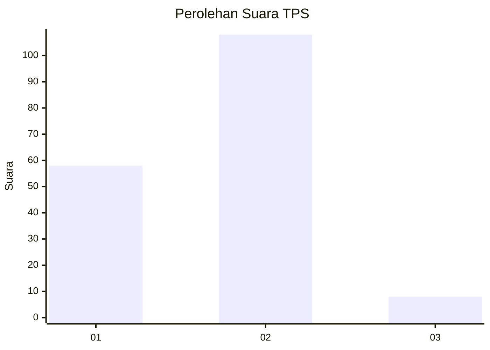
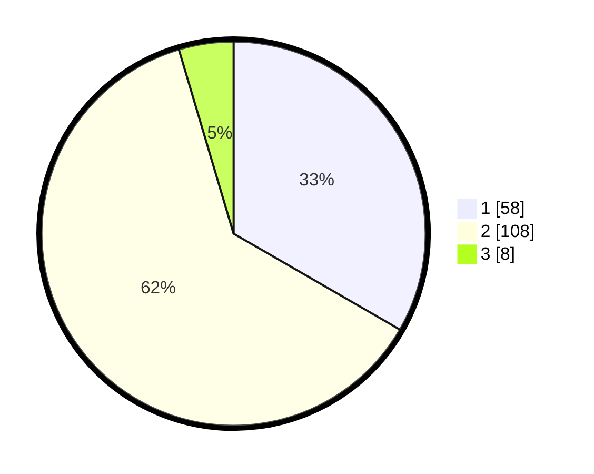

# Hasil

## Grafik

## Tabel

| No. | Nama Paslon    | Suara | Suara (raw) | Persentase |
|:--- |:-------------- | -----:| -----------:| ----------:|
| 1   | ANIES MUHAIMIN | 58    | [58][p-1]   | 33,33      |
| 2   | PRABOWO GIBRAN | 108   | [108][p-2]  | 62,07      |
| 3   | GANJAR MAHFUD  | 8     | [8][p-3]    | 4,60       |

[p-1]: https://github.com/gigit-pemilu/pemilu-2024-63-kalimantan-selatan/blob/main/pilpres/hitung-suara/sub/63-kalimantan-selatan/sub/04-barito-kuala/sub/04-anjir-muara/sub/2001-anjir-serapat-muara/sub/004-tps/sub/paslon-1.txt
[p-2]: https://github.com/gigit-pemilu/pemilu-2024-63-kalimantan-selatan/blob/main/pilpres/hitung-suara/sub/63-kalimantan-selatan/sub/04-barito-kuala/sub/04-anjir-muara/sub/2001-anjir-serapat-muara/sub/004-tps/sub/paslon-2.txt
[p-3]: https://github.com/gigit-pemilu/pemilu-2024-63-kalimantan-selatan/blob/main/pilpres/hitung-suara/sub/63-kalimantan-selatan/sub/04-barito-kuala/sub/04-anjir-muara/sub/2001-anjir-serapat-muara/sub/004-tps/sub/paslon-3.txt

## Foto C Plano

https://sirekap-obj-formc.kpu.go.id/7cfd/pemilu/ppwp/63/04/04/20/01/6304042001004-20240215-081222--21cf7177-c102-4bb1-838a-3126e71726e3.jpg

https://sirekap-obj-formc.kpu.go.id/7cfd/pemilu/ppwp/63/04/04/20/01/6304042001004-20240215-081344--3909a6dc-c788-492d-820c-b3af17e3991e.jpg

https://sirekap-obj-formc.kpu.go.id/7cfd/pemilu/ppwp/63/04/04/20/01/6304042001004-20240215-081451--b051e43a-47aa-47c1-a73c-b7385a000e97.jpg

## Metadata

| Key        | Value               |
| ---------- | ------------------- |
| Time Stamp | 2024-02-19 16:00:00 |

