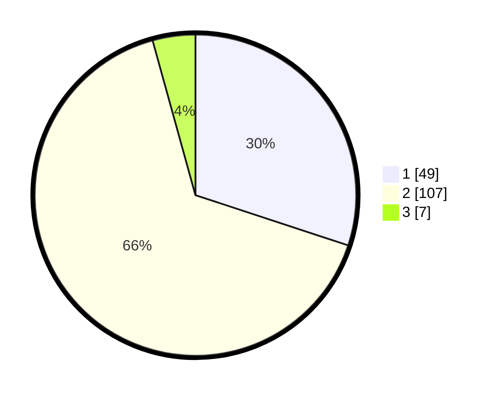

# Hasil

## Grafik

## Tabel

| No. | Nama Paslon    | Suara | Suara (raw) | Persentase |
|:--- |:-------------- | -----:| -----------:| ----------:|
| 1   | ANIES MUHAIMIN | 49    | [49][p-1]   | 30,06      |
| 2   | PRABOWO GIBRAN | 107   | [107][p-2]  | 65,64      |
| 3   | GANJAR MAHFUD  | 7     | [7][p-3]    | 4,29       |

[p-1]: https://github.com/gigit-pemilu/pemilu-2024-63-kalimantan-selatan/blob/main/pilpres/hitung-suara/sub/63-kalimantan-selatan/sub/04-barito-kuala/sub/04-anjir-muara/sub/2001-anjir-serapat-muara/sub/005-tps/sub/paslon-1.txt
[p-2]: https://github.com/gigit-pemilu/pemilu-2024-63-kalimantan-selatan/blob/main/pilpres/hitung-suara/sub/63-kalimantan-selatan/sub/04-barito-kuala/sub/04-anjir-muara/sub/2001-anjir-serapat-muara/sub/005-tps/sub/paslon-2.txt
[p-3]: https://github.com/gigit-pemilu/pemilu-2024-63-kalimantan-selatan/blob/main/pilpres/hitung-suara/sub/63-kalimantan-selatan/sub/04-barito-kuala/sub/04-anjir-muara/sub/2001-anjir-serapat-muara/sub/005-tps/sub/paslon-3.txt

## Foto C Plano

https://sirekap-obj-formc.kpu.go.id/a672/pemilu/ppwp/63/04/04/20/01/6304042001005-20240215-094309--b5f4ee9e-fa31-4f81-9970-c582d548b456.jpg

https://sirekap-obj-formc.kpu.go.id/a672/pemilu/ppwp/63/04/04/20/01/6304042001005-20240215-094529--9836cf8c-aaae-450a-89ec-1fe195b46f9c.jpg

https://sirekap-obj-formc.kpu.go.id/a672/pemilu/ppwp/63/04/04/20/01/6304042001005-20240215-094640--acab266c-9082-4528-b2c6-1952fd418c78.jpg

## Metadata

| Key        | Value               |
| ---------- | ------------------- |
| Time Stamp | 2024-02-15 18:30:25 |

