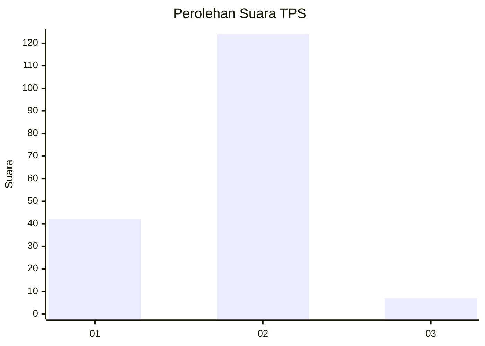
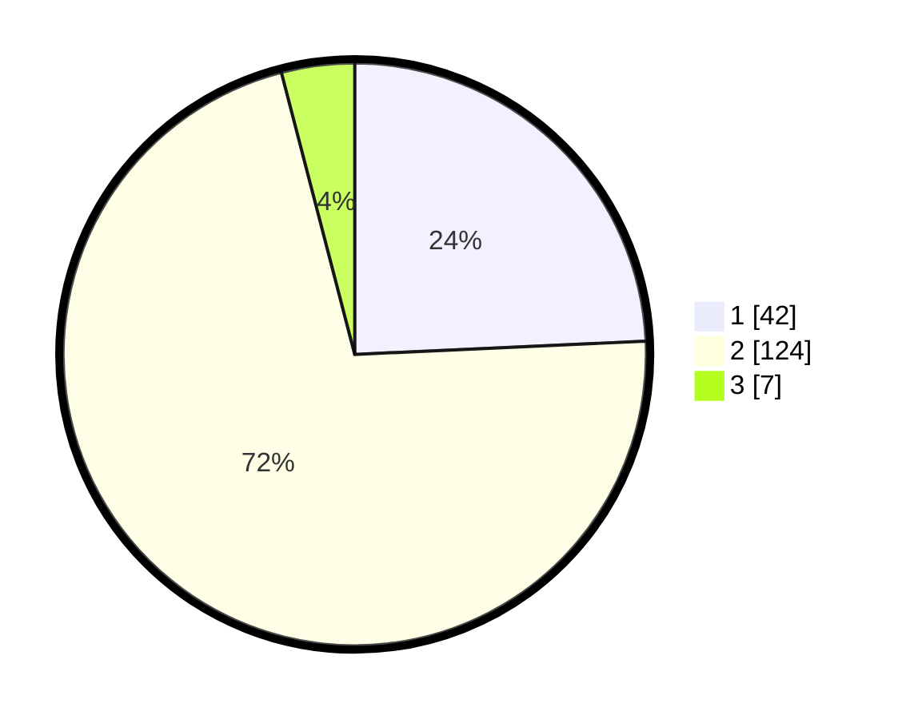

# Hasil

## Grafik

## Tabel

| No. | Nama Paslon    | Suara | Suara (raw) | Persentase |
|:--- |:-------------- | -----:| -----------:| ----------:|
| 1   | ANIES MUHAIMIN | 42    | [42][p-1]   | 24,28      |
| 2   | PRABOWO GIBRAN | 124   | [124][p-2]  | 71,68      |
| 3   | GANJAR MAHFUD  | 7     | [7][p-3]    | 4,05       |

[p-1]: https://github.com/gigit-pemilu/pemilu-2024-63-kalimantan-selatan/blob/main/pilpres/hitung-suara/sub/63-kalimantan-selatan/sub/04-barito-kuala/sub/05-alalak/sub/1001-berangas-barat/sub/006-tps/sub/paslon-1.txt
[p-2]: https://github.com/gigit-pemilu/pemilu-2024-63-kalimantan-selatan/blob/main/pilpres/hitung-suara/sub/63-kalimantan-selatan/sub/04-barito-kuala/sub/05-alalak/sub/1001-berangas-barat/sub/006-tps/sub/paslon-2.txt
[p-3]: https://github.com/gigit-pemilu/pemilu-2024-63-kalimantan-selatan/blob/main/pilpres/hitung-suara/sub/63-kalimantan-selatan/sub/04-barito-kuala/sub/05-alalak/sub/1001-berangas-barat/sub/006-tps/sub/paslon-3.txt

## Foto C Plano

https://sirekap-obj-formc.kpu.go.id/d7ae/pemilu/ppwp/63/04/05/10/01/6304051001006-20240214-224349--2fd6d912-b6fa-47de-abc7-30cd63fb6e36.jpg

https://sirekap-obj-formc.kpu.go.id/d7ae/pemilu/ppwp/63/04/05/10/01/6304051001006-20240214-224427--1a37675a-af96-4cf6-b0d4-687c4c93446d.jpg

https://sirekap-obj-formc.kpu.go.id/d7ae/pemilu/ppwp/63/04/05/10/01/6304051001006-20240214-224618--08bd3069-8c08-435a-9640-3efdc83b3423.jpg

## Metadata

| Key        | Value               |
| ---------- | ------------------- |
| Time Stamp | 2024-02-15 23:29:50 |

