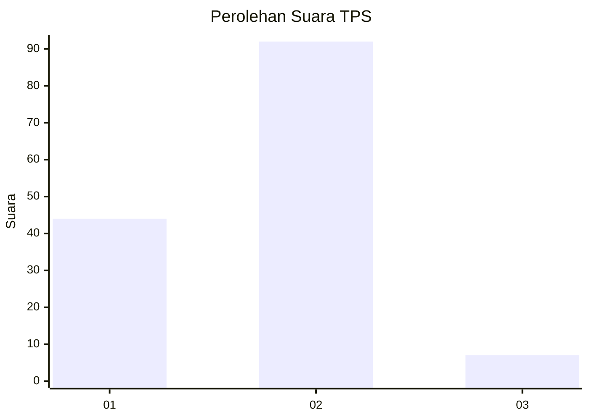
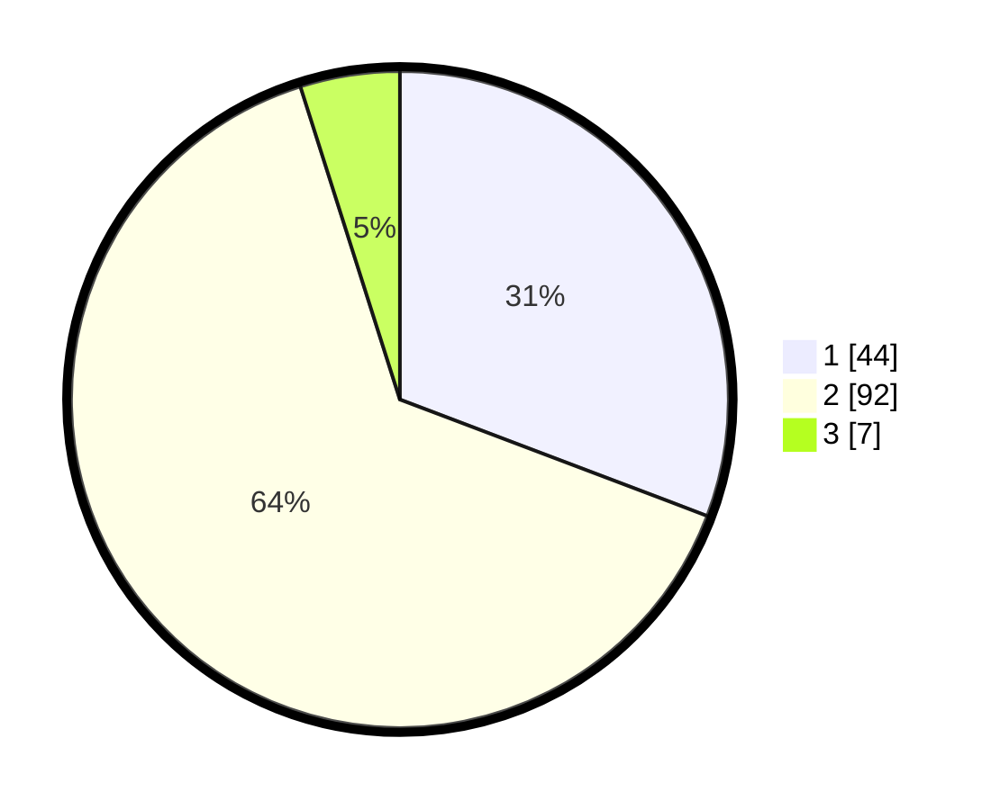

# Hasil

## Grafik

## Tabel

| No. | Nama Paslon    | Suara | Suara (raw) | Persentase |
|:--- |:-------------- | -----:| -----------:| ----------:|
| 1   | ANIES MUHAIMIN | 44    | [44][p-1]   | 30,77      |
| 2   | PRABOWO GIBRAN | 92    | [92][p-2]   | 64,34      |
| 3   | GANJAR MAHFUD  | 7     | [7][p-3]    | 4,90       |

[p-1]: https://github.com/gigit-pemilu/pemilu-2024-63-kalimantan-selatan/blob/main/pilpres/hitung-suara/sub/63-kalimantan-selatan/sub/04-barito-kuala/sub/06-mandastana/sub/2001-terantang/sub/001-tps/sub/paslon-1.txt
[p-2]: https://github.com/gigit-pemilu/pemilu-2024-63-kalimantan-selatan/blob/main/pilpres/hitung-suara/sub/63-kalimantan-selatan/sub/04-barito-kuala/sub/06-mandastana/sub/2001-terantang/sub/001-tps/sub/paslon-2.txt
[p-3]: https://github.com/gigit-pemilu/pemilu-2024-63-kalimantan-selatan/blob/main/pilpres/hitung-suara/sub/63-kalimantan-selatan/sub/04-barito-kuala/sub/06-mandastana/sub/2001-terantang/sub/001-tps/sub/paslon-3.txt

## Foto C Plano

https://sirekap-obj-formc.kpu.go.id/bd5f/pemilu/ppwp/63/04/06/20/01/6304062001001-20240218-191330--ba78cf93-1ed8-4b7d-ac2a-8aab97fa2592.jpg

https://sirekap-obj-formc.kpu.go.id/bd5f/pemilu/ppwp/63/04/06/20/01/6304062001001-20240218-172142--2b34ed1c-b40a-4544-8c15-bf6c0845319b.jpg

https://sirekap-obj-formc.kpu.go.id/bd5f/pemilu/ppwp/63/04/06/20/01/6304062001001-20240218-191453--5dc3ec42-a947-4f66-87c8-f0bd7cbb9821.jpg

## Metadata

| Key        | Value               |
| ---------- | ------------------- |
| Time Stamp | 2024-02-19 06:16:00 |

