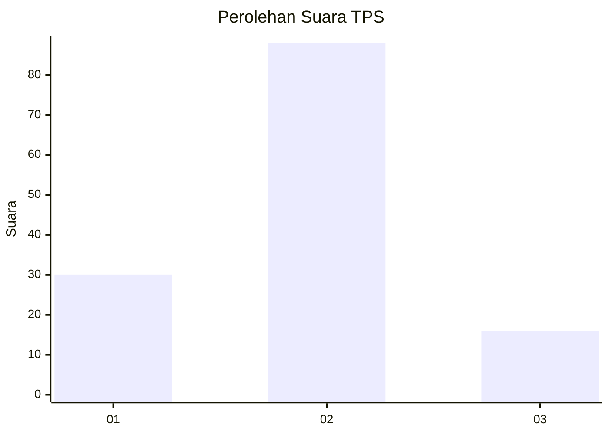
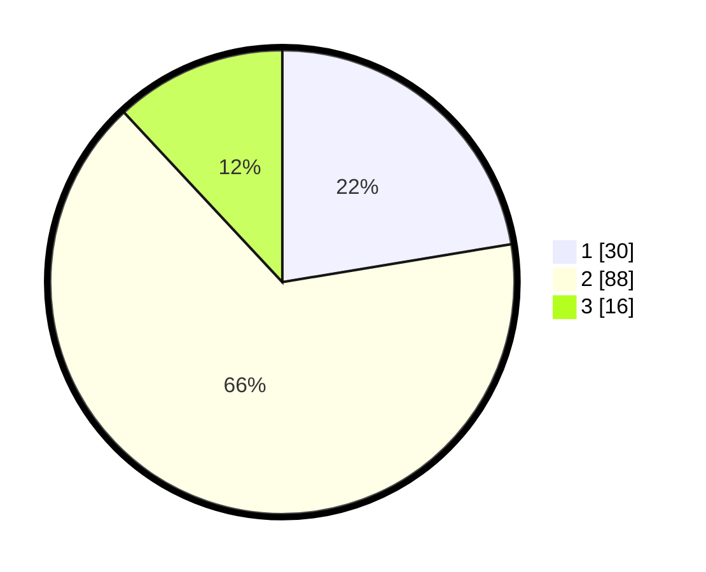

# Hasil

## Grafik

## Tabel

| No. | Nama Paslon    | Suara | Suara (raw) | Persentase |
|:--- |:-------------- | -----:| -----------:| ----------:|
| 1   | ANIES MUHAIMIN | 30    | [30][p-1]   | 22,39      |
| 2   | PRABOWO GIBRAN | 88    | [88][p-2]   | 65,67      |
| 3   | GANJAR MAHFUD  | 16    | [16][p-3]   | 11,94      |

[p-1]: https://github.com/gigit-pemilu/pemilu-2024/blob/main/pilpres/hitung-suara/sub/63-kalimantan-selatan/sub/04-barito-kuala/sub/06-mandastana/sub/2001-terantang/sub/002-tps/sub/paslon-1.txt
[p-2]: https://github.com/gigit-pemilu/pemilu-2024/blob/main/pilpres/hitung-suara/sub/63-kalimantan-selatan/sub/04-barito-kuala/sub/06-mandastana/sub/2001-terantang/sub/002-tps/sub/paslon-2.txt
[p-3]: https://github.com/gigit-pemilu/pemilu-2024/blob/main/pilpres/hitung-suara/sub/63-kalimantan-selatan/sub/04-barito-kuala/sub/06-mandastana/sub/2001-terantang/sub/002-tps/sub/paslon-3.txt

## Foto C Plano

https://sirekap-obj-formc.kpu.go.id/c778/pemilu/ppwp/63/04/06/20/01/6304062001002-20240218-211418--e144e68c-fef3-482e-9a73-efbd131f2d72.jpg

https://sirekap-obj-formc.kpu.go.id/c778/pemilu/ppwp/63/04/06/20/01/6304062001002-20240218-211546--3a6e726e-8571-4685-a2d2-b0177de9e672.jpg

https://sirekap-obj-formc.kpu.go.id/c778/pemilu/ppwp/63/04/06/20/01/6304062001002-20240218-211657--6633b221-c7df-4e75-a4eb-da4c853a8c8e.jpg

## Metadata

| Key        | Value               |
| ---------- | ------------------- |
| Time Stamp | 2024-02-19 06:16:00 |

