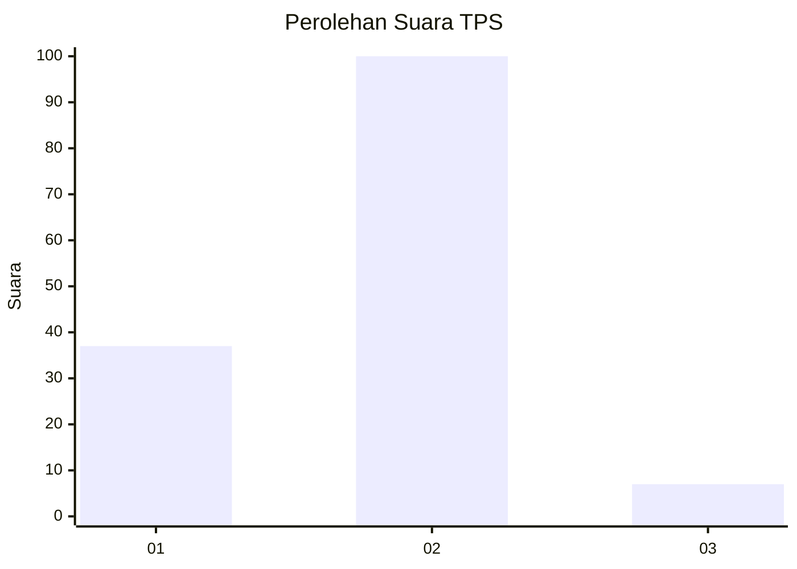
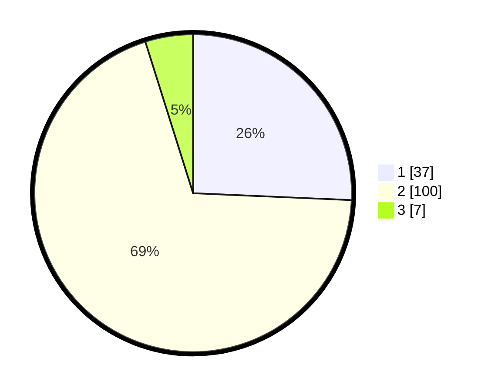

# Hasil

## Grafik

## Tabel

| No. | Nama Paslon    | Suara | Suara (raw) | Persentase |
|:--- |:-------------- | -----:| -----------:| ----------:|
| 1   | ANIES MUHAIMIN | 37    | [37][p-1]   | 25,69      |
| 2   | PRABOWO GIBRAN | 100   | [100][p-2]  | 69,44      |
| 3   | GANJAR MAHFUD  | 7     | [7][p-3]    | 4,86       |

[p-1]: https://github.com/gigit-pemilu/pemilu-2024/blob/main/pilpres/hitung-suara/sub/63-kalimantan-selatan/sub/04-barito-kuala/sub/06-mandastana/sub/2001-terantang/sub/003-tps/sub/paslon-1.txt
[p-2]: https://github.com/gigit-pemilu/pemilu-2024/blob/main/pilpres/hitung-suara/sub/63-kalimantan-selatan/sub/04-barito-kuala/sub/06-mandastana/sub/2001-terantang/sub/003-tps/sub/paslon-2.txt
[p-3]: https://github.com/gigit-pemilu/pemilu-2024/blob/main/pilpres/hitung-suara/sub/63-kalimantan-selatan/sub/04-barito-kuala/sub/06-mandastana/sub/2001-terantang/sub/003-tps/sub/paslon-3.txt

## Foto C Plano

https://sirekap-obj-formc.kpu.go.id/a6a4/pemilu/ppwp/63/04/06/20/01/6304062001003-20240218-231438--653e9f41-75ad-4b6d-bff2-01aaf4e85f55.jpg

https://sirekap-obj-formc.kpu.go.id/a6a4/pemilu/ppwp/63/04/06/20/01/6304062001003-20240218-231645--2ce6b096-3ce1-4a2e-b1d4-705f211d5f99.jpg

https://sirekap-obj-formc.kpu.go.id/a6a4/pemilu/ppwp/63/04/06/20/01/6304062001003-20240218-231913--320bb17a-fb1d-4c63-8bdc-18c356cafb95.jpg

## Metadata

| Key        | Value               |
| ---------- | ------------------- |
| Time Stamp | 2024-02-19 09:00:00 |

